---
lab:
    title: '实验室教学 1 - Azure AD 特权身份管理'
    module: '模块 1：管理身份和访问'
---

# 模块 1：实验室教学 1 - Azure AD 特权身份管理


**场景**

在本实验室中，你将学习如何使用 Azure 特权身份管理 (PIM) 启用即时管理并控制可以执行特权操作的用户数量。你还将了解可用的不同目录角色以及更新的功能，其中包括将 PIM 扩展为资源级别的角色分配。课程包括：

- PIM 入门
- PIM 安全向导
- 目录角色 PIM
- 角色资源 PIM

✔️管理身份课程还包括 Azure RBAC 和 Azure 活动目录。此内容也已涵盖其中，旨在为课程的其余部分提供更多的背景和基础。


## Azure AD 特权身份管理

## 练习 1 - 发现和管理 Azure 资源

### 任务 1：实验室教学设置


本实验室教学需要用于 PIM 的用户创建。


1.  在**“Azure 门户”**中，在**“PowerShel”**模式中，打开**“Cloud Shell”**。如果出现提示，单击**“创建存储”**。

1.  运行以下 PowerShell 命令，在默认域中创建 AD 用户和密码

    ```powershell
    $PasswordProfile = New-Object -TypeName Microsoft.Open.AzureAD.Model.PasswordProfile
    ```
    ```powershell
    $PasswordProfile.Password = "Pa55w.rd"
    ```
    ```powershell
    $domainObj = get-azureaddomain
    ```
    ```powershell
    $domain = $domainObj[0].name
    ```
    ```powershell
    New-AzureADUser -DisplayName "Isabella Simonsen" -PasswordProfile $PasswordProfile -UserPrincipalName "Isabella@$domain" -AccountEnabled $true -MailNickName "Isabella"
    ```
### 任务 2：  启用 Azure AD Premium P2 试用版并创建测试用户。

1.  在 Azure 门户的中心菜单上，单击**“Azure 活动目录”**。

1.  选择**“管理”**中的**“许可”**。

    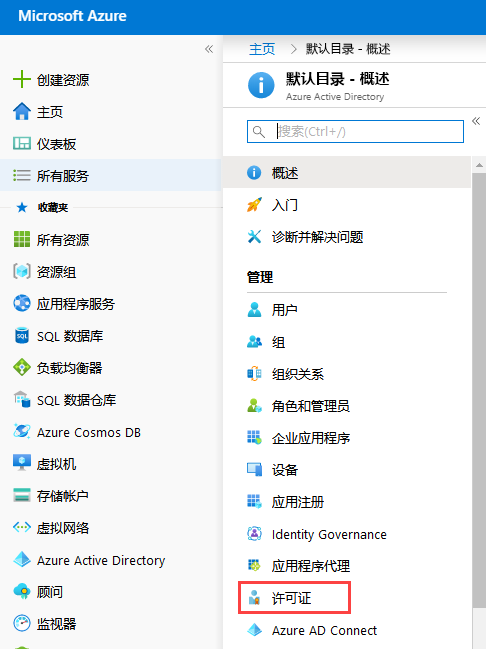

1.  选择**“所有产品”**。

     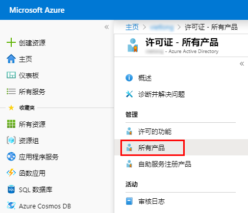


1.  单击**“尝试/购买”**。

     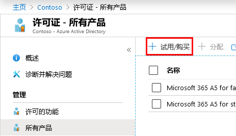

1.  单击下拉箭头，在**“Azure AD Premium P2”**产品中选择**“激活”**。

     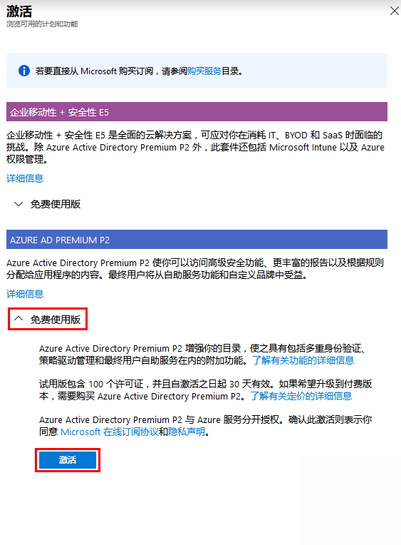

**你需要注销 Azure 门户并再次登录刷新**

### 任务 3：发现资源

1.  在 Azure 门户中，单击**“所有服务”**并搜索选择**“Azure AD 特权身份管理”**。

     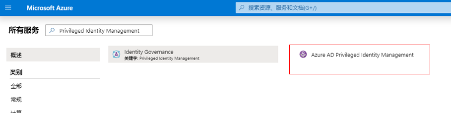

1.  单击同意 PIM。

     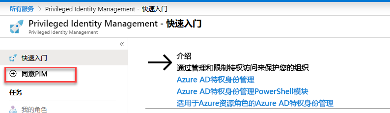

1.  单击**“验证我的身份”**。

     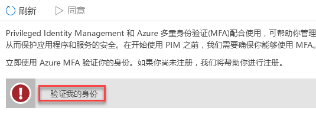

1.  单击**“下一步”**。

     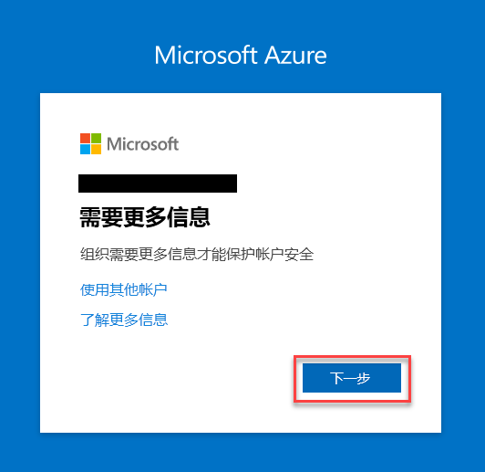

1.  输入你的手机/电话详细信息，然后单击**“下一步”**。

     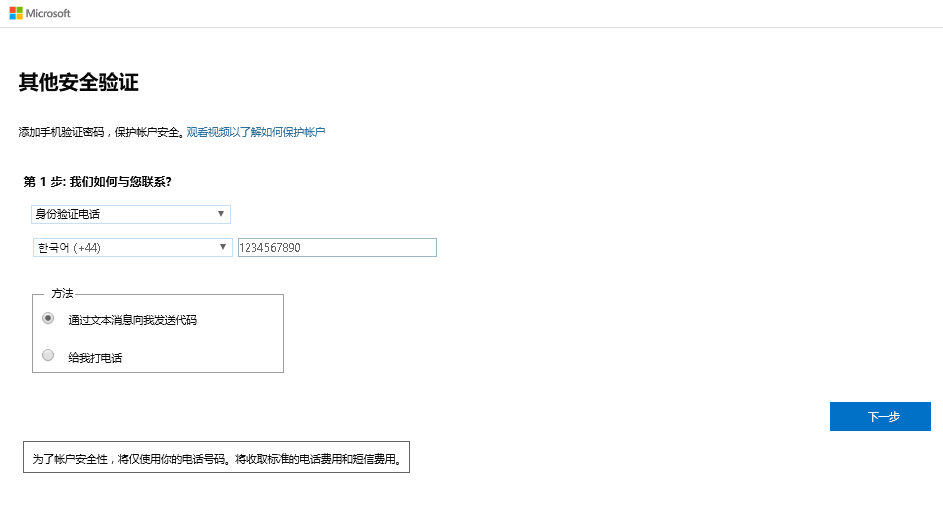
 
1.  收到短信验证码时，输入验证码，然后单击**“校验”**。

     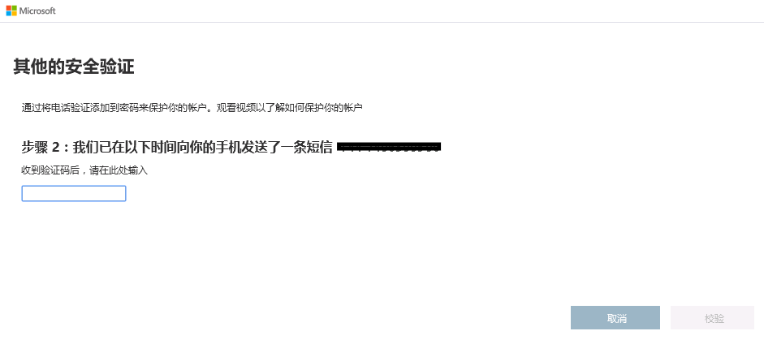

1. 验证成功后，单击**“完成”**。

1.  在 Azure 门户中，单击**“所有服务”**并搜索选择**“Azure AD 特权身份管理”**。

     

1.  单击同意 PIM。

     

1.  回到**“同意 PIM 刀片服务器”**，单击**“同意”**，然后单击**“是”**。

     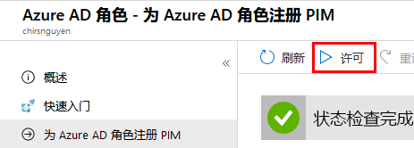

1.  通过按下 **F5**，刷新 Azure 门户。
   
    **注**：如果刷新浏览器中的门户后，并未显示 PIM 已启用，请注销并重新登录 Azure 门户。

2.  单击**“Azure 资源”**。

     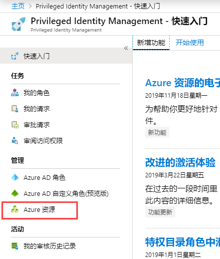


3.  单击**“发现资源”**，启动发现体验。

     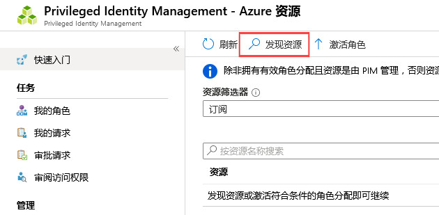


4.  在“发现”窗格上，使用**“资源状态筛选程序”**和**“选择资源类型”**，筛选你具有写入权限的管理组或订阅。最简单的方法是初始选择**“所有”**。

     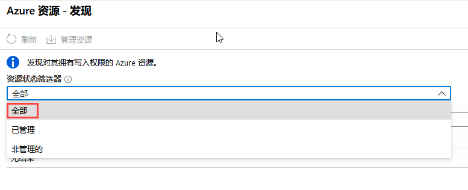

5.  在你的 Azure 订阅旁边添加一个复选标记。
   
     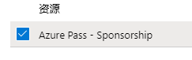
 
6.  单击**“管理资源”**，开始管理所选资源。

     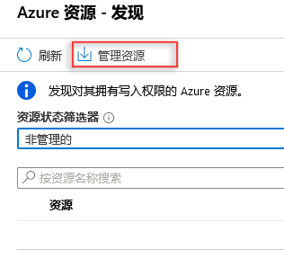

7.  提示时，单击**“是”**。


    **注**：你只能搜索并选择要使用 PIM 进行管理的管理组或订阅资源。在 PIM 中管理管理组或订阅时，还可以管理其子资源。


    **注**：将管理组或订阅设置为已管理后，不可取消管理。这样可以防止其他资源管理员删除 PIM 设置。


## 练习 2 - 分配目录角色

### 任务 1：  确保用户有资格担任角色


在以下任务中，你将使用户有资格获得 Azure AD 目录角色。


1.  登录至 Azure 门户

1.  在 Azure 门户中，单击**“所有服务”**并搜索选择**“Azure AD 特权身份管理”**。

     

1.  选择**“Azure AD 角色”**。

     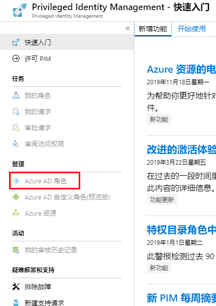
 
1.  单击**“注册 Azure AD 角色 PIM”**。

     


1.  单击**“注册”**，然后单击**“是”**。

     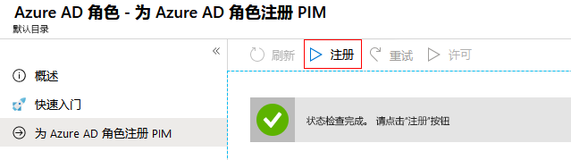

1.  **“刷新浏览器”**。

1.  单击**“角色”**。

     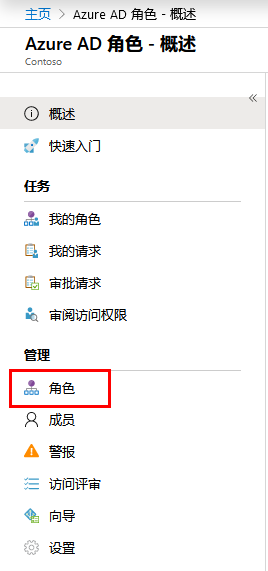


1.  单击**“新增成员”**，打开添加受管成员。

     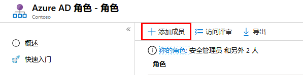

1.  单击**“选择一个角色”**，然后单击**“账单管理员”**，然后单击**“选择”**。

     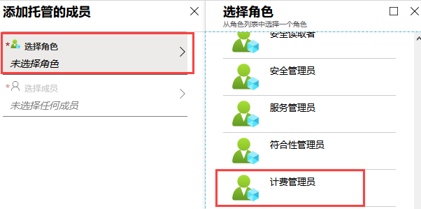

1.  单击**“选择成员”**，选择**“Isabella”**，然后单击**“选择”**。

     

1.  在添加受管成员中，单击**“确定”**，将用户添加到角色。

1.  查看添加的成员

     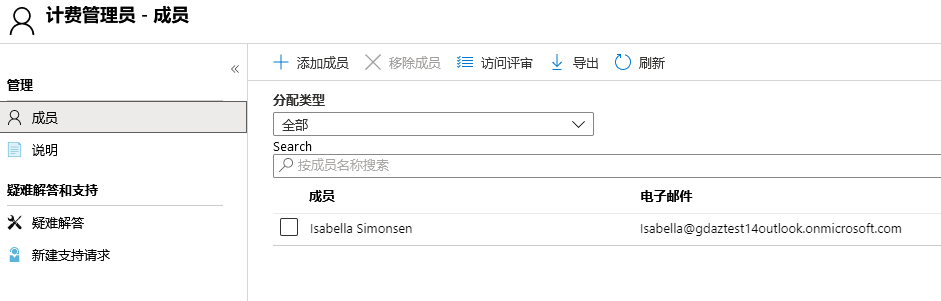

1.  分配角色后，你选择的用户将在成员列表中显示为**“合格”**角色。


### 任务 2：将角色分配永久化


默认情况下，新用户只具有目录角色的资格。如果要将角色分配永久化，请执行以下步骤。


1.  在 Azure 门户中，单击**“所有服务”**并搜索选择**“Azure AD 特权身份管理”**。

     

1.  选择**“Azure AD 角色”**。

     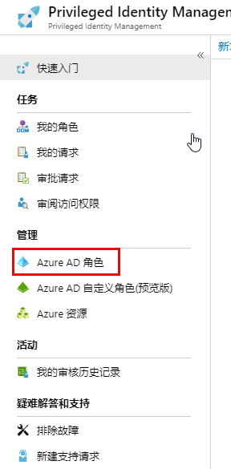

1.  单击**“成员”**。

     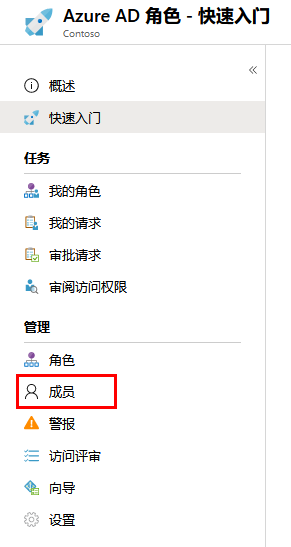

1.  单击你要永久化的**“合格”**角色。

     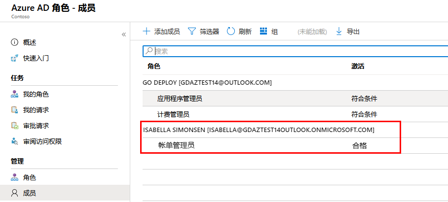
 
1.  单击**“更多”**，然后单击**“设为永久”**。

     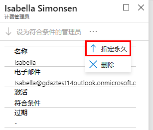
 

**“结果”**：该角色现在列为**“永久”**。


### 任务 3：从角色中删除用户


你可以从角色分配中删除用户，但请确保始终至少有一个用户是永久全局管理员。


1.  在 Azure 门户中，单击**“所有服务”**并搜索选择**“Azure AD 特权身份管理”**。

     

1.  选择**“Azure AD 角色”**。

     

1.  单击**“成员”**。

     

1.  单击你要删除的角色分配。

     
 
1.  单击**“更多”**，然后单击**“删除”**。

     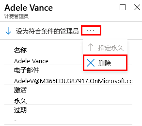
 
1.  在要求你确认的消息中，单击**“是”**。角色分配将被删除。


## 练习 3 - 激活和停用 PIM 角色

### 任务 1：激活角色


当你需要承担 Azure AD 目录角色时，可以使用 PIM 中**“我的角色”**导航选项。


1.  在 Azure 门户中，单击**“所有服务”**并搜索选择**“Azure AD 特权身份管理”**。

     

1.  选择**“Azure AD 角色”**。

     
 
1.  单击**“快速开始”**，然后单击**“分配资格”**。

     

1.  单击**“账单管理员”**并将 Isabella 重新添加到**“账单管理员”**角色。


1.  打开一个**“个人”**浏览会话并导航到**“https://portal.azure.com”**，使用密码**“Pa55w.rd”**登录**“Isabella”**。  出现提示时，更改 Isabella 的密码。

1.  在 Azure 门户中，单击**“所有服务”**并搜索选择**“Azure AD 特权身份管理”**。

     

1.  在 Azure 门户中，单击**“所有服务”**并搜索选择**“Azure AD 特权身份管理”**。

     

1.  选择**“Azure AD 角色”**。

     

1.  单击**“快速开始”**，然后单击**“激活你的角色”**。

     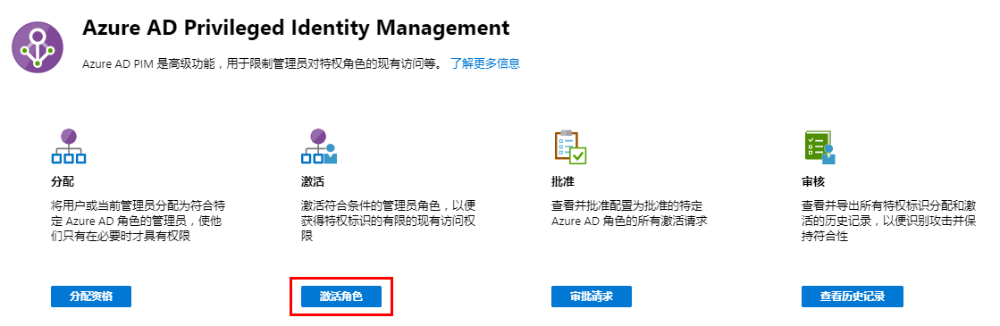

1.  在“账单管理员”角色上，向右滚动并单击**“激活”**。

     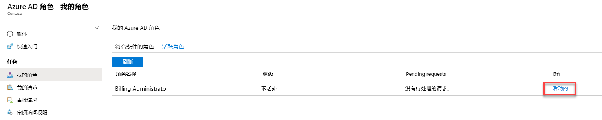

1.  单击**“继续操作之前，请验证你的身份”**。每个会话只需认证一次。运行向导以验证 Isabella。

     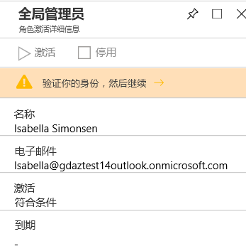
 
1.  返回 Azure 门户后，单击**“所有服务”**，搜索并选择**“Azure AD 特权身份管理”**。

     

1.  选择**“Azure AD 角色”**，然后在快速启动刀片服务器上单击**“激活你的角色”**。

1.  在“账单管理员”角色上，向右滚动并单击**“激活”**。

     

1.  单击**“激活”**。

     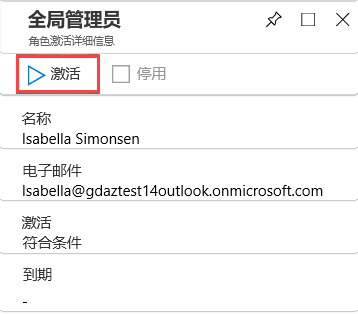

1.  输入激活原因，然后单击**“激活”**

     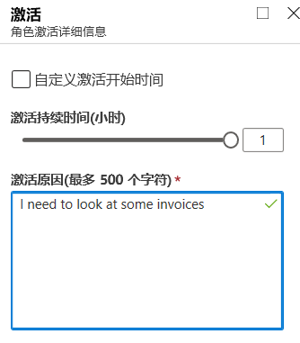

默认情况下，除非在设置中明确配置，否则角色无需批准。 

 如果角色不需要批准，则会激活该角色并将其添加到活动角色列表中。如果要立即使用该角色，请按照下一节中的步骤进行操作。

 如果角色需要批准才能激活，浏览器右上角会显示一条通知，通知你该请求正在等待批准。


### 任务 2：激活后立即使用角色


在 PIM 中激活角色时，最多可能需要 10 分钟才能访问管理门户或在特定管理工作内执行功能。要强制更新你的权限，请按照下列步骤使用**“应用访问”**：


1.  单击**“注销”**。

     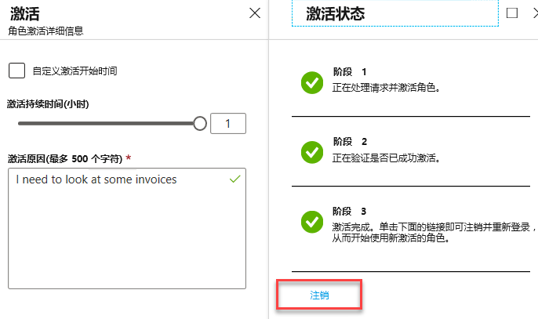

1.  以 Isabella 的身份重新登录。


### 任务 3：查看你的请求状态


你可以查看要激活的待处理请求状态。


1.  仍以**“Isabella”**身份登录，在 Azure 门户中，单击**“所有服务”**并搜索选择**“Azure AD 特权身份管理”**。

     

1.  选择 **Azure AD 角色**。

1.  单击**“我的请求”**，查看你的请求列表。

     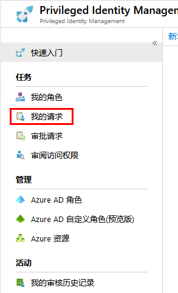

### 任务 4：停用角色


激活角色后，到达其时间限制（合格时间）后，将自动停用。

如果你提早完成管理员任务，则还可以在 Azure AD 特权身份管理中手动停用角色。


1.  仍以**“Isabella”**身份登录，打开 Azure AD 特权身份管理。

1.  选择**“Azure AD 角色”**。

1.  单击**“我的角色”**。

     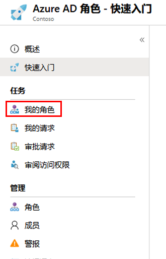

1.  单击**“激活角色”**，查看你的激活角色列表。

     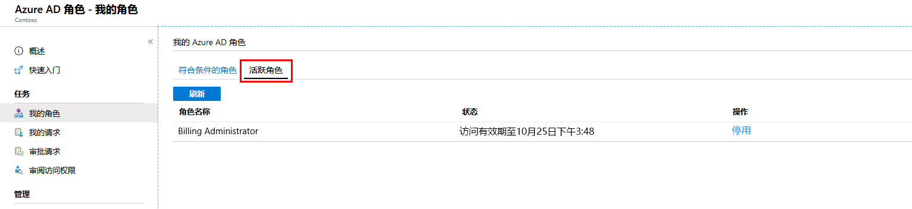

1.  找到你完成使用的角色，然后单击**“停用”**。

     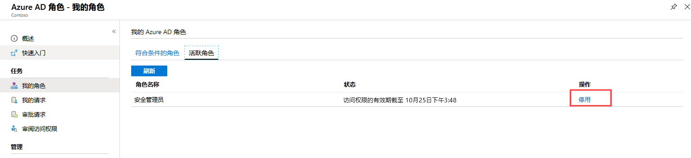

1.  再次单击**“停用”**。

     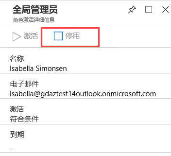

1.  单击**“是”**进行确认。


### 任务 5：取消待处理的请求


如果你不需要激活需要批准的角色，则可以随时取消待处理的请求。


1.  **“打开 Azure AD 特权身份管理”**。

1.  选择**“Azure AD 角色”**。

1.  单击**“我的请求”**。

1.  对于要取消的角色，单击**“取消”**按钮。

**注**：请求批准后，此任务中的取消按钮显示为灰色。

单击取消时，该请求将被取消。要再次激活该角色，必须提交新的激活请求。


## 练习 4 - 目录角色（常规）

### 任务 1：对 PIM 中的 Azure AD 目录角色启动访问检查


当用户具有不再需要的访问特权时，角色分配将变为“过期”。为了降低与这些过期角色分配有关的风险，特权角色管理员或全局管理员应定期创建访问权限检查，要求管理员检查已授予为用户的角色。此任务包括在 Azure AD 特权身份管理 (PIM) 中启动访问检查的步骤。


1.  返回以全局管理员帐户身份登录的浏览器。

1.  在 PIM 应用程序主页上，单击**“管理”**部分中单击**“Azure AD 角色”**，之后依次单击**“访问检查”**和 >**“新建”**。

     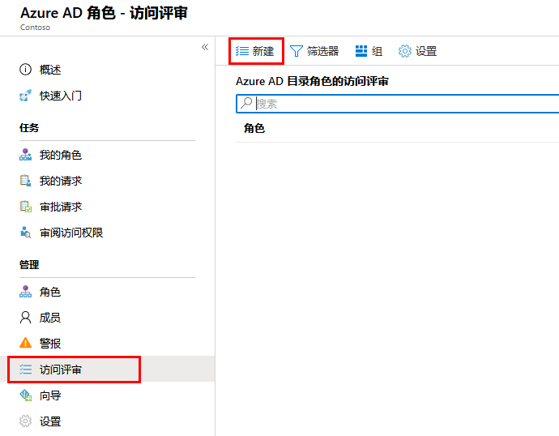

1.  输入以下详细信息，然后单击**“开始”**：

      - 审查名称：  **全局管理审查**
      - 频率：**一次**
      - 开始日期：  **当日** 
      - 结束日期：  **下个月末**
      - 审查角色成员：  **全局管理员**
      - 审查人：  **选择你的帐户。**
 
 
     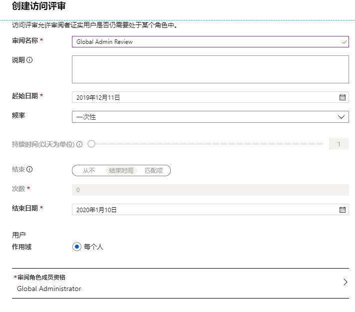
 
1.  审查完成后，状态为激活。  单击**“全局管理审查”**。

1.  选择结果并查看**“未审查”**的结果**。

     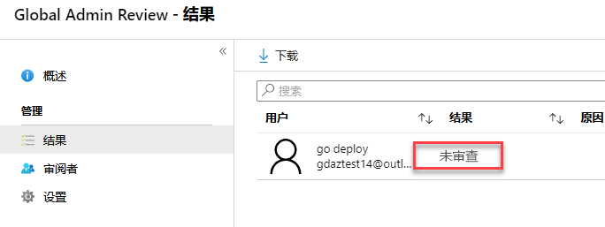

### 任务 2：批准或拒绝访问


当你批准或拒绝访问时，你只是在告诉审查人你是否仍在使用此角色。如果你想保留该角色，请选择批准；如果你不再需要访问权限，请选择拒绝。你的状态不会立即变更，直到审查人应用结果后方可变更。请按照以下步骤查找并完成访问审查：


1.  在 PIM应 用程序中，选择**“审查访问”**。 

2.  选择**“全局管理审查”**。

     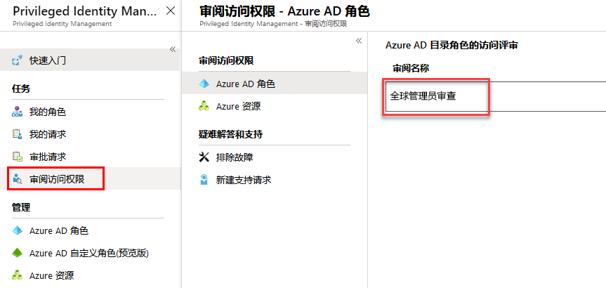

3.  除非你创建了审查，否则你将成为审查中的唯一用户。选择你的姓名旁边的复选标记。

     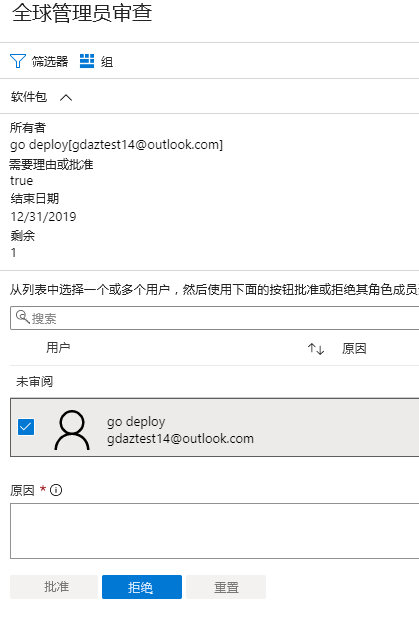

5.  关闭**“查看 Azure AD 角色”**刀片服务器。

### 任务 3：完成对 PIM 中 Azure AD 目录角色的访问审查


开始访问审查后，特权角色管理员可以审查特权访问。Azure AD 特权身份管理 (PIM) 将自动发送一封电子邮件，提示用户查看其访问权限。如果用户没有收到电子邮件，你可以向他们发送有关如何执行访问权限审查的说明。

访问审查期结束或所有用户都完成了自我审查后，请按照此任务中的步骤管理审查并查看结果。


1.  转到 Azure 门户并选择**“Azure AD 特权身份管理”**。

1.  选择**“Azure AD 角色”**。

2.  选择**“访问审查”**。


3.  选择“全局管理审查”。


1.  查看刀片服务器。

     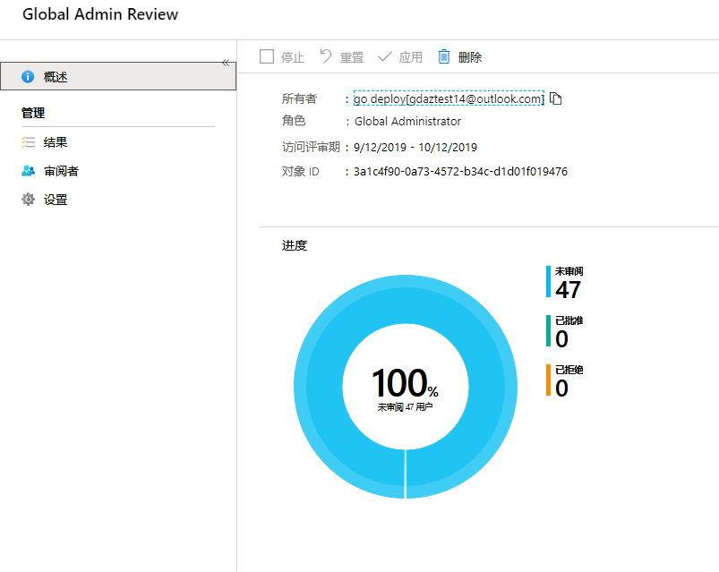


### 任务 4：在 PIM 中为 Azure AD 目录角色配置安全警报


你可以在 PIM 中自定义一些安全警报，以处理你的环境和安全目标。请按照以下步骤打开安全警报设置：


1.  打开**“Azure AD 特权身份管理”**。

1.  选择**“Azure AD 角色”**。

1.  单击**“设置”**，然后单击**“警报”**。


1.  单击警报名，配置该警报的设置。


## 练习 5 - PIM 资源工作流程

### 任务 1：  配置全局管理员角色，以请求批准。

1.  打开**“Azure AD 特权身份管理”**。

1.  选择**“Azure AD 角色”**。

1.  单击**“设置”** 

1.  单击**“角色”**，然后选择**“全局管理员”**。

1.  向下滚动并更改**“需要批准”**到**“启用”**，然后单击**“保存”**。

     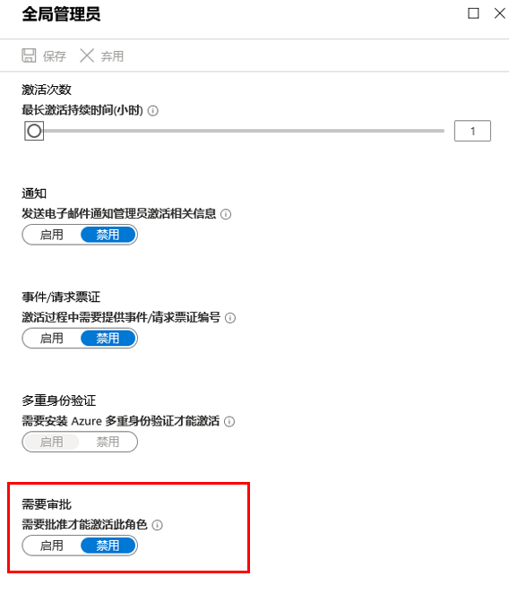

### 任务 2：为 Isabella 启用全局管理员特权。

1.  打开**“Azure AD 特权身份管理”**。

1.  选择**“Azure AD 角色”**。

1.  单击**“快速开始”**，然后选择**“分配资格”**。

     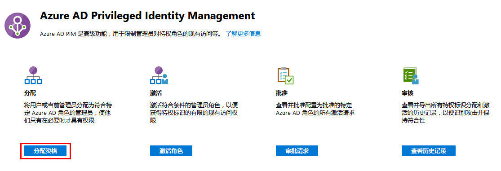

1.  选择**“全局管理员”**。


1.  选择**“+ 添加成员”**，然后选择**“Isabella”**。


1.  在“个人浏览”会话中打开一个会话，并以 Isabella 的身份登录 portal.azure.com。

1.  打开**“Azure AD 特权身份管理”**。

1.  选择**“我的角色”**。

     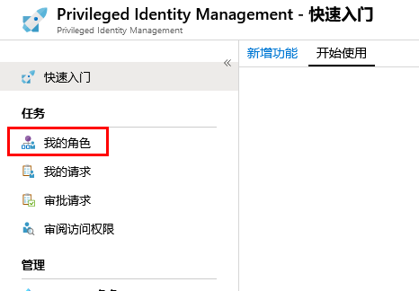

1.  **“激活”**全局管理员角色。

     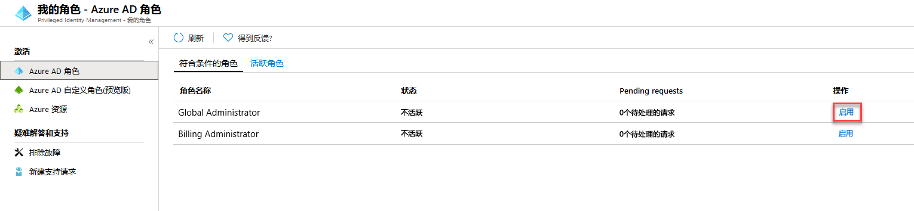

1.  使用向导验证 Isabella 的身份。

     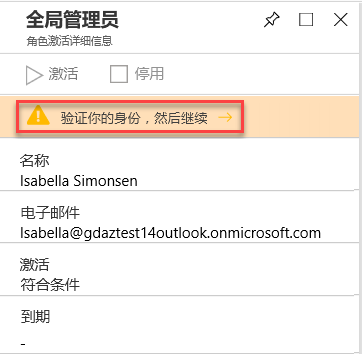

1.  在**“Azure AD 特权身份管理”**中返回**“我的角色”**。

1.  **“激活”**全局管理员角色。

1.  单击**“激活”**。

     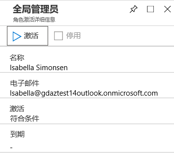

1.  输入理由**“我需要执行一些管理任务”**，然后单击**“激活”**。

     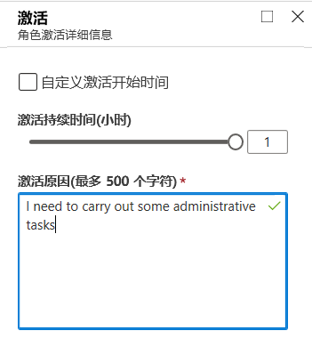


### 任务 3：批准或拒绝 PIM 中 Azure 资源角色的请求


通过 Azure AD 特权身份管理 (PIM)，你可以配置角色以要求批准激活，同时选择一个或多个用户或组作为委派批准者。请按照本文中的步骤批准或拒绝 Azure 资源角色的请求。


###### 查看待处理的请求


作为委派的批准者，当 Azure 资源角色请求正在等待你的批准时，你将收到一封电子邮件通知。你可以在 PIM 中查看这些待处理的请求。


1.  切换回你使用全局管理帐户登录的浏览器。

1.  打开**“Azure AD 特权身份管理”**。

1.  单击**“批准请求”**。

     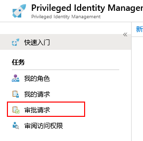

1.  单击来自 Isabella 的请求，然后单击**“批准”**。

     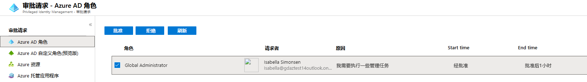

1.  输入原因**“同意执行该任务”**，然后单击**“批准”**。

      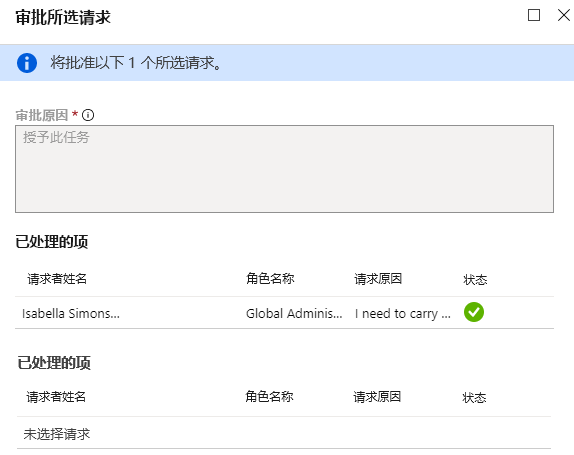

1.  随即显示一条通知，说明你已批准。

     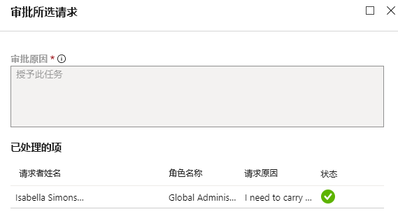

1.  切换回 Isabella 登录的个人浏览会话，然后单击我的角色，注意状态现已批准。

     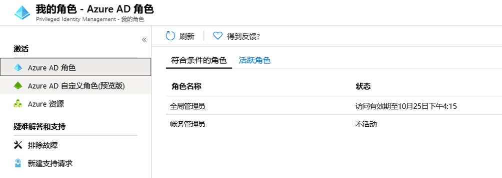

## 练习 6 - 查看PIM中 Azure AD 角色的审核历史


你可以使用Azure 活动目录 (Azure AD) 特权身份管理 (PIM) 审核历史，查看过去30天内所有特权角色的所有角色分配和激活情况。如果要查看目录中活动的完整审核历史，包括管理员、最终用户和同步活动，请按照下列步骤操作。


### 任务 1：查看审核历史


按照以下步骤查看 Azure AD 角色的审核历史。


1.  打开**“Azure AD 特权身份管理”**。

1.  选择**“Azure AD 角色”**。

1.  单击**“目录角色审核历史”**。

    系统将根据你的审核历史显示一个柱形图，包括总激活数、每天的最大激活数以及每天的平均激活数。

    页面底部将显示一个表，其中包含有关可用审核历史中每个操作信息。这些列具有以下含义：

    | 列 | 描述 |
    | --- | --- |
    | 时间 | 操作发生的时间。 |
    | 请求者 | 请求角色激活或更改的用户。如果值为**“Azure 系统”**，请查看 Azure 审核历史以获取更多信息。 |
    | 操作 | 请求者采取的行动。操作包括分配、取消分配、激活、停用或 PIM 外部添加。 |
    | 成员 | 正在激活或分配角色的用户。 |
    | 角色 | 用户已分配或已激活的角色。 |
    | 理由 | 激活期间在理由字段中输入的文本。 |
    | 到期时间 | 激活角色的到期时间。仅适用于合格的角色分配。 |

1.  要对审核历史进行排序，单击**“时间”**、**“操作”**和**“角色”**按钮。

### 任务 2：筛选审核历史

1.  在审核历史页面顶部，单击**“筛选”**按钮。

    屏幕中显示**“更新图表参数”**窗格。

1.  在**“时间范围”**中，选择一个时间范围。

1.  在**“角色”**中，为你要查看的角色添加复选标记。

1.  单击**“完成”**，查看筛选后的审核历史。


**“结果”**：现在你已经完成了本实验室教学。


