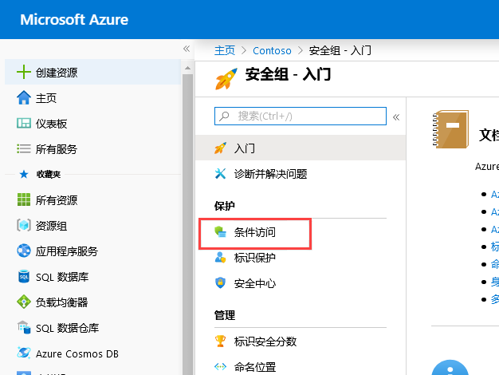
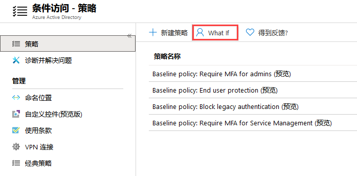
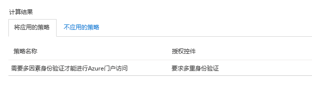
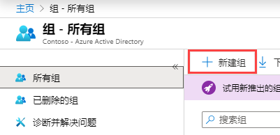
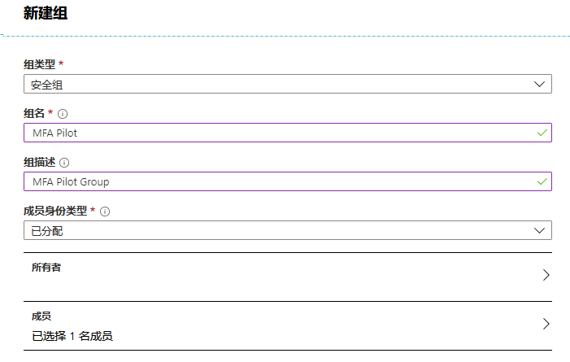

---
lab:
    title: '实验室教学 2：使用多重身份验证进行安全访问'
    module: '模块 1：管理身份和访问'
---

# 实验室教学 2：使用多重身份验证进行安全访问

在本模块中，你将学习如何通过多重身份验证 (MFA)，保护登录过程。你将学习 MFA 的工作原理以及本地和云场景之间的实现差异。你还将了解如何使用条件访问策略，对环境中的应用程序和资源进行更精细的控制。

- 引入多重身份验证
- 实施 MFA

# 实验室教学 2：使用多重身份验证进行安全访问

## 练习 1：MFA 身份验证试点（对具有 Azure 活动目录条件访问权限的特定程序要求 MFA）

### 任务 1：创建你的条件访问策略 

本节将介绍如何创建所需的条件访问策略。该场景使用：

- Azure 门户作为需要 MFA 的云应用程序的占位符。 
- 你的样本用户将测试条件访问策略。  

在你的策略中，设置：

|设置 |值|
|---     | --- |
|用户和组 | Isabella Simonsen |
|云应用 | Microsoft Azure 管理 |
|授予访问权 | 要求多重身份验证 |

 
1.  登录到 Azure 门户。

2.  在 Azure 门户的中心菜单上，在管理部分中单击**“安全”**。

3. 在**“安全 - 启动刀片服务器”**中，单击**“条件访问”**。

     
 
5.  在**“条件访问”**页面顶部的工具栏中，单击**“新策略”**。

    **注**：如果此按钮显示为灰色，请刷新浏览器会话页面。

6.  在**“新”**页面中的**“名称”**文本框中，键入**“需要 MFA 进行 Azure 门户访问”**。

7.  在**“分配”**部分，单击**“用户和组”**。

8.  在**“用户和组”**页面中，执行以下步骤：

    a. 单击**“选择用户和组”**，然后选择**“用户和组”**。

    b. 单击**“选择”**。

    c. 在**“选择”**页面，选择**“Isabella Simonsen”**，然后单击**“选择”**。

    d. 在**“用户和组”**页面，单击**“完成”**。

9.  单击**“云应用程序或操作”**。

10. 在**“云应用程序”**页面上，执行以下步骤：

    a. 单击**“选择应用程序”**。

    b. 单击**“选择”**。

    c. 在**“选择”**页面，选择**“Microsoft Azure 管理”**，然后单击**“选择”**。

    d. 在**“云应用程序”**页面上，单击**“完成”**。

11.  在**“访问控制”**部分，单击**“同意”**。

12.  在**“同意”**页面上，执行以下步骤：
     1. 选择**“同意访问”**。
     2.  选择**“需要多重身份验证”**。
     3.  单击**“选择”**。

13.  在**“启用策略”**部分，单击**“开启”**。

14.  单击**“创建”**。

### 任务 2：评估模拟登录

现在，你已经配置了条件访问策略，你可能想知道该策略能否按预期工作。第一步，使用条件访问确定策略工具如何模拟测试用户的登录。模拟将评估此登录对你策略的影响，并生成模拟报告。  

要初始化策略评估工具，设置：

- **“Isabella Simonsen”**为用户 
- **“Microsoft Azure管理”**为云应用程序

 单击**“模拟”**创建一个模拟报告，其中显示：

- **“适用策略”**中的**“需要 MFA 进行 Azure 门户访问”** 
- **“需要多重身份验证”**为**“同意控制”**。

1.  在条件访问-策略页面的顶部菜单中，单击**“模拟”**。  
 
     

2.  单击**“用户”**，选择**“Isabella Simonsen”**，然后单击**“选择”**。

3.  要选择云应用程序，请执行以下步骤：

    a. 单击**“云应用程序或操作”**。

    b. 在**“云应用程序页面”**，单击**“选择应用程序”**。

    c. 单击**“选择”**。

    d. 在**“选择”**页面，选择**“Microsoft Azure 管理”**，然后单击**“选择”**。

    e. 在云应用程序页面上，单击**“完成”**。

4.  单击**“模拟”**。

5.  注意结果，需要 MFA 进行 Azure 门户访问。

     

### 任务 3：测试你的条件访问策略

在上一节中，你已经学习了如何评估模拟登录。除了模拟外，你还应该测试你的条件访问策略，确保其按照预期工作。 

要测试你的策略，请尝试使用你的**“Isabella Simonsen”**测试账户登录到 Azure 门户**“https://portal.azure.com”**。你可以看到一个对话框，要求你设置帐户以进行其他安全验证。

## 练习 2：MFA 条件访问（完成 Azure 多重身份验证试点发布）

在本实验室教学中，你将逐步学习配置条件访问策略，在登录到 Azure 门户时启用 Azure 多重身份验证 (Azure MFA)。该策略已部署到特定的试点用户组并使用这些用户进行了测试。与传统的强制方法相比，使用条件访问部署 Azure MFA 为组织和管理员提供了显着的灵活性。

- 启用 Azure 多重身份验证
- 测试 Azure 多重身份验证

### 任务 1：启用 Azure 多重身份验证

1.  返回以全局管理员帐户身份登录的 Azure 门户。

1.  在中心菜单上单击**“Azure 活动目录”**。

1.  单击**“组”**，然后单击**“+ 新组”**。

     

1.  输入以下信息，然后单击**“创建”**：

      * 组类型；**“安全”**
      * 组名：**“MFA 试点”**
      * 组说明：**“MFA 试点组”**
      * 成员类型：**“已分配”**
      * 成员：选择**“Isabella”**
  
  
      
  
2.  浏览到**“Azure 活动目录”**，单击安全，然后在**“安全”**刀片服务器上选择**“条件访问”**。

 

3.  选择**“+ 新策略”**。

 

4.  将你的策略命名为**“MFA 试点”**
5.  在**“用户和组”**中，选择**“选择用户和组”**复选框。
    * 选择你的试点组**“MFA 试点”**。
    * 单击**“选择”**
    * 单击**“完成”**
     
6.  在**“云应用程序或操作”**中，选择**“选择应用程序”**单选按钮
    * Azure 门户的云应用程序为**“Microsoft Azure 管理”**
    * 单击**“选择”**
    * 单击**“完成”**
     
7.  跳过**“条件”**部分
8.  在**“同意”**中，确保**“同意访问”**单选按钮已选中
    * 选中**“需要多重身份验证”**复选框
    * 单击**“选择”**
     
9.  跳过**“会话”**部分
10. 将**“启用策略”**设置为**“开启”**
11. 单击**“创建”**

### 任务 2：测试 Azure 多重身份验证

为了证明你的条件访问策略有效，你需要测试登录到不需要 MFA 的资源，然后登录到需要 MFA 的 Azure 门户。

1.  在隐私模式或匿名模式下打开新的浏览器窗口，然后浏览**“https://account.activedirectory.windowsazure.com”**
    * 使用作为本文前提条件部分的已创建测试用户登录，请注意，系统不应要求你完成 MFA。
    * 关闭浏览器窗口。

2.  在隐私模式或匿名模式下打开新的浏览器窗口，然后浏览到**“https://portal.azure.com”**

       * 使用作为本文前提条件部分的已创建测试用户登录，请注意，你不需要注册使用 Azure 多重身份验证。
       * 关闭浏览器窗口。

| 警告：在继续之前，你应该删除此实验室教学使用的所有资源。  为此，应在**“Azure 门户”**中，单击**“资源组”**。  选择你创建的任何资源组。  在资源组刀片服务器上，单击**“删除资源组”**，输入资源组名，然后单击**“删除”**。  对你创建的任何其他资源组重复该过程。**“否则可能会导致其他实验室教学出现问题”**。 |
| --- |

**“结果”**：现在你已经完成了本实验室教学。
