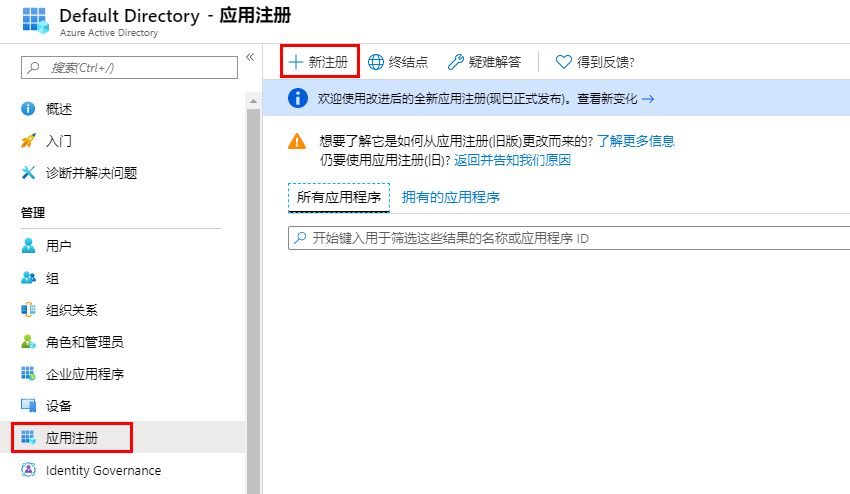
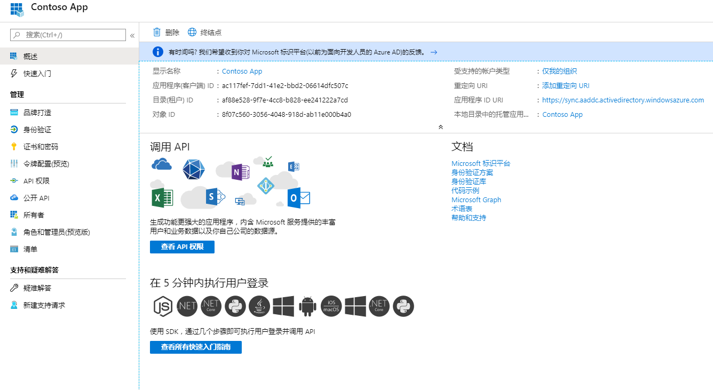

---
lab:
    title: '实验室教学 3：应用程序注册'
    module: '模块 1：管理身份和访问'
---

# 实验室教学 3：应用程序注册

**场景**

企业开发人员和软件即服务 (SaaS) 提供商可以开发商业云端服务或业务线应用程序，这些应用程序可与 Microsoft 身份平台集成，以便为其服务提供安全登录和授权。

本实验室教学向你展示如何使用 Azure 门户中的应用程序注册添加并注册应用程序，确保你的应用程序能够与 Microsoft 身份平台集成。

## 练习 1：申请注册

### 任务 1：使用 Azure 门户注册新应用程序

1.  登录到 Azure 门户。

1.  在左侧导航窗格中，选择**“Azure 活动目录”**服务，然后选择**“应用注册>新注册”**。

     

1.  显示**“注册一个新应用”**页面时，输入你申请的注册信息：

       - **“名义”** - 输入：**Contoso 应用程序**
       - **“支持的账户类型”** - 选择**“仅此组织目录中的帐户”**（阅读下面的选项）。

       | 支持的帐户类型 | 说明 |
       |-------------------------|-------------|
       | **仅此组织目录中的帐户** | 如果要构建业务线 (LOB) 应用程序，请选择此选项。如果你不在目录中注册应用，则此选项不可用。   此选项映射到 Azure AD 仅单租户。   除非你在目录外注册应用，否则这是默认选项。如果应用程序在目录外注册，则默认为 Azure AD 多租户和个人 Microsoft 帐户。 |
       | **任一组织目录中的帐户** | 如果要定位所有商业和教育客户，请选择此选项。   此选项仅映射到 Azure AD 仅多租户。   如果将应用程序注册为 Azure AD 仅单租户，你可以将其更新为 Azure AD 多租户，然后通过**“身份验证”**刀片服务器返回单租户。 |
       | **任一组织目录中的帐户和个人 Microsoft 帐户** | 选择此选项可定位最广泛的客户。   此选项映射到 Azure AD 多租户和个人 Microsoft 帐户。   如果将应用程序注册为 Azure AD 多租户和个人 Microsoft 帐户，则无法在 UI 中更改此设置。相反，你必须使用应用程序清单编辑器来更改支持的帐户类型。 |

       - **“重定向 URI（可选）”** - 选择**“网页”**，然后输入**“https://app.contoso.com”**
         - 对于网络应用程序，提供应用程序的基本 URL。例如，`http://localhost:31544`可能是本地计算机上运行的网络应用程序的 URL。用户将使用此 URL 登录网络客户端应用程序。
         - 对于公共客户端应用程序，请提供 Azure AD 用于返回令牌响应的 URI。输入一个特定于你的应用的值，例如`myapp://auth`。
 

1.  完成后，选择`“注册”**。

1.  Azure AD 将为你的应用分配一个唯一的应用（客户端）ID，然后你将进入应用的`“概览”**页面。要向你的应用程序添加其他功能，可以选择其他配置选项，包括品牌、证书和机密、API权限等。

     
 

**“结果”**：现在你已经完成了本实验室教学。

