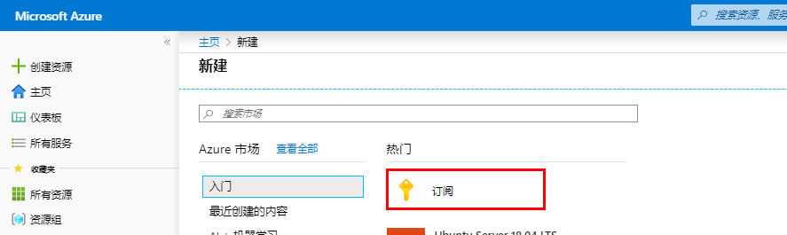
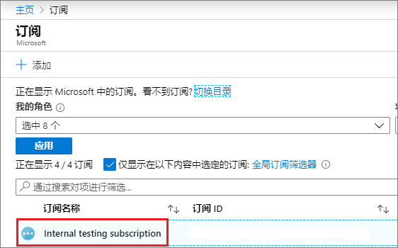
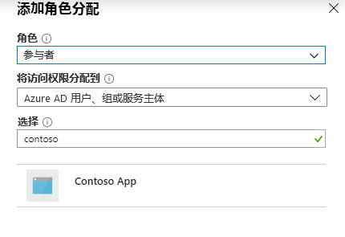
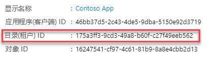
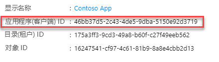
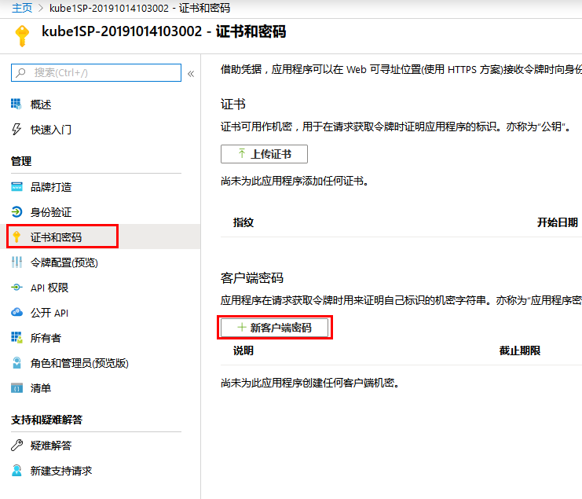
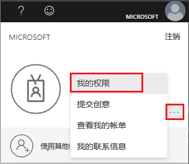
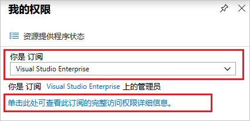
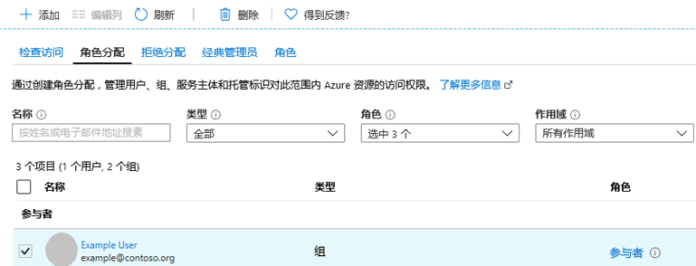

---
lab:
    title: '实验室教学 4 - 应用程序服务主体'
    module: '模块 1：管理身份和访问'
---

# 实验室教学 4 - 应用程序服务主体

**场景**

本实验室教学向你展示如何创建可与基于角色的访问控制一起使用的新 Azure 活动目录 (Azure AD) 应用程序和服务主体。当你拥有需要访问或修改资源的代码时，可以为该应用程序创建一个身份。此身份称为服务主体。然后，你可以将所需的权限分配给服务主体。本文将为你介绍如何使用门户网站创建服务主体。重点介绍了单租户应用程序，即该应用程序仅在一个组织内运行。通常，你会在组织内业务线应用程序中使用单租户应用程序。

## 练习 1：使用门户创建可以访问资源的服务主体

你可以在订阅级别设置范围：资源组或资源。权限继承到较低的范围级。例如，将应用程序添加到资源组的读取者角色意味着该应用程序可以读取该资源组及其中的任何资源。

### 任务 1：将应用程序分配给角色

1.  导航到你希望分配应用程序的范围级别。例如，要在订阅范围内分配角色，请选择**“所有服务”**和**“订阅”**。

       

1.  选择你的订阅。

       

1.  选择**“访问控制 (IAM)”**。
1.  选择**“添加”**，然后选择**“添加角色分配”**。
1.  选择你希望分配到应用程序的参与者角色。为确保应用程序执行**“重启”**、**“启动”**和**“停止”**实例等操作，选择**“参与者”**角色。默认情况下，可用选项中不显示 Azure AD 应用程序。要找到你的应用程序，请搜索**“Contoso 应用程序”**名并选定。

     

1.  选择**“保存”**，完成角色分配。你会在分配给该范围的角色用户列表中看到你的应用程序。

你的服务主体已设置。你可以开始使用该服务主体运行脚本或应用程序。下一部分将说明如何在以编程方式登录时获取所需的值。

### 任务 2：获取值进行登录

以编程方式登录时，你需要在身份验证请求中通过租户 ID。你还需要应用程序 ID 和身份验证密钥。要获取这些值，请参考以下步骤：

1.  选择**“Azure 活动目录”**。
1.  在 Azure AD **“应用程序注册”**中，选择**“Contoso 应用程序”**应用程序。
1.  复制目录（租户）ID 并将其存储在你的应用程序代码中。

       

1.  复制**“申请 ID”**并将其存储在你的应用程序代码中。

       

### 任务 3：创建一个新应用程序密钥

你可以选择证书或应用程序密钥。  在此任务中，你将创建一个应用程序密钥。

1.  选择**“证书和密钥”**。
1.  选择**“客户端密钥->新客户端密钥”**。
 
     

1.  提供有关密钥的描述和有效期。完成后，选择**“添加”**。

保存客户端密钥后，将显示客户端密钥值。复制此值，因为以后你将无法检索密钥。提供具有应用程序 ID 的密钥值，登录应用程序。将密钥值存储在应用程序可以检索的位置。

  
### 任务 4：检查 Azure AD 权限

1.  选择**“Azure 活动目录”**。

1.  选择**“用户设置”**。
1.  检查**“应用程序注册”**设置。该值只能由管理员进行设置。如果设置为**“是”**，则 Azure AD 租户中的任何用户都可以注册应用程序。

 如果应用程序注册设置设置为**“否”**，则只有具有管理员角色的用户才能注册这些类型的应用程序。

### 任务 5：检查 Azure 订阅权限

在 Azure 订阅中，你的帐户必须具有`Microsoft.Authorization/*/Write`访问权限，才能将 AD 应用程序分配给角色。此操作是通过所有者角色或用户访问管理员授予的。

要检查你的订阅权限：

1.  在右上角选择你的帐户，然后选择......-> 我的权限。

       

1.  在下拉列表中，选择要在其中创建服务主体的订阅。然后，选择**“单击此处查看此订阅的完整访问详细信息”**。

       
   
1.  选择**“角色分配”**，查看分配的角色，并确定你是否具有足够的权限将 AD 应用程序分配给角色。如果没有，你需要请求你的订阅管理员将你添加到用户访问管理员角色。在下图中，将用户分配给所有者角色，这意味着该用户拥有足够的权限。

       
   

**“结果”**：现在你已经完成了本实验室教学。

