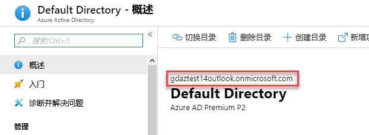
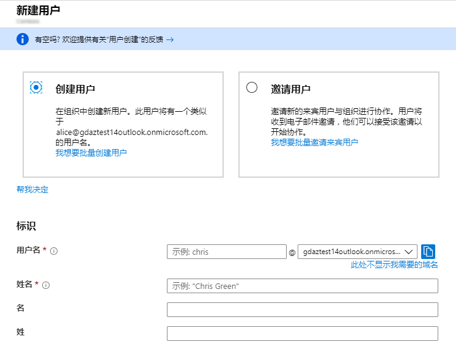
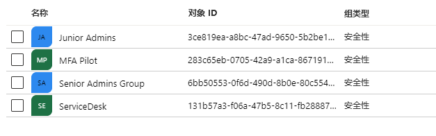
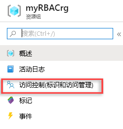
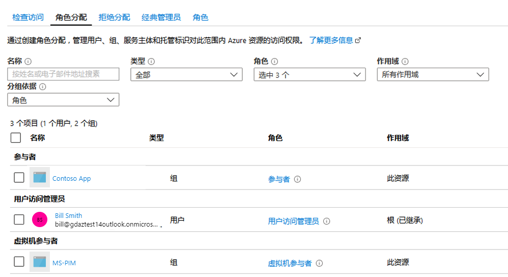

---
lab:
    title: '实验室教学 5：Azure 中的身份保护介绍'
    module: '模块 1：管理身份和访问'
---

# 模块 1：管理身份和访问 


**场景**

在本模块中，你将学习基于角色的访问控制，这是基于最少特权原则组织并管理组织管理访问的基础。你还将了解 Azure 活动目录概念，并深入了解由于违反特权访问而对IT组织造成的威胁情况和安全风险。课程包括：

- 基于角色的访问控制
- Azure 活动目录（复习）
- 保护环境中的特权访问

# 实验室教学 5：Azure 中的身份保护介绍

## 练习 1：基于角色的访问控制

### 任务 1：创建一个用户

1.  登录 Azure 门户**`https://portal.azure.com/`**

1.  选择**“Azure 活动目录”**并在概览刀片服务器上记下你的租户域。

     

1.  选择**“用户”**，然后选择**“新用户”**。


3.  在**“用户”**页上，使用以下信息填充刀片服务器：

      - **“用户名”**：bill
      - **“姓名”**： Bill Smith


     

4.  显示**“密码”**框中提供的自动生成的密码。你需要将此密码提供给用户，以执行初始登录过程。
  
  

5.  选择**“创建”**。

    用户已创建并添加到你的 Azure AD 租户。

8.  通过单击 Azure 门户顶部的 PowerShell 图标，然后在出现提示时选择 PowerShell，发布**“Azure Cloud Shell”**。

  
9.  **“输入以下命令”**，在 PS Cloud Shell**“取代你的域”**中，使用你之前记下的域创建一个用户

     ```powershell
      $PasswordProfile = New-Object -TypeName Microsoft.Open.AzureAD.Model.PasswordProfile
      ```
       ```powershell
      $PasswordProfile.Password = "Pa55w.rd"
      ```
       ```powershell
      New-AzureADUser -DisplayName "Mark" -PasswordProfile $PasswordProfile     -UserPrincipalName "Mark@yourdomain.onmicrosoft.com" -AccountEnabled $true -MailNickName "Mark"

     ```
 
     

10.  运行以下命令，获取 Azure AD 中的用户列表 

      ```powershell
      Get-AzureADUSer 
      ```
 
11.  使用下拉菜单，将 Azure Cloud Shell 更改为带有 Bash 的 Azure CLI 模式

     

12.  在**“Azure CLI”**中输入以下命令，在 Azure CLI**“取代你的域”**中，使用你之前记下的域，创建一个用户
 
       ```cli
      az ad user create --display-name Tracy --password Pa55w.rd --user-principal-name Tracy@yourdomain.onmicrosoft.com
       ```


现在，你的 Azure AD 中应该有 3 个用户


### 任务 2：在门户、PowerShell 和 CLI 中创建组

1.  在 Azure 门户的**“Azure AD 刀片服务器”**上单击**“Azure 活动目录”**，之后单击**“组”**并选择**“新建组”**。
 
16.  使用以下详细信息填写详细信息：
  
       - **“组类型”**：安全
       - **“组名”**：高级管理组 
    
17.  单击**“成员”**，然后选择**“Bill”**

18.  单击**“创建”**

1.  通过单击 Azure 门户顶部的 PowerShell 图标，发布**“Cloud Shell Bash”**。

19.  在**“Cloud Shell”**中，输入以下命令：

       ```cli
      az ad group create --display-name ServiceDesk --mail-nickname ServiceDesk
       ```

20.  将 Cloud Shell 更改为**“PowerShell”**并输入以下命令：

       ```powershell
      New-AzureADGroup -DisplayName "Junior Admins" -MailEnabled $false -SecurityEnabled $true -MailNickName JuniorAdmins
       ```
 
1.  退出**“Cloud Shell”**。

21.  在**“活动目录刀片服务器”**中，单击**“组”**并确认你有**“4”**个组

     


## 练习 2：练习 - RBAC

### 任务 1：创建资源组

1.  在导航列表中，选择**“资源组”**。

1.  选择**“添加”**，打开**“资源组”**刀片服务器。

1.  对于**“资源组名”**，输入**“myRBACrg”**

1.  选择你的订阅和**“美国东部”**位置。

1.  选择**“创建”**，创建资源组。

1.  选择**“刷新”**，刷新资源组列表。

   新资源组将显示在资源组列表中。

### 任务 2：授予访问权


在 RBAC 中，要授予访问权限，你需要创建角色分配。


1.  在**“资源组”**列表中，选择新的**“myRBACrg”**资源组。

1.  选择**“访问控制 (IAM)”**，查看当前角色分配列表。

       

1.  选择**“添加”**，打开**“添加角色分配”**窗格。

    如果你没有分配角色的权限，则不会看到**“添加”**选项。

1.  在**“角色”**下拉列表中，选择**“虚拟机参与者”**。

1.  在**“选择”**列表，选择**“Bill Smith”**。

1.  选择**“保存”**，创建角色分配。

   片刻之后，在rbac-quickstart-resource-group资源组范围内为用户分配了虚拟机参与者角色。

  
### 任务 3：删除访问权限


在 RBAC 中，要删除访问权限，请删除角色分配。


1.  单击角色分配选项卡。

1.  在角色分配列表中，在具有虚拟机参与者角色的用户旁边添加一个复选标记。
  
      

1.  选择**“删除”**。

1.  在显示的删除角色分配消息中，选择**“是”**。  
   
  
## 练习 3：  使用 PowerShell 的基于角色的访问控制 (RBAC)


在本练习中，你将使用 PowerShell：

-   使用 Get-AzureRMRoleAssignment 命令列出角色分配
-   使用 Remove-AzureRmResourceGroup 命令删除访问权限


### 任务 1：授予访问权
  

要授予用户访问权限，请使用New-AzureRmRoleAssignment命令分配角色。你必须指定安全主体、角色定义和范围。  


1.  启动**“Cloud Shell PowerShell”**。
  
1.  使用**“Get-AzureRmSubscription”**命令获取你的订阅 ID。
  
       ```powershell
      Get-AzureRmSubscription
       ```

  
1.  将订阅范围保存在变量中，将000000替换为你的订阅 ID。
  
       ```powershell
      $subScope = "/subscriptions/00000000-0000-0000-0000-000000000000" 
       ```  
  

  
1.  使用下列命令（将你的域替换为你前面记下的租户域），在订阅范围内为用户分配读取者角色。
  
       ```powershell
      New-AzureRmRoleAssignment -SignInName bill@yourdomain.onmicrosoft.com -RoleDefinitionName "Reader" -Scope $subScope  
       ```
  
      
  
1.  使用以下命令，在资源组域中将参与者角色分配给用户：
  
       ```powershell
      New-AzureRmRoleAssignment -SignInName bill@yourdomain.onmicrosoft.com -RoleDefinitionName "Contributor" -ResourceGroupName "myRBACrg"
       ```

  
### 任务 2：列出访问权限  
  
1.  要验证订阅的访问权限，请使用 Get-AzureRmRoleAssignment 命令使用列出角色分配：
  
       ```powershell
      Get-AzureRmRoleAssignment -SignInName bill@yourdomain.onmicrosoft.com -Scope $subScope
       ```

       

    在输出中，你可以看到在订阅范围内已将读取者角色分配给 RBAC 教程用户。

2.  要验证对资源组的访问，请使用 Get-AzureRmRoleAssignment 命令列出角色分配：
  
     ```powershell
    Get-AzureRmRoleAssignment -SignInName bill@yourdomain.onmicrosoft.com     -ResourceGroupName "myRBACrg"
     ```


 在输出中，你可以看到参与者和读取者角色均已分配给 RBAC 教程用户。参与者角色在 rbac-tutorial-resource-group 范围内，而读取者角色在订阅范围内继承。

### 任务 3：删除访问权限
  

要删除用户、组和应用程序的访问权限，请使用 Remove-AzureRmRoleAssignment 命令删除角色分配。


1.  使用以下命令在资源组范围中删除用户的参与者角色分配。
  
     ```powershell
    Remove-AzureRmRoleAssignment -SignInName bill@yourdomain.onmicrosoft.com -RoleDefinitionName "Contributor" -ResourceGroupName "myRBACrg"
     ```
  
  
1.  使用以下命令在订阅范围内删除用户的读取者角色分配。

     ```powershell
    Remove-AzureRmRoleAssignment -SignInName bill@yourdomain.onmicrosoft.com -RoleDefinitionName "Reader" -Scope $subScope
     ```
  
  
1.  通过运行以下命令来删除资源组（提示你确认时，请按 Y 并按 Enter）：
  
     ```powershell
    Remove-AzureRmResourceGroup -Name "myRBACrg"
     ```

1.  关闭**“Cloud Shell”**。  


**“结果”**：现在你已经完成了本实验室教学。
