---
lab:
    title: '实验室教学 6：Azure Policy'
    module: '模块 1：管理身份和访问'
---

# 模块 1：管理身份和访问 

你的企业标准和服务水平协议。在本实验室教学中，你将学习如何使用 Azure Policy 执行与整个组织中创建、分配和管理策略相关的一些更常见的任务，例如：

> - 分配策略以强制实施你将来要创建的资源条件
> - 创建并分配计划定义以跟踪多个资源的合规性
> - 解决不合规或被拒绝的资源
> - 在整个组织中实施新策略


## 实验室教学 6：Azure Policy

### 练习 1：了解如何在 Azure 中创建并管理策略对于维持合规性非常重要

### 任务 1：分配策略


强制遵守 Azure 策略的第一步是分配策略定义。策略定义确定了在哪些条件下强制执行策略以及有哪些效果。在本示例中，分配一个内置策略定义，称为“Require SQL Server version 12.0”**，以强制实施所有SQL服务器数据库必须满足v12.0的条件。


1.  在 Azure 门户中，单击**“所有服务”**，然后搜索并选择**“策略”**，发布 Azure Policy 服务。

    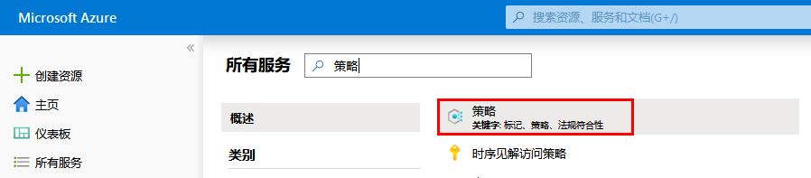

2.  在 Azure Policy 页面的左侧选择**“分配”**。分配是一项
   已分配为在特定范围内执行的策略。

    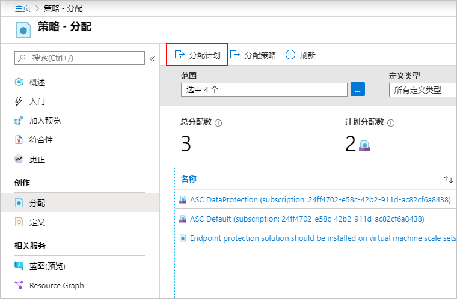

3.  在**“策略 - 分配”**页面顶部，选择**“分配策略”**。

    

4.  在**“分配策略”**页面上，通过单击省略号并选择管理组或订阅，选择**“范围”**。我们选择一个资源组。范围确定了执行策略分配的资源或资源组。然后在**“范围”**页面底部单击**“选择”**。

    本示例使用**“Contoso”**订阅。你的订阅会有所不同。

5.  可以根据**“范围”**排除资源。**“排除资源”**以低于**“范围”**的一个水平开始执行。**“排除资源”**是可选的，因此暂时将其留空。

6.  选择**“策略定义”**省略号，打开可用定义的列表。你可以筛选策略定义**“类型”**为*“内置”*，查看所有内容并读取其描述。

7.  选择**“Require SQL Server version 12.0”**。如果你无法立即找到它，请在搜索框中键入**“require sql server”**，然后按 ENTER 或在搜索框中单击。找到并选择策略定义后，在**“可用定义”**页面底部，单击**“选择”**。

    

1.  **“分配名”**会自动以你选择的策略名填充，但是你可以对其进行更改。对于此示例，保留*“Require SQL Server version 12.0”*。你还可以添加可选**“描述”**。该描述提供有关此策略分配的详细信息。**“分配者”**会根据登录者自动填充。此字段是可选的，因此可以输入自定义值。

1.  不选中**“创建托管身份”**复选框。当所分配的策略或计划包括具有以下**`deployIfNotExists`**影响的策略时，“必须”__选中该复选框。由于本教程使用的策略没有此类影响，因此请将其留空。 

1.  单击**“分配”**。

### 任务 2：实施一个新的自定义策略

现在，你已经分配了内置策略定义，你可以使用 Azure Policy 做更多的事情。接下来，创建新的自定义策略，通过验证你的环境中创建的 VM 不在 G 系列中来节约成本。这样，组织中的用户每次尝试在 G 系列中创建 VM 时，该请求都会被拒绝。

1.  在 Azure Policy 页面左侧，选择**“创作”**下的**“定义”**。

    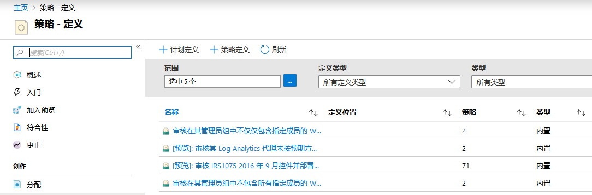
  
1.  在页面顶部选择**“+ 策略定义”**。此按钮打开到**“策略定义”**页面。

1.  输入下列信息。

    - 保存策略定义的管理组或订阅。使用
     **“定义位置”**上的省略号选择。

       **注**：如果你计划将此策略定义应用于多个订阅，则该位置必须是一个管理组，其中包含你分配策略的订阅。计划定义也是如此。


    - 策略定义的名称 - *Require VM SKUs smaller than the G series*
    - 策略定义的目的说明 - *此策略定义
     强制在此范围内创建的所有 VM 的 SKU 均小于 G 系列，以减少
     成本。*
    - 从现有选项（例如_Compute_）中选择，或为此策略定义
     创建一个新类别。
    - 复制以下 JSON 代码，然后通过以下方式对其进行更新：
      - 策略参数。
      - 策略规则/条件，在这种情况下 - VM SKU 大小等于 G 系列
      - 策略效果，在这种情况下 - **“拒绝”**。

    这是 JSON 的状态。将修改后的代码粘贴到 Azure 门户。

   ```json
   {
       "policyRule": {
           "if": {
               "allOf": [{
                       "field": "type",
                       "equals": "Microsoft.Compute/virtualMachines"
                   },
                   {
                       "field": "Microsoft.Compute/virtualMachines/sku.name",
                       "like": "Standard_G*"
                   }
               ]
           },
           "then": {
               "effect": "deny"
           }
       }
   }
   ```

  
   策略规则中的*“字段”*属性必须是以下值之一：名称、类型、位置、标签或别名。别名的示例为**“Microsoft.Compute / VirtualMachines / Size”**

4.  选择**“保存”**。

### 任务 3：创建并分配计划定义

使用计划定义，你可以将多个策略定义分组，以实现一个总体目标。一项计划会评估分配范围内的资源是否符合纳入策略。 


1.  在 Azure Policy 页面左侧，选择**“创作”**下的**“定义”**。

    

1.  在页面顶部选择**“+ 计划定义”**，打开**“计划定义”**
   页面。

    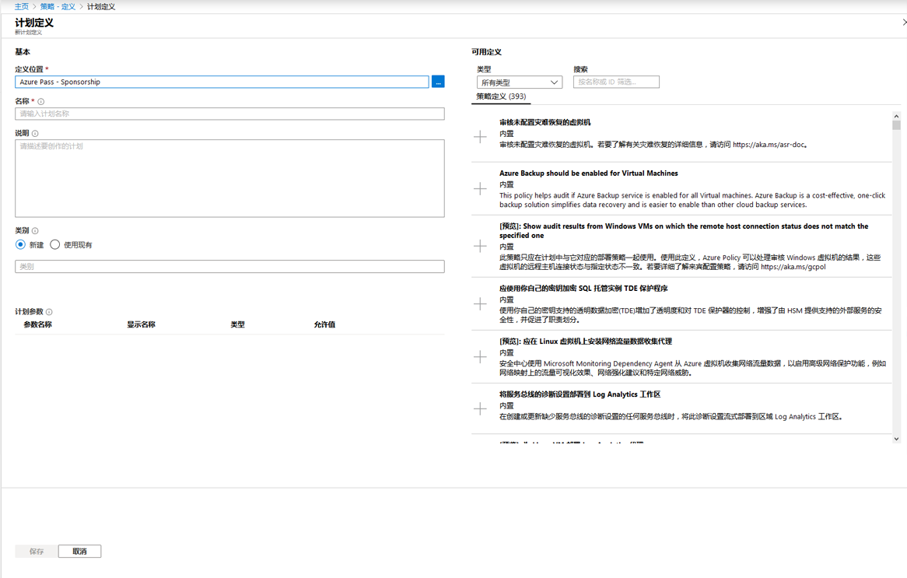

1.  使用**“定义位置”**省略号，选择管理组或订阅，存储定义。如果上一页的范围是单个管理组或订阅，**“定义位置”**将自动填充。

1.  输入计划的**“名称”**和**“描述”**。

    此示例验证了资源是否符合有关获取安全性的策略定义。将计划命名为**“获取安全性”**并将说明设置为：**“创建该计划是为了处理与保护资源相关的所有策略定义”**。

1.  对于**“类别”**，从现有选项中选择或创建新类别。

1.  浏览**“可用定义”**列表（**计划定义**页面
   的右半部分），然后选择要添加到该计划中的策略定义。对于**获取
   安全性**定义，通过单击策略定义信息旁边的**“+”**，添加以下内置策略定义，
   或者策略定义行然后单击详细信息页面中的**“+ 添加”**
   选项：

    - Require SQL Server version 12.0
    - [预览]：在安全中心中监视不受保护的网络应用程序。
    - [预览]：在安全中心中监视允许的网络。
    - [预览]：在安全中心中监视可能的应用程序白名单。
    - [预览]：在安全中心中监视未加密的 VM 磁盘。

    从列表中选择策略定义后，其添加到**“策略和参数”**中。

    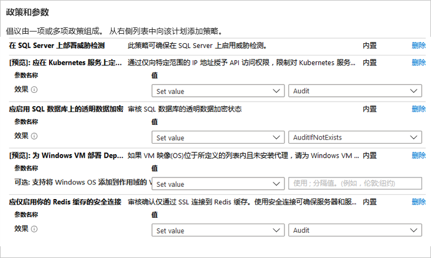

1.  如果要添加到计划中的策略定义包含参数，则这些参数会显示在
   **“策略和参数”**区域的策略名中。“值”__可以设置为“设定值”
   （针对该计划的所有分配进行硬编码）或“使用计划参数”（在
   每个计划分配期间设定）。如果选定“设定值”，则可在“值”__右侧的下拉菜单中
   输入或选择值。如果选定“使用计划参数”，则显示新
   **“计划参数”**部分，你可以由此定义计划分配期间设定的
   参数。此计划参数上的允许值将进一步
   限制计划分配期间可以设置的内容。

    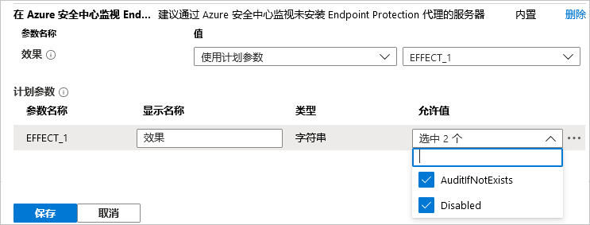

    **注**：对于某些“strongType”参数，无法自动确定值列表。在这些情况下，参数行的右侧会出现一个省略号。单击省略号会打开“参数范围 (&lt;parameter name&gt;)”页面。在此页面上，选择用于提供值选项的订阅。此参数范围仅在创建计划定义期间使用，并且对策略评估或分配后的计划范围没有影响。

2.  单击**“保存”**。

### 任务 4：分配计划定义

1.  在 Azure Policy 页面左侧，选择**“创作”**下的**“定义”**。

1.  找到你先前创建的**“获取安全性”**计划定义，然后单击。在页面顶部选择**“分配”**，打开**“获取安全性”：“分配计划”**页面。

    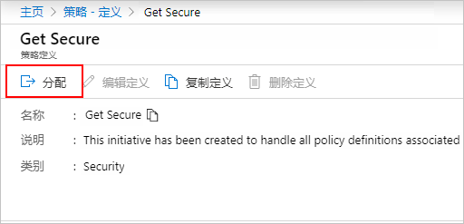
  
    你也可以右键单击所选的行，或者左键单击该行末尾的省略号，获取上下文菜单。然后选择**“分配”**。

    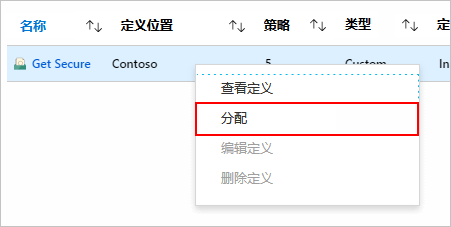

1.  填写**“获取安全性”：“分配计划”**页面，输入以下示例信息。你可以使用自己的信息。

    - 范围：你保存计划的管理组或订阅将成为默认设置。你可以更改范围，将计划分配给保存位置中的订阅或资源组。
    - 排除资源：在范围内配置任一资源，防止将计划分配应用于这些资源。
    - 计划定义和分配名称：获取安全性（预先填充为要分配的计划名称）。
    - 说明：主动分配此任务是为了强制执行这组策略定义。
    - 分配者：根据登录者自动填充。此字段是可选的，因此可以输入自定义值。

2.  不选中**“创建托管身份”**复选框。当所分配的策略或计划包括具有以下**`deployIfNotExists`**影响的策略时，“必须”__选中该复选框。由于本教程使用的策略没有此类影响，因此请将其留空。 

3.  单击**“分配”**。

### 任务 5：检查初始合规性

1.  在 Azure Policy 页面左侧，选择**“合规性”**。

1.  找到**“获取来源”**计划。该计划可能处于“未开始”__的**“合规状态”**。单击计划以获取有关分配进度的完整详细信息。

     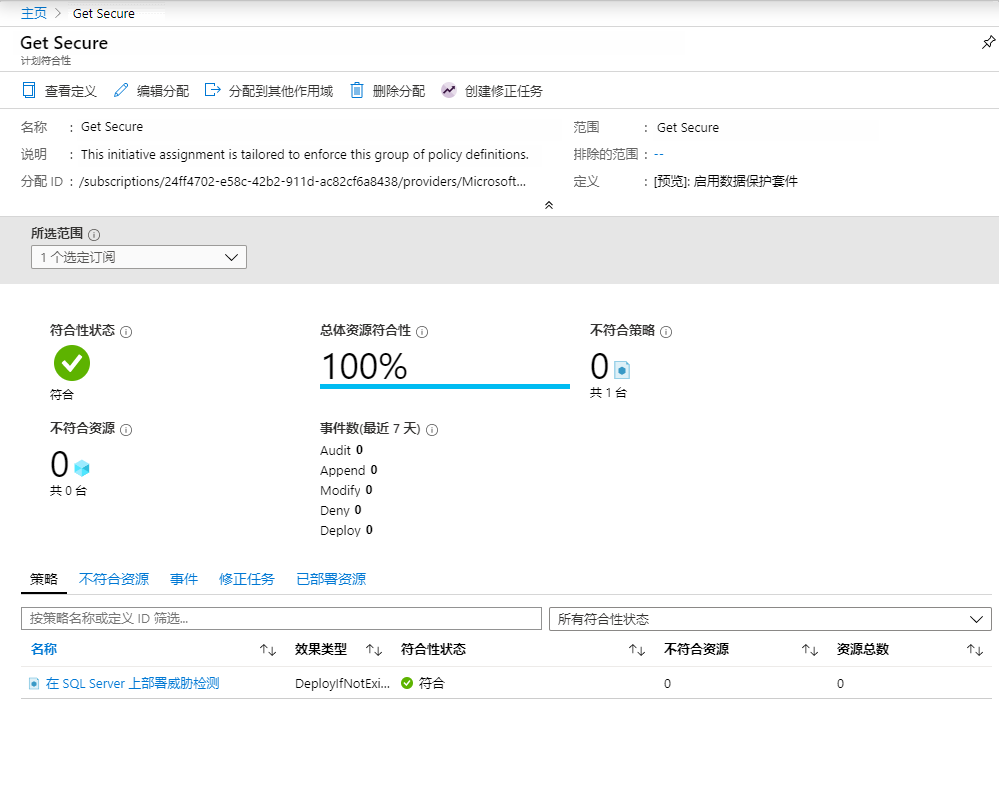

1.  计划分配完成后，合规性页面将更新为“合规”__的**“合规状态”**。

     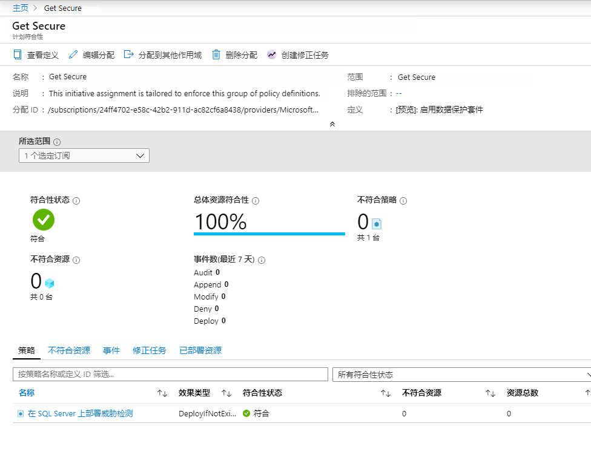

1.  单击计划合规性页面上的任一策略，将打开该策略的
   合规性详细信息页面。该页面提供了合规性资源级别的详细信息。

### 任务 6：使用排除豁免不合规或拒绝的资源

按照上面的示例，在将策略定义分配为 require SQL server version 12.0 之后，使用非 12.0 的其他版本创建的 SQL 服务器将被拒绝。在此任务中，你将通过在单个资源组上创建排除资源来解决创建 SQL 服务器的拒绝请求。排除资源会阻止对策略（计划）对该资源的强制执行。在以下示例中，可单个资源组中使用任何 SQL 服务器版本。排除资源可应用于订阅、资源组，也可以将排除资源范围缩小到单个资源。


可以在两个位置查看分配策略或计划阻止的部署：

- 在部署目标的资源组上：在页面的左侧选择**“部署”**，然后单击失败部署的**“部署名”**。列出被拒绝的资源，其状态为“禁止”__。要确定拒绝资源的策略或计划和分配，单击**“失败”**、在部署概览页面上，选择**“单击此处了解详细信息->”**。在页面右侧打开一个窗口，显示错误信息。在**“错误详细信息”**中，显示了相关策略对象的 GUID。

  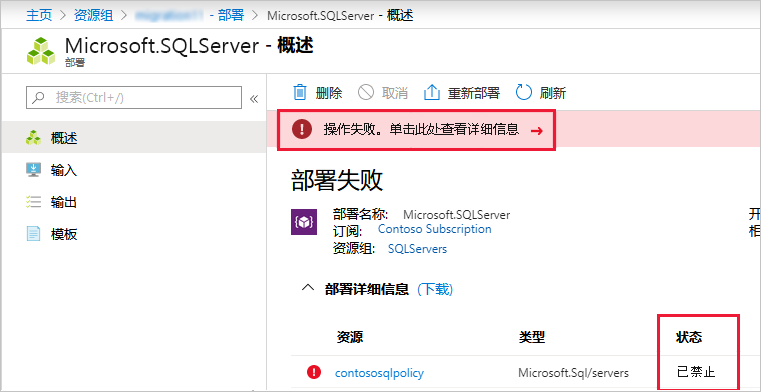

- 在 Azure 策略页面上：在页面左侧选择**“合规”**，然后单击**“Require SQL Server version 12.0”**策略。在打开的页面上，你会看到**“拒绝”**计数增加。在**“事件”**选项卡中，你还将看到谁尝试了该策略拒绝的部署。

 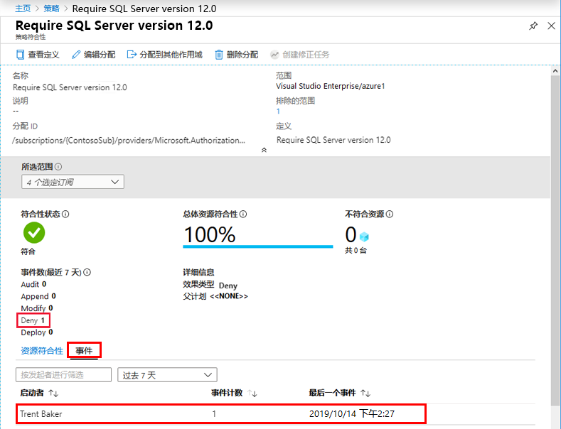

在此示例中，Contoso 的高级虚拟化专家之一 Trent Baker 正在执行所需的工作。我们需要授予 Trent 一个例外，但是我们不希望任何资源组中的非版本 12.0 SQL 服务器都可以使用。我们创建了一个新的资源组，**“SQLServers_Excluded”**，并且现在将授予该策略分配例外情况。

### 任务 7：使用排除资源更新分配

1.  在 Azure Policy 页面左侧，选择**“创作”**下的**“分配”**。

2.  浏览所有策略分配，然后打开*“Require SQL Server version 12.0”*分配。

3.  通过单击省略号并选择要排除的资源组，设置**“排除资源”**，
   本示例为“SQLServers_Excluded”**。

    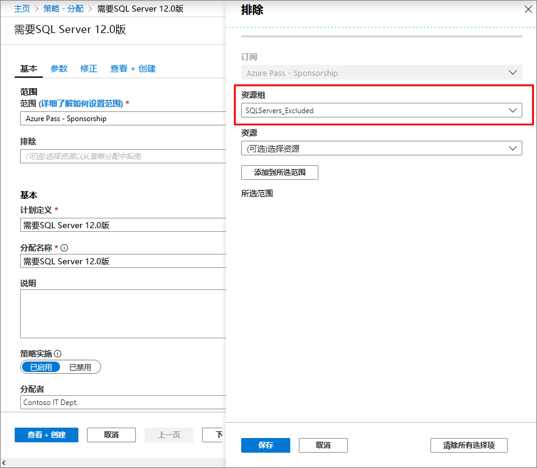

    **注**：  根据策略及其影响，也可以将排除授予分配范围内资源组中的特定资源。作为本教程中使用的一个**“拒绝”**影响，在已经存在的特定资源上设置排除资源是没有意义的。
@@@

1.  单击**“选择”**，然后单击**“保存”**。

在本节中，你将通过在单个资源组上创建排除资源来解决拒绝的请求。


### 任务 8：清理资源

现在，你已经完成了本实验室教学中资源的处理，请按照以下步骤删除上面创建的任何分配或定义：


1.  在 Azure Policy 页面的左侧，选择**“创作”**下方的**“定义”**（如果你要删除分配，则选择**“分配”**）。

1.  搜索要删除的新计划或策略定义（或分配）。

1.  右键单击该行，或选择定义（或分配）末尾的省略号，然后选择**“删除定义”**（或“删除分配”）。

在本实验室教学中，你将成功完成以下任务：

> - 分配策略以强制执行未来创建的资源条件。
> - 创建并分配计划定义，跟踪多个资源的合规性。
> - 解决不合规或被拒绝的资源。
> - 在整个组织中实施新策略。


**“结果”**：现在你已经完成了本实验室教学。

