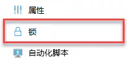
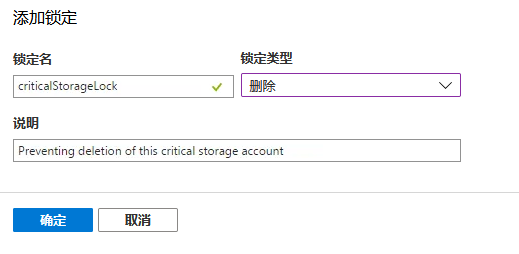

---
lab:
    title: '实验室教学 7：使用资源管理器锁定保护 Azure 资源'
    module: '模块 1：管理身份和访问'
---

# 模块 1：管理身份和访问 


**场景**

资源管理器锁定为管理员提供了一种锁定 Azure 资源的方法，以防止删除或更改资源。这些锁定位于基于角色的访问控制 (RBAC) 层次结构之外，并且在应用时将对所有用户的资源施加限制。当你的订阅中有重要资源时，用户不应删除或更改这些资源，因此这些锁定将非常有用，而且可以帮助防止意外和恶意更改或删除。

你可以使用两种类型的资源锁定：

 - **“无法删除”** - 防止任何人在锁定状态下删除资源，但是他们可以对其进行更改。
 - **“只读”** - 顾名思义，使资源成为只读资源，因此无法进行任何更改并且不可删除。
资源锁定可以根据需要应用于订阅、资源组或单个资源。锁定订阅时，该订阅中的所有资源（包括以后添加的资源）都将继承相同的锁定。应用后，这些锁定将影响所有用户（无论其角色如何），如果有必要删除或更改锁定资源，则必须先删除该锁定，方可进行变更。

**权限**

设置和删除锁定的权限需要访问以下 RBAC 权限之一：

- `Microsoft.Authorization/*`
- `Microsoft.Authorization/locks/*`

默认情况下，这些操作仅在内置于 RBAC 角色的所有者和用户访问管理员上可用，但是你可以根据需要将它们添加到自定义角色中。如前所述，具有这些角色的用户仍受制于锁定，但是显然，如果需要，他们可以将其删除。在 Azure 活动日志中跟踪锁定的创建和删除。


# 实验室教学 7：使用资源管理器锁定保护 Azure 资源


可以在创建 ARM 模板中的资源时创建锁定，也可以稍后使用门户网站或 PowerShell 创建锁定。


## 练习 1：创建锁定


确保锁定到位并保护资源的最佳方法是在运行时创建并在 ARM 模板中对其进行配置。锁定资源是顶级 ARM 资源，它们不属于被锁定资源的子集。他们指的是被锁定资源，因此该资源必须首先存在。 


### 任务 1：添加锁定（门户）

1.  打开 Cloud Shell (PowerShell) 并运行以下命令，创建资源组和存储帐户。  _（将命令中的 XXXXXX 更改为唯一的内容）_

     ```powershell
    New-AzResourceGroup -Name LockRG -Location EastUS
     ```
    
     ```powershell
    New-AzStorageAccount -ResourceGroupName LockRG -Name XXXXXX -Location  EastUS -SkuName Standard_LRS -Kind StorageV2 
     ```

1.  找到存储帐户并选择。在主刀片服务器中，单击“锁定”图标

     


1.  单击**“添加”**。

1.  为锁定赋名和描述，然后选择类型，删除或只读。

     


1.  请点击**“确认”**，保存锁定，该资源现在受到保护。

1.  如需删除锁定，只需简单地返回**“锁定”**，选择锁定，然后删除。

### 任务 2：添加锁定 (PowerShell)

1.  打开 Cloud Shell (PowerShell) 并运行以下命令，在存储帐户上创建锁定。_（将命令中的 XXXXXX 更改为你存储帐户的名称）_

     ```powershell
    New-AzureRmResourceLock -LockLevel CanNotDelete -LockName criticalStorageLock -ResourceName XXXXXX  -ResourceType Microsoft.Storage/storageAccounts -ResourceGroupName LockRG
     ```

1.  若要删除锁定，请运行以下命令：_（将命令中的 XXXXXX 更改为你存储帐户的名称）_

     ```powershell
    Remove-AzureRmResourceLock -LockName criticalStorageLock -ResourceName  XXXXX -ResourceGroupName LockRG -ResourceType Microsoft.Storage/storageAccounts
     ```


通过使用资源日志，你可以设置额外的防护措施，以防止意外或恶意更改和/或删除最重要的资源。这不是完美的操作，因为你的管理员仍然可以删除这些锁定，但是这需要自觉，因为删除锁定的唯一目的是规避锁定。由于这些锁定不属于 RBAC ，因此你可以应用锁定并确保可作用于所有用户，无论你授予这些用户什么角色或自定义权限。


**“结果”**：现在你已经完成了本实验室教学。
