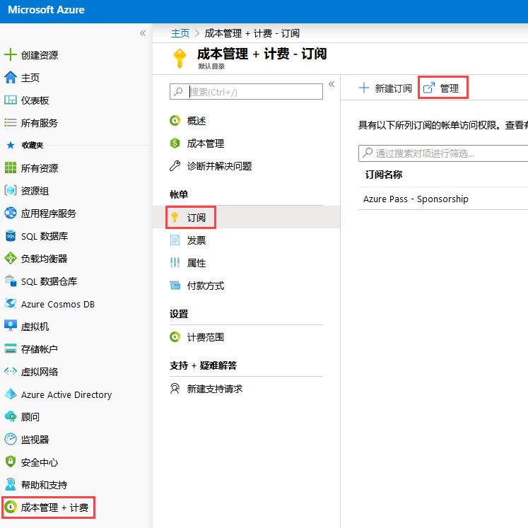
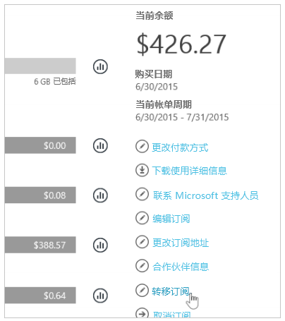
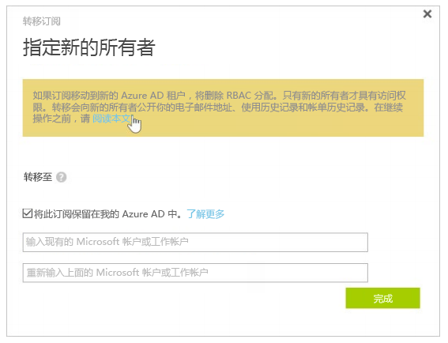
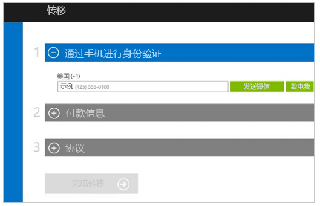

---
lab:
    title: '实验室教学 8：订阅'
    module: '模块 1：管理身份和访问'
---

# 模块 1：管理身份和访问 

# 实验室教学 8：订阅

**场景**

有时，需要将订阅从所有者转移到 Azure AD 租户。为了将订阅从 Azure AD 所有者转移到另一个订阅，你需要访问另一个订阅。如果你无权访问多个订阅，
只需查看下面概述的过程即可。

## 练习 1：在 Azure AD 租户之间传输 Azure 订阅

### 任务 1：如需转移 Azure 订阅的所有权

1.  以帐户管理员身份登录 Azure 门户。

1.  导航到**“成本管理 + 帐单”** > **“订阅”**，然后单击**“管理”**。

     

2.  选择你的订阅。

3.  通过查看支持的 Offer 清单中的 Offer 和 Offer ID 确认你的订阅符合自助转移的条件。

    **注**：在撰写本文时，Azure Pass - 赞助订阅不符合转移条件。  请遵循本指南以供参考。

4.  选择**“转移订阅”**。

     

5.  指定接收人。

    **注**：如果你将订阅转移到新的 Azure AD 租户，则 RBAC61 中的所有角色分配将从源租户中永久删除，不会迁移到目标租户。

     

6.  接收人将自动收到包含接受链接的电子邮件。
7.  接收人选择链接并按照说明进行操作，包括输入付款信息。

     

8.  Azure 完成订阅转移。

 此时，Azure 订阅的账单所有权将转移到新订阅。

**“结果”**：现在你已经完成了本模块。