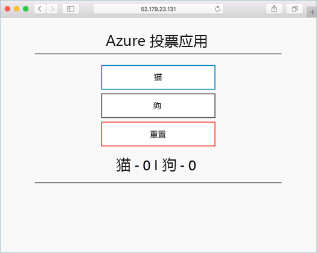

---
lab:
    title: '实验室教学 3 - 创建一个 Kubernetes 群集'
    module: '模块 2 - 实施平台保护'
---

# 模块 2：实验室教学 3 - 创建一个 Kubernetes 群集


Azure Kubernetes 服务 (AKS) 是托管 Kubernetes 服务，你可以使用该服务快速部署和管理群集。在本快速入门课程中，你将学习使用 Azure CLI 部署一个 AKS 群集。包含 Web 前端和 Redis 实例的多容器应用程序在群集中运行。然后，你将了解如何监视运行应用程序的群集和 Pod 的运行状况。

## 练习 1：创建一个 AKS 环境

### 任务 1：准备环境并创建资源组。

1.  打开浏览器并导航到**“Azure 门户”** **`https://portal.azure.com`**

1.  单击**“Cloudshell”**图标。

     

1.  选择**“Azure CLI BASH”**（如果需要）并创建一个存储帐户。

1.  在**“Cloud Shell”**中运行以下命令，创建一个新的**“资源组”**。

     ```cli
    az group create --name myResourceGroup --location eastus
     ```

### 任务 2：在 CLI 中创建 AKS 群集

1.  在**“CloudShell”**中运行一下命令。

     ```cli
    az aks create  --resource-group myResourceGroup --name myAKSCluster --node-count 1 --enable-addons monitoring --generate-ssh-keys
     ```
 
1.  几分钟后，命令完成并返回有关群集的**“JSON 格式化”信息**。

### 任务 3：连接到群集


若要管理 Kubernetes 群集，请使用 Kubernetes 命令行客户端 kubectl。如果使用 Azure Cloud Shell，则已安装“kubectl”。


1.  在**“Azure Cloud Shell”**中，输入以下命令：

     ```azurecli
    az aks install-cli
     ```


1.  要配置“kubectl”以连接到**“Kubernetes”**集群，请使用 az-aks-get-credentials 命令。此命令会下载凭据并配置**“Kubernetes CLI”**使用。


     ```azurecli-interactive
    az aks get-credentials --resource-group myResourceGroup --name myAKSCluster
     ```

1.  要验证与你群集的连接，使用 kubectl-get 命令返回群集节点的列表。


    ```azurecli-interactive
    kubectl get nodes
    ```

1.  以下示例输出显示了在上述步骤中创建的单个节点。确保节点状态为*“就绪”*：

    ```json
    NAME                       STATUS   ROLES   AGE     VERSION
    aks-nodepool1-31718369-0   Ready    agent   6m44s   v1.9.11
    ```

### 任务 4：运行应用程序


Kubernetes 清单文件定义了群集的所需状态，例如应运行的容器镜像。在此示例中，清单用于创建运行 Azure Vote 应用程序所需的所有对象。此清单包括两个 Kubernetes 部署，一个用于 Azure Vote Python 应用程序，另一个用于 Redis 实例。此外，还创建了两个 Kubernetes 服务 - 一个是用于 Redis 实例的内部服务，另一个是用于从 Internet 访问 Azure Vote 应用程序的外部服务。清单文件已创建并保存到该实验室教学的 Godithly Github 页面。该文件为 azure-vote.yaml，可以在以下网址中找到**“https://raw.githubusercontent.com/MicrosoftLearning/AZ-500-Azure-Security/master/Allfiles/Labs/Mod2_Lab03/azure-vote.yaml”**


1.  在 Cloud Shell 中运行以下命令，这将直接从 Godeploy Github 中提取所需的 yaml 文件以部署 AKS 应用程序

     ```cli
    kubectl apply -f https://raw.githubusercontent.com/MicrosoftLearning/AZ-500-Azure-Security/master/Allfiles/Labs/Mod2_Lab03/azure-vote.yaml
     ```

2.  以下示例输出显示了**“部署和服务”**创建成功：

     ```json
    部署“azure-vote-back”已创建
    服务“azure-vote-back”已创建
    部署“azure-vote-front”已创建
    服务“azure-vote-front”已创建
     ```

**注**：应用程序运行时，Kubernetes 服务会向 Internet 公开应用程序前端。这一过程可能需要几分钟才能完成。


### 任务 5：测试应用程序


应用程序运行时，Kubernetes 服务会向 Internet 公开应用程序前端。这一过程可能需要几分钟才能完成。


1.  要监视进度，请使用带有“--watch”参数的 kubectl-get 命令。

     ```azurecli-interactive
    kubectl get service azure-vote-front --watch
     ```

1.  最初“azure-vote-front”**服务的“EXTERNAL-IP”**显示为“待定”**。

     ```
    NAME               TYPE           CLUSTER-IP   EXTERNAL-IP   PORT(S)         AGE
    azure-vote-front   LoadBalancer   10.0.37.27   <pending>     80:30572/TCP    6s
     ```


1.  当*“EXTERNAL-IP”*地址从*“待定”*更改为实际公共 IP 地址时，请使用‘CTRL-C’停止`kubectl`监视过程。以下示例输出显示了分配给服务的有效公共 IP 地址：

     ```
    azure-vote-front   LoadBalancer   10.0.37.27   52.179.23.131   80:30572/    TCP   2m
     ```

2.  若要查看 Azure Vote 应用程序的运行情况，请打开网络浏览器，访问显示在前一个命令结果中的服务外部 IP 地址。

     


### 任务 6：监控运行状况和日志


创建 AKS 群集后，随即启用了用于容器的 Azure Monitor，以捕获群集节点和 Pod 的运行状况指标。Azure 门户提供这些运行状况指标。


要查看 Azure Vote pod 的当前状态、正常运行时间和资源使用情况，请完成以下步骤：

1.  打开网络浏览器访问 Azure 门户。

1.  选择你的资源组，例如*“myResourceGroup”*，然后选择你的 AKS 群集，例如*“myAKSCluster”*。
1.  在左侧的**“监视”**下，选择**“分析”**。
1.  在顶部，选择**“+ 添加筛选器”**
1.  选择*“命名空间”*作为属性，然后选择*“\< 所有，kube-system 除外\>”*
1.  选择查看**“容器”**。

    显示*“azure-vote-back”*和*“azure-vote-front”*容器


1.  要查看**“azure-vote-front”杆的日志，选择容器列表右侧的“查看容器日志”**链接。这些日志包括来自容器的*“stdout”*和*“stderr”*数据流。


### 任务 7：删除群集


不再需要群集时，请使用**“az 组删除”**命令删除资源组、容器服务和所有相关资源。


1.  运行以下命令，删除群集。

     ```cli
    az group delete --name myResourceGroup --yes --no-wait
     ```


**“结果”**： 现在你已经完成了本实验室教学。
