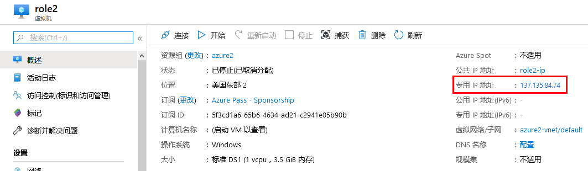

---
lab:
    title: '实验室教学 5 - NSG'
    module: '模块 2 - 实施平台保护'
---

# 模块 2：实验室教学 5 - NSG


你可以使用网络安全组过滤进入虚拟网络子网和从虚拟网络子网出站的网络流量。网络安全组包括安全规则，这些规则可以按照 IP 地址、端口和协议过滤网络流量。安全规则适用于部署在子网中的资源。在本教程中，你将学会如何：

- 创建网络安全组和安全规则
- 创建虚拟网络并将网络安全组关联到子网
- 将虚拟机 (VM) 部署到子网中
- 测试流量过滤程序


## 练习 1：使用 Azure 门户网络安全组过滤网络流量。

### 任务 1：  创建一个虚拟网络。

1.  在 Azure 门户网站的左上角选择**“+ 创建一个资源”**。
2.  选择**“联网”**，然后选择**“虚拟网络”**。
3.  输入或选择以下信息，接受其余设置的默认设置，然后选择**“创建”**：

    | 设置                 | 值                                              |
    | ---                     | ---                                                |
    | 名称                    | myVirtualNetwork                                   |
    | 地址空间           | 10.0.0.0/16                                        |
    | 订阅            | 选择你的订阅。                          |
    | 资源组          | 选择**“新建”**，输入*“MyResourceGroup”*。 |
    | 位置                | 选择**“美国东部”**。                                |
    | 子网 — 名称            | mySubnet                                           |
    | 子网 — 地址范围  | 10.0.0.0/24                                        |

### 任务 2：  创建应用程序安全组


你可以通过应用程序安全组，将具有类似功能的服务器（如网络服务器）分组在一起。


1.  在 Azure 门户网站的左上角选择**“+ 创建一个资源”**。
2.  在**“搜索市场”**对话框中，输入*“应用程序安全组”*。搜索结果中显示**“应用程序安全组”**时，选中并在**“全部”**中再次选择**“应用程序安全组”**，然后选择**“创建”**。
3.  输入或选择以下信息，然后选择**“创建”**：

    | 设置        | 值                                                         |
    | ---            | ---                                                           |
    | 名称           | myAsgWebServers                                               |
    | 订阅   | 选择你的订阅。                                     |
    | 资源组 | 选择**“使用现有”**，然后选择**“myResourceGroup”**。 |
    | 位置       | 美国东部                                                       |

4.  再次完成步骤3，并指定以下值：

    | 设置        | 值                                                         |
    | ---            | ---                                                           |
    | 名称           | myAsgMgmtServers                                              |
    | 订阅   | 选择你的订阅。                                     |
    | 资源组 | 选择**“使用现有”**，然后选择**“myResourceGroup”**。 |
    | 位置       | 美国东部                                                       |

### 任务 3：  创建一个网络安全组

1.  在 Azure 门户网站的左上角选择**“+ 创建一个资源”**。
2.  选择**“联网”**，然后选择**“网络安全组”**。
3.  输入或选择以下信息，然后选择**“创建”**：

    |设置|值|
    |---|---|
    |名称|myNsg|
    |订阅| 选择你的订阅。|
    |资源组 | 选择**“使用现有”**，然后选择*“myResourceGroup”*。|
    |位置|美国东部|

### 任务 4：  将网络安全组与子网关联

1.  在门户顶部的*“搜索资源、服务和文档”*对话框中，开始输入*“myNsg”*。搜索结果中显示**“myNsg”**时，选中。
2.  在**“设置”**中，选择**“子网”**，然后选择**“+ 关联”**。 

3.  在**“关联子网”**中，选择**“虚拟网络”**，然后选择**“myVirtualNetwork”**。选择**“子网”**，选择**“mySubnet”**，然后选择**“确认”**。

### 任务 5：  创建安全规则

1.  在**“设置”**中，选择**“入站安全规则”**，然后选择**“+ 添加”**。

2.  创建一个安全规则，允许端口 80 和 443 连接到**“myAsgWebServers”**应用程序安全组。在**“添加入站安全规则”**中，输入或选择以下值，接受其余的默认值，然后选择**“添加”**：

    | 设置                 | 值                                                                                                           |
    | ---------               | ---------                                                                                                       |
    | 目标             | 选择**“应用程序安全组”**，然后对**“应用程序安全组”**选择**“myAsgWebServers”**。  |
    | 目标端口范围 | 输入 80、443                                                                                                    |
    | 协议                | 选择 TCP                                                                                                      |
    | 名称                    | Allow-Web-All                                                                                                   |

3.  再次完成步骤 2，并指定以下值：

    | 设置                 | 值                                                                                                           |
    | ---------               | ---------                                                                                                       |
    | 目标             | 选择**“应用程序安全组”**，然后对**“应用程序安全组”**选择**“myAsgMgmtServers”**。 |
    | 目标端口范围 | 输入 3389                                                                                                      |
    | 协议                | 选择 TCP                                                                                                      |
    | 优先级                | 输入 110                                                                                                       |
    | 名称                    | Allow-RDP-All                                                                                                   |

    在本教程中，RDP（端口 3389）为分配到*“myAsgMgmtServers”*应用程序安全组的虚拟机连接网络。对于生产环境，建议不要将端口 3389 联网，建议你使用 VPN 或专用网络连接到要管理的 Azure 资源。


### 任务 6：  创建虚拟机

1.  在 Azure 门户网站的左上角选择**“创建一个资源”**。
2.  选择**“计算”**，然后选择**“Windows 服务器 2016 数据中心”**。
3.  输入或选择以下信息，并接受其余设置的默认设置：

    |设置|值|
    |---|---|
    |订阅| 选择你的订阅。|
    |资源组| 选择**“使用现有”**，然后选择**“myResourceGroup”**。|
    |名称|myVmWeb|
    |位置| 选择**“美国东部”**。|
    |用户名| 输入你选择的用户名。|
    |密码| Pa55w.rd1234 |

   

4.  选择虚拟机的大小，然后选择**“选择”**。
5.  在**“联网”**中，选择以下值，并接受其余的默认设置：

    |设置|值|
    |---|---|
    |虚拟网络 |选择**“myVirtualNetwork”**。|
    |NIC 网络安全组 |选择**“高级”**。|
    |公共入站端口|选择**“无”**。 |

6.  在左下角的底部选择**“查看创建”**，选择**“创建”**开始 VM 部署。

### 任务 7：  创建第二个 VM

再次完成上述步骤 1-6，但在步骤 3 中，为 VM 命名*“myVmMgmt”*。VM 部署需要几分钟的时间。在 VM 部署完成之前，请勿继续下一步。

### 任务 8：  将网络接口与 ASG 相关联


门户创建 VM 时，将为每个 VM 创建一个网络接口，并将该网络接口附加到该 VM。将每个 VM 的网络接口添加到先前创建的应用程序安全组之一：


1.  在门户顶部的*“搜索资源、服务和文档”*对话框中，开始输入*“myVmWeb”*。搜索结果中显示**“myVmWeb”**时，选中。
2.  在**“设置”**中，选择**“联网”**。  选择**“配置应用程序安全组”**，对**“应用程序安全组”**选择**“myAsgWebServers”**，然后选择**“保存”**。

3.  再次完成步骤 1 和 2，搜索**“myVmMgmt”**VM 并选择**“myAsgMgmtServers”**ASG。

### 任务 9：  测试流量过滤程序

1.  连接到*“myVmMgmt”*VM。在门户顶部的搜索框中输入*“myResourceGroup”*。搜索结果中显示**“myVmMgmt”**时，选中。选择**“连接”**按钮。
2.  选择**“下载 RDP 文件”**。
3.  打开下载的 RDP 文件，并选择**“连接”**。输入创建 VM 时指定的用户名和密码。你需要选择**“更多选择”**，然后选择**“使用一个不同的帐户”**，指定创建 VM 时输入的凭证。
4.  选择**“确定”**。
5.  在登录过程中，你可能会收到证书警告。如果收到警告，请选择**“是”**或**“继续”**，以继续进行连接。

    连接成功，因为允许端口 3389 从网络入站到*“myAsgMgmtServers”*应用程序安全组，即网络接口连接到*“myVmMgmt”*VM 所在的应用程序组。

6.  在 PowerShell 会话中输入以下命令，从*“myVmMgmt”*VM 连接到*“myVmWeb”*VM：

    ```powershell
    mstsc /v:myVmWeb
    ```

    你可以从 myVmMgmt VM 连接到 myVmWeb VM，因为默认情况下，同一虚拟网络中的 VM 可以通过任何端口相互通信。但是，你无法创建从网络到*“myVmWeb”*VM的远程桌面连接，因为*“myAsgWebServers”*的安全规则不允许端口 3389 从网络入站，并且在默认情况下，拒绝网络的入站流量连接到所有资源。

7.  要在*“myVmWeb”*VM 安装 Microsoft IIS，在 PowerShell 会话的*“myVmWeb”*VM 上输入以下命令：

    ```powershell
    Install-WindowsFeature -name Web-Server -IncludeManagementTools
    ```

8.  IIS 安装完成后，断开*“myVmWeb”*VM 的连接，处于*“myVmMgmt”*VM 远程桌面连接。
9.  断开*“myVmMgmt”*VM 的连接。
10.  在 Azure 门户顶部的*“搜索资源、服务和文档”*对话框中，从你的计算机中开始输入*“myVmWeb”*。搜索结果中显示**“myVmWeb”**时，选中。注意你的 VM 的**“公用 IP 地址”**。下图中显示的地址是 137.135.84.74，但是你的地址与此不同：

       
  
11.  为了确认你可以通过网络访问*“myVmWeb”*网络服务器，在计算机上打开互联网浏览器，然后浏览到`http：// <public-ip-address-from-previous-step>`。你会看到 IIS 欢迎屏幕，因为允许端口 80 从网络入站到*“myAsgWebServers”*应用程序安全组，即网络接口连接到*“myVmWeb”*VM 所在的应用程序安全组。


| 警告：在继续之前，你应该删除此实验室教学使用的所有资源。  为此，应在**“Azure 门户”**中，单击**“资源组”**。  选择你创建的任何资源组。  在资源组刀片服务器上，单击**“删除资源组”**，输入资源组名，然后单击**“删除”**。  对你创建的任何其他资源组重复该过程。**“否则可能会导致其他实验室教学出现问题”**。 |
| --- |

**“结果”**：现在你已经完成了本实验室教学。
