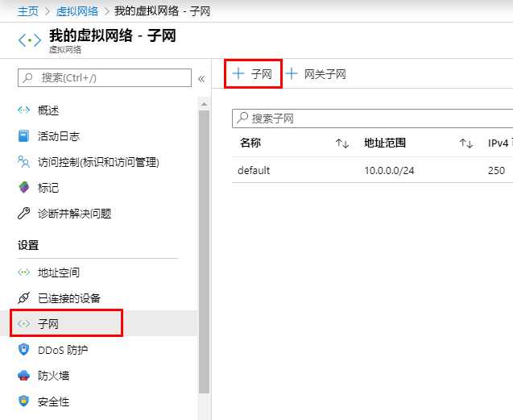
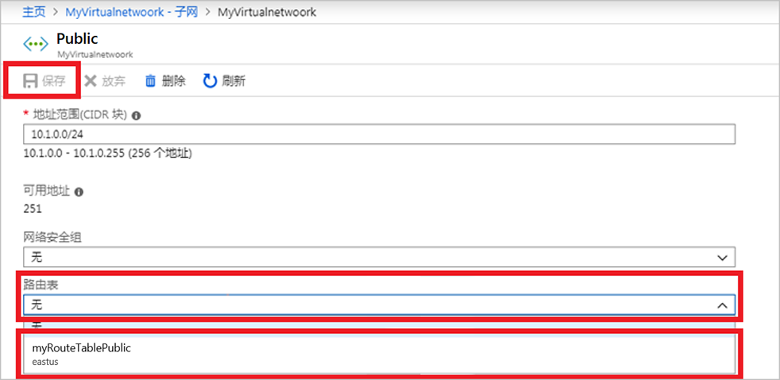
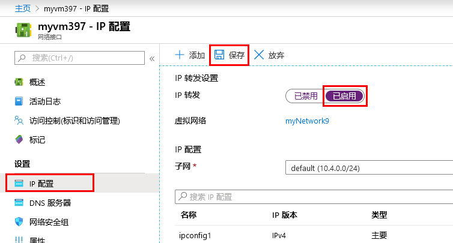

---
lab:
    title: '实验室教学 6 - NVA'
    module: '模块 2 - 实施平台保护'
---

# 模块 2：实验室教学 6 - NVA


**场景**

Azure 默认情况下在虚拟网络中的所有子网之间路由流量。你可以创建自己的路由来覆盖 Azure 的默认路由。例如，如果你想通过网络虚拟设备 (NVA) 在子网之间路由流量，创建自定义路由的功能将很有帮助。在本实验室教学中，你将学习如何：


> * 创建一个路由表
> * 创建一个路由
> * 创建一个带有多个子网的虚拟网络
> * 将路由表与子网关联
> * 创建能够路由流量的 NVA
> * 将虚拟机 (VM) 部署到不同的子网中
> * 通过 NVA 将流量从一个子网路由到另一个子网

## 练习 1：使用 Azure 门户的路由表路由网络流量

### 任务 1：创建一个路由表

1.  在屏幕的左上角，选择**“创建一个资源”** > **“计算”** > **“Windows 服务器 2016 数据中心”**。

1.  在**“创建路由表”**中，输入或选择此信息：

    | 设置 | 值 |
    | ------- | ----- |
    | 名称 | 输入*“myRouteTablePublic”*。 |
    | 订阅 | 选择你的订阅。 |
    | 资源组 | 选择**“新建”**，输入*“MyResourceGroup”*，然后选择*“确定”*。 |
    | 位置 | 保留默认的**“美国东部”**。
    | BGP 路由传播 | 保留默认的**“已启用”**。 |

1.  选择**“创建”**。

### 任务 2：创建一个路由

1.  在门户搜索栏中输入*“myRouteTablePublic”*。

1.  搜索结果中显示**“搜索结果中显示“myVmWeb”**时，选中。

1.  在**“设置”**的**“myRouteTablePublic”**中，选择**“路由”** > **“+ 添加”**。


1.  在**“添加路由”**中，输入或选择此信息：

    | 设置 | 值 |
    | ----- | ----- |
    | 路由名称 | 输入*“ToPrivateSubnet”*。 |
    | 地址前缀 | 输入*“10.0.1.0/24”*。 |
    | 下一个跃点类型 | 选择**“虚拟设备”**。 |
    | 下一个跃点地址 | 输入*“10.0.2.4”*。 |

1.  选择**“确定”**。

### 任务 3：将路由表与子网关联


必须先创建一个虚拟网络和子网，然后才能将路由表关联到子网。


1.  在屏幕的左上角，选择**“创建一个资源”** > **“网络”** > **“虚拟网络”**。

1.  在**“创建虚拟网络”**中，输入或选择此信息：

    | 设置 | 值 |
    | ----- | ----- |
    | 名称 | 输入*“myVirtualNetwork”*。 |
    | 地址空间 | 输入*“10.0.0.0/16”*。 |
    | 订阅 | 选择你的订阅。 |
    | 资源组 | 选择***选择现有的*** >**“myResourceGroup”**。 |
    | 位置 | 保留默认的**“美国东部”**。 |
    | 子网 — 名称 | 输入*“公共”*。 |
    | 子网 — 地址范围 | 输入*“10.0.0.0/24”*。 |

1.  保留其余的默认设置，并选择**“创建”**。

### 任务 4：将子网添加到虚拟网络

1.  在门户搜索栏中输入*“myVirtualNetwork”*。

1.  搜索结果中显示“搜索结果中显示**“myVirtualNetwork”**时，选中。

1.  在**“设置”**的**“myVirtualNetwork”**中，选择**“子网”** > **“+ 子网”**。

       

1.  在**“添加子网”**中，输入以下信息：

    | 设置 | 值 |
    | ----- | ----- |
    | 名称 | 输入*“个人”*。 |
    | 地址空间 | 输入*“10.0.1.0/24”*。 |

1.  保留其余的默认设置，选择**“确定”**。

1.  再次选择**“+ 子网”**。这次，输入以下信息：

    | 设置 | 值 |
    | ----- | ----- |
    | 名称 | 输入*“DMZ”*。 |
    | 地址空间 | 输入*“10.0.2.0/24”*。 |

1.  与上次一样，保留其余的默认设置，然后选择**“确定”**。

    Azure 显示了三个子网：**“公共”**、**“个人”**和**“DMZ”**。

### 任务 5：将 myRouteTablePublic 与你的公共子网关联

1.  选择**“公共”**。

1.  在**“公共”**中，选择**“路由表”** > **“我的路由表公共”** > **“保存”**。

       

### 任务 6：创建一个 NVA

NVA 是有助于网络功能（例如路由和防火墙优化）的 VM。你可以根据需要选择其他操作系统。本教程假定你正在使用**“Windows 服务器 2016 数据中心”**。

1.  在屏幕的左上角，选择**“创建一个资源”** > **“计算”** > **“Windows 服务器 2016 数据中心”**。

1.  在**“创建一个虚拟机 — 基础”**中，输入或选择以下信息：

    | 设置 | 值 |
    | ----- | ----- |
    | **项目详情** | |
    | 订阅 | 选择你的订阅。 |
    | 资源组 | 选择**“myResourceGroup”** |
    | **实例详情** |  |
    | 虚拟机名称 | 输入*“myVmNva”* |
    | 区域 | 选择**“美国东部”**。 |
    | 可用性选项 | 保留默认的**“无需基础架构冗余”**。 |
    | 图像 | 保留默认的**“Windows 服务器 2016 数据中心”**。 |
    | 大小 | 保留默认的**“标准 DS1 v2”**。 |
    | **管理员帐户** |  |
    | 用户名 | 输入你选择的用户名。 |
    | 密码 | Pa55w.rd1234|
    | 确认密码 | 重新输入密码。 |
    | **入站端口规则** |  |
    | 公共入站端口 | 保留默认的**“无”**。
    | **节省资金** |  |
    | 已拥有 Windows 许可证？ | 保留默认的**“否”**。 |

1.  选择**“下一步：”****“磁盘”**。

1.  在**“创建虚拟机-磁盘”**中，选择适合你需要的设置。

1.  选择**“下一步：”****“联网”**。

1.  在**“创建一个虚拟机 — 联网”**中，选择此信息：

    | 设置 | 值 |
    | ----- | ----- |
    | 虚拟网络 | 保留默认的**“myVirtualNetwork”**。 |
    | 子网 | 选择**“DMZ (10.0.2.0/24)”**。 |
    | 公共 IP | 选择**“无”**。你不需要使用公共 IP 地址。VM 无法通过网络进行连接。|

1.  保留其余的默认设置，选择**“下一步：”****“管理”**。

1.  在**“创建虚拟机 — 管理”**中，为**“诊断存储帐户”**选择**“新建”**。

1.  在**“创建存储帐户”**中，输入或选择此信息：

    | 设置 | 值 |
    | ----- | ----- |
    | 名称 | 输入*“mynvastorageaccount”**。 |
    | 帐户类型 | 保留默认**“存储（通用 v1）”**。 |
    | 性能 | 保留默认**“标准”**。 |
    | 复制 | 保留默认的**“本地冗余存储 (LRS)”**。

1.  选择**“确定”**

1.  选择**“审阅 + 创建”**。你将进入**“审阅 + 创建”**页面，Azure 将验证你的配置。

1.  看到**“验证通过”**，选择**“创建”**。

    VM 创建需要几分钟的时间。在 Azure 完成 VM 创建之前不要继续操作。**“你的部署正在进行中”**页面将显示你的部署详情。

1.  VM 准备就绪后，选择**“转到资源”**。

### 任务 7：打开 IP 转发


打开*“myVmNva”*的 IP 转发。Azure 将网络流量发送到*“myVmNva”*时，如果流量指定给其他 IP 地址，则 IP 转发会将流量发送到正确的位置。


1.  在**“myVmNva”**的**“设置”**中，选择**“联网”**。

1.  选择**“myvmnva123”**。这就是 Azure 为你的 VM 创建的网络接口。其中包括一串独一无二的数字。

1.  在**“设置”**中，选择**“IP 配置”**。

1.  在**“myvmnva123 - IP 配置”**中，对于**“IP 转发”**，选择**“已启用”**，然后选择**“保存”**。

       

### 任务 8：创建公共和个人虚拟机


在虚拟网络中创建公共 VM 和个人 VM。稍后，你将使用这些 VM 来查看 Azure 通过 NVA 将*“公共”*子网流量路由到*“个人”*子网。


1.  完成创建一个 NVA 任务的步骤 1-12。使用大多数相同的设置。这些值必须不相同：

 | 设置 | 值 |
 | ----- | ----- |
 | **公共 VM** | |
 | 基本版 |  |
 | 虚拟机名称 | 输入*“myVmPublic”*。 |
 | 联网 | |
 | 子网 | 选择**“公共 (10.0.0.0/24)”**。 |
| 公共 IP 地址 | 接受默认设置。 |
| 公共入站端口 | 选择**“允许选定的端口”**。 |
| 选择入站端口 | 选择**“HTTP”**和**“RDP”**。 |
| 管理 | |
| 诊断存储帐户 | 保留默认的**“mynvastorageaccount”**。 |
| **个人 VM** | |
| 基本版 |  |
| 虚拟机名称 | 输入*“myVmPrivate”*。 |
| 联网 | |
| 子网 | 选择**“个人 (10.0.1.0/24)”**。 |
| 公共 IP 地址 | 接受默认设置。 |
| 公共入站端口 | 选择**“允许选定的端口”**。 |
| 选择入站端口 | 选择**“HTTP”****和**“RDP”**。 |
| 管理 | |
| 诊断存储帐户 | 保留默认的**“mynvastorageaccount”**。 |

你可以创建*“myVmPrivate”*VM，同时在 Azure 创建*“myVmPublic”*VM。在 Azure 完成创建两个 VM 之前，不要继续其余步骤。

### 任务 9：通过 NVA 路由流量

1.  通过远程桌面登录 myVmPrivate

1.  在门户搜索栏中输入*“myVmPrivate”*。

1.  搜索结果中显示**“myVmPrivate”**时，选中。

1.  选择**“连接”**，创建连接到*“myVmPrivate”*VM 的远程桌面连接。

1.  在**“连接到虚拟机”**中，选择**“下载 RDP 文件”**。Azure 会创建一个远程桌面协议 (*.rdp*) 文件并将其下载到你的计算机。

1.  打开下载的*“rdp”*文件。

    1. 如果出现提示，请选择**“连接”**。

    1. 输入创建个人 VM 时指定的用户名和密码。

    1. 你需要选择**“更多选择”** > **“使用其他帐户”**，以使用个人 VM 凭证。

1.  选择**“确定”**。

    在登录过程中,你可能会收到证书警告。

1.  选择**“是”**连接到 VM。

### 任务 10：通过 Windows 防火墙启用 ICMP


在后续步骤中，你将使用跟踪路由工具来测试路由。跟踪路由使用网络控制消息协议 (ICMP)，Windows 防火墙默认拒绝该协议。通过 Windows 防火墙启用 ICMP。


1.  在*“myVmPrivate”*的远程桌面中，打开 PowerShell。

1.  输入此命令：

    ```powershell
    New-NetFirewallRule -DisplayName "Allow ICMPv4-In" -Protocol ICMPv4
    ```

    在本教程中，你将使用跟踪路由来测试路由。对于生产环境，我们不建议通过 Windows 防火墙允许 ICMP。

### 任务 11：打开 myVmNva 中的 IP 转发


你需要使用 Azure 为 VM 网络接口打开 IP 转发。VM 的操作系统还必须转发网络流量。使用以下命令，打开*“myVmNva”*VM 操作系统的 IP 转发。


1.  通过*“myVmPrivate”*VM 上的命令提示符，打开一个远程桌面到*“myVmNva”*VM：

    ```cmd
    mstsc /v:myvmnva
    ```

1.  在 PowerShell 的*“myVmNva”*中，输入以下命令，打开 IP 转发：

    ```powershell
    Set-ItemProperty -Path HKLM:\SYSTEM\CurrentControlSet\Services\Tcpip\Parameters -Name IpEnableRouter -Value 1
    ```

1.  重新启动*“myVmNva”*VM。在任务栏中，选择**“开始按钮”** > **“电源按钮”**，**“其他（计划中）”** > **“继续”**。

    这也会断开远程桌面会话的连接。

1.  *“myVmNva”* VM 重新启动后，创建到*“myVmPublic”*VM 的远程桌面会话。虽然仍然连接到 *myVmPrivate* VM，打开命令提示符并运行以下命令：

    ```cmd
    mstsc /v:myVmPublic
    ```
1.  在* myVm1 *的远程桌面中，打开 PowerShell。

1.  输入以下命令，通过 Windows 防火墙启用 ICMP：

    ```powershell
    New-NetFirewallRule -DisplayName "Allow ICMPv4-In" -Protocol ICMPv4
    ```

### 任务 12：测试网络流量的路由。


首先，让我们测试从 *myVmPublic* VM 到 *myVmPrivate* VM 的网络流量路由。


1.  在 PowerShell 的 *myVmPublic* VM 上，输入以下命令：

    ```powershell
    tracert myVmPrivate
    ```

    响应类似于此示例：

    ```powershell
    Tracing route to myVmPrivate.vpgub4nqnocezhjgurw44dnxrc.bx.internal.cloudapp.net [10.0.1.4]
    over a maximum of 30 hops:

    1    <1 ms     *        1 ms  10.0.2.4
    2     1 ms     1 ms     1 ms  10.0.1.4

    Trace complete.
    ```

    你可以看到第一个跃点是到 10.0.2.4。这是 NVA 的专用 IP 地址。第二跃点是 *myVmPrivate* VM 到服务器的专用 IP 地址：10.0.1.4之前，你将路由添加到了 *myRouteTablePublic* 路由表并将其关联到 *公共* 子网。结果，Azure 通过 NVA 发送了流量，而不是直接发送到 *个人* 子网。

1.  关闭到 *myVmPublic* VM 的远程桌面会话，你仍然可以连接到 *myVmPrivate* VM。

1.  在 *myVmPrivate* VM 的命令提示符中，输入以下命令：

    ```cmd
    tracert myVmPublic
    ```

    测试从 *myVmPrivate* VM 到 *myVmPublic* VM 的网络流量路由。响应类似于此示例：

    ```cmd
    Tracing route to myVmPublic.vpgub4nqnocezhjgurw44dnxrc.bx.internal.cloudapp.net [10.0.0.4]
    over a maximum of 30 hops:

    1     1 ms     1 ms     1 ms  10.0.0.4

    Trace complete.
    ```

    你可以看到，Azure 直接路由从 *myVmPrivate* VM 到 *myVmPublic* VM 的流量。默认情况下，Azure 直接在子网之间路由流量。

1.  关闭到*“myVmPrivate”* VM的远程桌面会话。


| 警告：在继续之前，你应该删除此实验室教学使用的所有资源。  为此，应在**“Azure 门户”**中，单击**“资源组”**。  选择你创建的任何资源组。  在资源组刀片服务器上，单击 **删除资源组**，输入资源组名称，然后单击 **删除**。  对你创建的任何其他资源组重复该过程。**否则可能会导致其他实验室教学出现问题。** |
| --- |
    


**结果**：现在你已经完成了本实验室教学。


