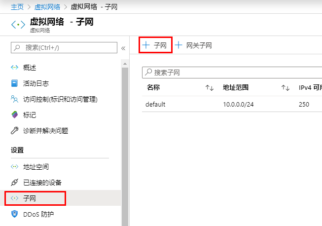
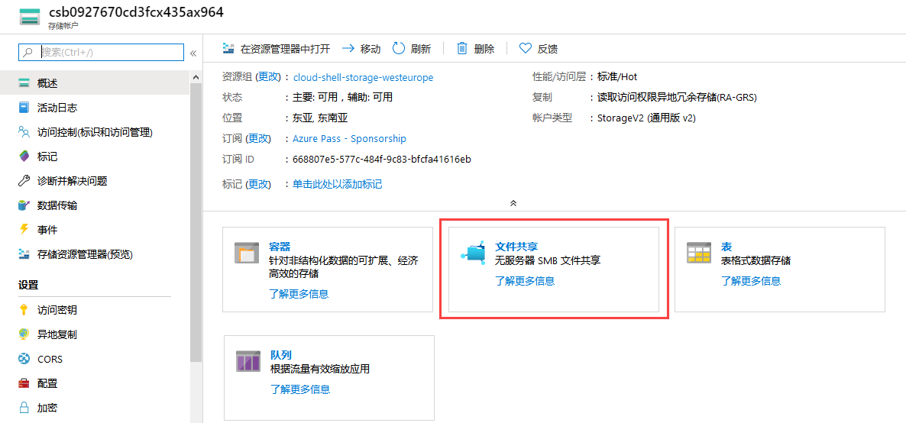
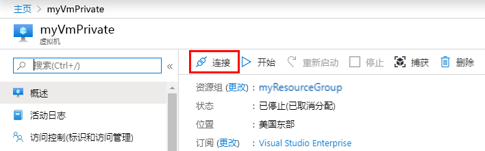
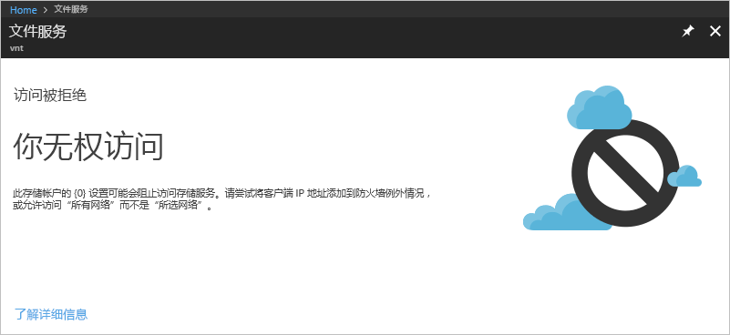

---
lab:
    title: '实验室教学 7：服务终结点'
    module: '模块 2 - 实施平台保护'
---

# 模块 2：实验室教学 7：服务终结点


你可以通过虚拟网络服务终结点将对某些 Azure 服务资源的网络访问限制到虚拟网络子网。你还可以删除对资源的网络访问。服务终结点提供从NIDE 虚拟网络到支持 Azure 服务的直接连接，允许你使用虚拟网络的专用地址空间访问 Azure 服务。通过服务终结点发往 Azure 资源的流量始终留在 Microsoft Azure 骨干网络上。在本教程中，你将学会如何：

- 创建带有一个子网的虚拟网络
- 添加一个子网并启用服务终结点
- 创建一个 Azure 资源并仅允许从子网对其进行网络访问
- 将虚拟机 (VM) 部署到每个子网
- 确认从子网访问资源
- 确认拒绝从子网和网络访问资源


## 练习 1：使用 Azure 门户，通过虚拟网络服务终结点限制对 PaaS 资源的网络访问

### 任务 1：创建一个虚拟网络

1.  在 Azure 门户网站的左上角选择**+ 创建资源**。
2.  选择 **联网**，然后选择 **虚拟网络**。
3.  输入或选择以下信息，然后选择 **创建**：

   |设置|值|
   |----|----|
   |名称| myVirtualNetwork |
   |地址空间| 10.0.0.0/16|
   |订阅| 选择你的订阅|
   |资源组 | 选择**“新建”**，输入*“MyResourceGroup”*。|
   |位置| 选择**“美国东部”**。 |
   |子网名| 公共|
   |子网地址范围| 10.0.0.0/24|
   |DDoS 保护| 基本|
   |服务终结点| 已禁用|
   |防火墙| 已禁用|


### 任务 2：启用服务终结点


每个服务，每个子网都启用了服务终结点。创建一个子网并为该子网启用服务终结点。


1.  在门户顶部的**搜索资源、服务和文档**对话框中，输入 *myVirtualNetwork。*搜索结果中显示 **myVirtualNetwork**时，选中。
2.  将子网添加到虚拟网络。在**设置**中，选择**子网**，然后选择**+ 子网路**，如下图所示：

       

3.  在**添加子网**中，选择或输入以下信息，然后选择**确定**：

    |设置|值|
    |----|----|
    |名称| 专用 |
    |地址范围| 10.0.1.0/24|
    |服务终结点| 在“服务”下选择**Microsoft.存储**|

### 任务 3：限制子网的网络访问


默认情况下，子网中的所有 VM 均可与所有资源进行通信。通过创建网络安全组并将其与子网关联，可以限制与子网中所有资源之间的通信。


1.  在 Azure 门户网站的左上角选择**+ 创建资源**。
2.  选择**联网**，然后选择**网络安全组**。
3.  在**创建一个网络安全组**中，输入或选择以下信息，然后选择**创建**：

    |设置|值|
    |----|----|
    |名称| myNsgPrivate |
    |订阅| 选择你的订阅|
    |资源组 | 选择**使用现有**，然后选择*myResourceGroup*。|
    |位置| 选择**“美国东部”**。 |

4.  创建网络安全组后，在门户顶部的**搜索资源、服务和文档**对话框中，输入*myNsgPrivate*。搜索结果中显示 **myNsgPrivate**时，选中。
5.  在**设置**中，选择**出站安全规则**。
6.  选择 **+ 添加**。
7.  创建一个规则，允许与 Azure 存储服务的出站通信。输入或选择以下信息，然后选择**添加**：

    |设置|值|
    |----|----|
    |源| 选择 **VirtualNetwork** |
    |源端口范围| * |
    |目标 | 选择 **服务标签**|
    |目标服务标签 | 选择**存储**|
    |目标端口范围| * |
    |协议|任何|
    |操作|允许|
    |优先级|100|
    |名称|Allow-Storage-All|

8.  创建另一个拒绝与网络通信的出站安全规则。该规则将覆盖所有允许出站网络通信的网络安全组中的默认规则。使用以下值再次完成步骤 5-7：

    |设置|值|
    |----|----|
    |源| 选择 **VirtualNetwork** |
    |源端口范围| * |
    |目标 | 选择 **服务标签**|
    |目标服务标签| 选择**网络**|
    |目标端口范围| * |
    |协议|任何|
    |操作|拒绝|
    |优先级|110|
    |名称|Deny-Internet-All|

9.  在**设置**中，选择**入站安全规则**。
10.  选择 **+ 添加**。
11.  创建一个入站安全规则，允许远程桌面协议 (RDP) 流量可从任何位置流向子网。该规则将覆盖默认的安全规则，拒绝来自网络的所有入站流量。允许远程桌面连接到子网，以便在以后的步骤中测试连接性。在**设置**中，选择**入站安全规则**，选择**+ 添加**，输入以下值，然后选择**添加**：

        |设置|值|
        |----|----|
        |源| 任何 |
        |源端口范围| * |
        |目标 | 选择** VirtualNetwork **|
        |目标端口范围| 3389 |
        |协议|任何|
        |操作|允许|
        |优先级|120|
        |名称|Allow-RDP-All|

12.  在**设置**中，选择**子网**。
13.  选择**+ 关联**
14.  在**关联子网**中，选择**虚拟网络**，然后在 **选择一个虚拟网络**下选择**myVirtualNetwork**。
15.  在**选择子网**下，选择**个人**，然后选择**确定**。

### 任务 4：限制网络访问到子网


限制网络访问到 Azure 服务（为服务终结点启用）创建资源的必要步骤因服务而异。有关每种服务的特定步骤，请参阅单一服务文档。作为示例，本教程的其余部分包括限制 Azure 存储帐户的网络访问的步骤。


1.  在 Azure 门户网站的左上角选择**+ 创建资源**。
2.  选择**存储**，然后选择**存储帐户 - Blob、文件、表、队列**。
3.  输入或选择以下信息，保留其余默认设置，然后选择**创建**：

    |设置|值|
    |----|----|
    |名称| 输入在所有 Azure 位置中唯一的名称，长度在 3 到 24 个字符之间，仅使用数字和小写字母。|
    |帐户类型|StorageV2（通用 v2）。|
    |位置| 选择**“美国东部”**。 |
    |复制| 本地冗余存储（LRS）|
    |订阅| 选择你的订阅|
    |资源组 | 选择**使用现有**，然后选择*myResourceGroup*。|

### 任务 5：在存储帐户中创建一个文件共享

1.  创建存储帐户后，在门户顶部的**搜索资源、服务和文档**对话框中，输入存储帐户名。当搜索结果中显示村粗帐户的名称时，选中。
2.  选择**文件共享**，如下图所示：

       

3.  选择**+ 文件共享**。
4.  在*名称*下输入**my-file-share**，然后选择**确定**。
5.  关闭**文件服务**对话框。

### 任务 6：限制网络访问到子网


默认情况下，存储帐户接受来自任何网络上客户端的连接，包括网络。拒绝来自网络和所有虚拟网络中所有其他子网的网络访问，但*myVirtualNetwork*虚拟网络中的*个人*子网除外。


1.  对于存储帐户，在**设置**中，选择**防火墙和虚拟网络**。
2.  选择**选定网络**。
3.  选择**+ 添加现有虚拟网络**。
4.  在**添加网络**中，选择以下值，然后选择**添加**：

    |设置|值|
    |----|----|
    |订阅| 选择你的订阅。|
    |虚拟网络|在“虚拟网络”下，选择**myVirtualNetwork**。|
    |子网| 在“子网”下选择**个人**|


5.  选择**保存**。
6.  关闭**防火墙和虚拟网络**对话框。
7.  对于存储帐户，在**设置**中，选择**访问密钥**。

8.  注意**密钥**值，因为在将文件共享映射到 VM 中的驱动器号时，你将需要在后续步骤中手动输入该值。

### 任务 7：创建虚拟机


要测试对存储帐户的网络访问，请将 VM 部署到每个子网。


1.  在 Azure 门户的左上角选择**+ 创建一个资源**。
2.  选择**计算**，然后选择**虚拟机**。
3.  输入或选择以下信息，然后选择**确定**：

   |设置|值|
   |----|----|
   |名称| myVmPublic|
   |用户名|输入你选择的用户名。|
   |密码| Pa55w.rd1234 |
   |订阅| 选择你的订阅。|
   |资源组| 选择**使用现有**，然后选择**myResourceGroup**。|
   |位置| 选择**“美国东部”**。|
   |映像| 选择 **Windows 服务器 2019 数据中心**。|

   
4.  选择虚拟机大小，然后选择**选择**。
5.  在**联网**选项卡中选择**myVirtualNetwork**。然后选择**子网**，然后选择**公共**子网。

   
6.  在**网络安全组**中，选择**基本**并允许端口 3389。 

1.  单击**审阅 + 创建**。

7.  在**摘要**页面，选择**创建**开始虚拟机部署。VM 需要花费几分钟的时间进行部署，但是你可以在创建 VM 时继续进行下一步。

1.  再次完成步骤 1-8，但是在步骤 3 中，命名虚拟机为 *myVmPrivate*，然后在步骤 5 中选择**个人**子网。

VM 部署需要几分钟的时间。在完成创建并在门户中打开设置之前，请勿继续下一步。

### 任务 8：确认访问存储帐户

1.  *myVmPrivate* VM 完成创建后，Azure 将打开其设置。通过选择**连接**按钮，如以下屏幕截图所示，连接至 VM：

       

2.  选择**连接**按钮后，将创建一个远程桌面协议 (.rdp) 文件并将其下载到你的计算机。  
3.  打开下载的 rdp 文件。如果出现提示，请选择**连接**。输入创建 VM 时指定的用户名和密码。你需要选择**更多选择**，然后选择**使用一个不同的帐户**，指定创建 VM 时输入的凭证。 
4.  选择**确定**。
5.  在登录过程中，你可能会收到证书警告。如果收到警告，请选择**是**或**继续**，以继续进行连接。
6.  在 *myVmPrivate* VM，使用 PowerShell 将 Azure 文件共享映射到驱动器 Z。在运行后面的命令之前，将‘<storage-account-key>’和‘<storage-account-name>’替换为你在**创建一个存储帐户**任务中提供的检索的值。

       ```powershell
       $acctKey = ConvertTo-SecureString -String "<storage-account-key>" -AsPlainText -Force
       $credential = New-Object System.Management.Automation.PSCredential -ArgumentList "Azure\<storage-account-name>", $acctKey
       New-PSDrive -Name Z -PSProvider FileSystem -Root "\\<storage-account-name>.file.core.windows.net\my-file-share"  -Credential $credential
       ```

     Azure 文件共享已成功映射到 Z 驱动器。

7.  通过命令提示符确认 VM 没有与 Internet 的出站连接：

       ```
       ping bing.com
       ```

    你没有收到任何回复，因为与*个人*子网有关的网络安全组不允许出站访问网络。

8.  关闭到“myVmPrivate”** VM的远程桌面会话。

### 任务 9：确认已拒绝存储的帐户的访问

1.  在门户顶部的**搜索资源、服务和文档**对话框中，输入*myVmPublic*。
2.  搜索结果中显示 **myVmPublic** 时，选中。
3.  完成 *myVmPublic* 虚拟机确认访问存储帐户任务中的步骤 1-。

       短暂等待后，你会收到‘New-PSDrive : Access is denied’错误。访问被拒绝，因为 *myVmPublic* VM 部署在 *公共* 子网。*公共* 子网没有为 Azure 存储启用服务终结点。该存储帐户仅允许从*个人*子网，不是*公共* 子网进行网络访问。

4.  关闭到“myVmPrivate”** VM 的远程桌面会话。

5.  在你的计算机上，浏览到 Azure 门户。
6.  输入你在**搜索资源、服务和文档**对话框中创建的存储帐户名。当搜索结果中显示村粗帐户的名称时，选中。
7.  选择 **文件**。
8.  你会收到以下屏幕截图中显示的错误：

      

      访问被拒，因为你的计算机不在 *MyVirtualNetwork* 虚拟网络的 *个人* 子网中。


| 警告：在继续之前，你应该删除此实验室教学使用的所有资源。  为此，应在**“Azure 门户”**中，单击**“资源组”**。  选择你创建的任何资源组。  在资源组刀片服务器上，单击 **删除资源组**，输入资源组名称，然后单击 **删除**。  对你创建的任何其他资源组重复该过程。**否则可能会导致其他实验室教学出现问题。** |
| --- |

**结果**：现在你已经完成了本实验室教学。
