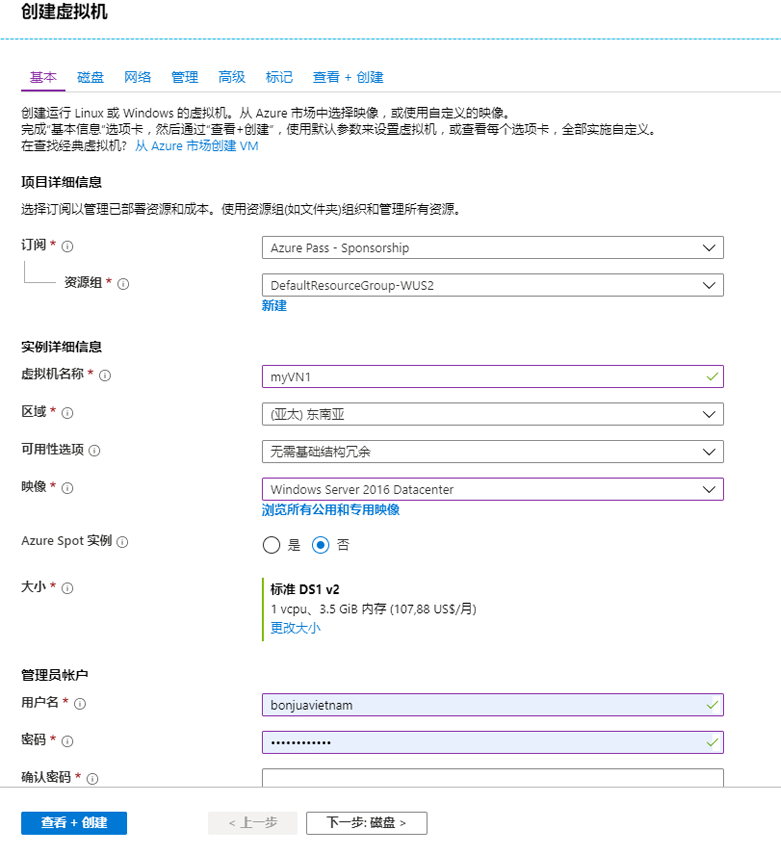
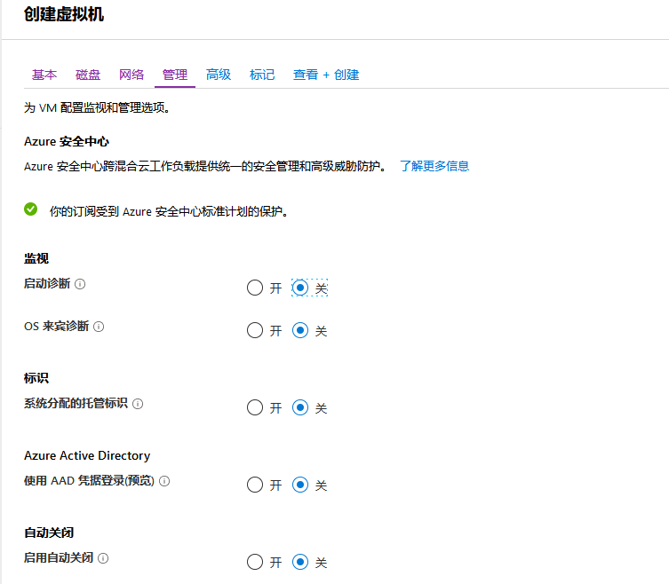

---
lab:
    title: '实验室教学 8 - VNet 对等互连'
    module: '模块 2 - 实施平台保护'
---

# 模块 2：实验室教学 8 - VNet 对等互连


**场景**

你可以通过虚拟网络对等互连，将虚拟网络彼此连接。这些虚拟网络可以位于相同区域或不同区域（也称为全局 VNet 对等互连）。虚拟网络对等互连后，两个虚拟网络中的资源能够以相同的延迟和带宽相互通信，类似于资源位于同一虚拟网络中。在本教程中，你将学会如何：

- 创建两个虚拟网络
- 使用虚拟网络对等互连，连接两个虚拟网络
- 将虚拟机 (VM) 部署到每个虚拟网络中
- 在 VM 之间进行通信


### 练习 1：创建虚拟网络并实施对等互连。

### 任务 1：创建虚拟网络

1.  在 Azure 门户网站的左上角选择**+ 创建资源**。
2.  选择 **联网**，然后选择 **虚拟网络**。
3.  输入或选择以下信息，接受其余的默认设置，然后选择 **创建**：

    |设置|值|
    |---|---|
    |名称|myVirtualNetwork1|
    |地址空间|10.0.0.0/16|
    |订阅| 选择你的订阅。|
    |资源组| 选择**新建**，输入 *MyResourceGroup*。|
    |地点| 选择**“美国东部”**。|
    |子网名|Subnet1|
    |子网地址范围|10.0.0.0/24|


4.  再次完成步骤 1-3，进行以下更改：

    |设置|值|
    |---|---|
    |名称|myVirtualNetwork2|
    |地址空间|10.1.0.0/16|
    |资源组| 选择**使用现有**，然后选择**myResourceGroup**。|
    |子网地址范围|10.1.0.0/24|

### 任务 2：对等互连虚拟网络

1.  在 Azure 门户顶部的搜索框中，开始输入 *MyVirtualNetwork1*。搜索结果显示 **myVirtualNetwork1**时，选中。
2.  在 **设置**中选择 **对等互连**，然后选择 **+ 添加**。

3.  输入或选择以下信息，接受其余的默认设置，然后选择 **确定**。

    |设置|值|
    |---|---|
    |名称|myVirtualNetwork1-myVirtualNetwork2|
    |订阅| 选择你的订阅。|
    |虚拟网络|myVirtualNetwork2-选择 *myVirtualNetwork2* 虚拟网络，选择 **虚拟网络**，然后选择 **myVirtualNetwork2**。你可以在相同区域或不同区域中选择一个虚拟网络。|
    |名称|myVirtualNetwork2-myVirtualNetwork1|


    **对等互连状态***已发起*，如以下屏幕截图所示：


    如果看不到状态，请刷新浏览器。

    **对等互连状态** 为 *已连接*。Azure 还更改了 *myVirtualNetwork2-myVirtualNetwork1* 的对等互连状态，从 *已发起* 更改为 *已连接。*两个虚拟网络对等互连状态为*已连接*后，才算成功建立虚拟网络对等互连。 
    
    

### 任务 3：创建虚拟机

1.  在 Azure 门户网站的左上角选择**+ 创建资源**。
2.  选择 **计算**，然后选择 **Windows 服务器 2016 数据中心**。你可以选择其他操作系统，但是其余步骤假定你已选择 **Windows 服务器 2016 数据中心**。 
3.  对于 **基本**，输入或选择以下信息，接受其余的默认设置，然后选择 **创建**：

    |设置|值|
    |---|---|
    |资源组| 选择**“我的资源组”**。|
    |名称|myVM1|
    |区域| 美国东部|
    |用户名| localadmin |
    |密码| Pa55w.rd1234 |
       
     
   

5.  选择网络选项卡：

    |设置|值|
    |---|---|
    |虚拟网络| myVirtualNetwork1-如果尚未选择，请选择 **虚拟网络**，然后在 **选择虚拟网络** 下选择 **myVirtualNetwork1**。|
    |子网| 子网 1-如果尚未选择，请选择 **子网**，然后在**选择子网**下选择**子网 1**。|
    |公共入站端口| 选择**允许选定的端口**。|
    |选择入站端口| **RDP** |


1.  选择管理选项卡，然后将所有单选按钮切换为 **关**。

     

6.  选择 **审阅 + 创建**并单击 **创建**。


1.  通过以下更改再次完成上述步骤（创建虚拟机需要几分钟的时间。在创建两个 VM 之前，不要继续其余步骤。）：

 |设置|值|
 |---|---|
 |名称 | myVM2|
 |虚拟网络 | myVirtualNetwork2|


### 任务 4：在 VM 之间进行通信

1.  在门户顶部的 *搜索* 对话框中，开始输入 *myVM1*。搜索结果显示 **myVM1**时，选中。
2.  通过选择*连接*，创建到**myVm1 **VM 的远程桌面连接。

3.  要连接到 VM，请打开下载的 RDP 文件。如果出现提示，请选择**连接**。
4.  输入创建 VM 时指定的用户名和密码（需要选择 **更多选择**，然后 **使用其他帐户**，指定你在创建 VM 时输入的凭证），然后选择 **确定**。
5.  在登录过程中，你可能会收到证书警告。选择 **确定** 继续进行连接。
6.  在后续步骤中，使用 ping 实现从 *myVm1* VM 与*myVm2* 虚拟机的通信。Ping 使用网络控制消息协议 (ICMP)，默认情况下会通过 Windows 防火墙拒绝该协议。在 *myVm1* VM，通过 Windows 防火墙启用ICMP，你可以在以后的步骤中，使用 PowerShell，从 *myVm2* 对该 VM 进行 ping：

    ```powershell
    New-NetFirewallRule -DisplayName "Allow ICMPv4-In" -Protocol ICMPv4
    ```
    
    尽管在本教程中使用 ping 在 VM 之间进行通信，但不建议通过 Windows 防火墙允许 ICMP 进行生产部署。

7.  如需连接到 *myVm2* VM，在 *myVm1* VM 的命令提示符下输入以下命令：

    ```cli
    mstsc /v:10.1.0.4
    ```
    
8.  由于你启用了 *myVm1* 的 ping，你现在可以按 IP 地址进行 ping：

    ```cli
    ping 10.0.0.4
    ```
    
9.  断开你的 RDP 会话与 *myVM1* 和 *myVM2* 的连接。


10. 保持所有资源运行。  你将在以后的实验室教学中使用。


**“结果”**：现在你已经完成了本实验室教学。

