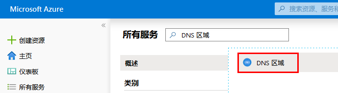
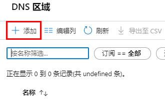
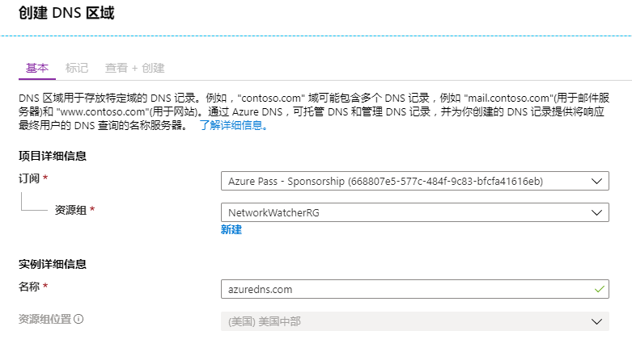
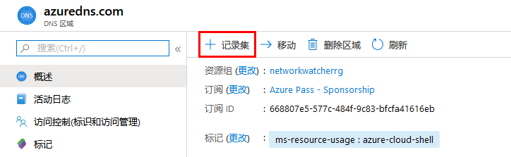
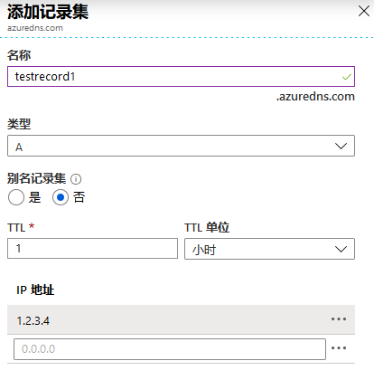
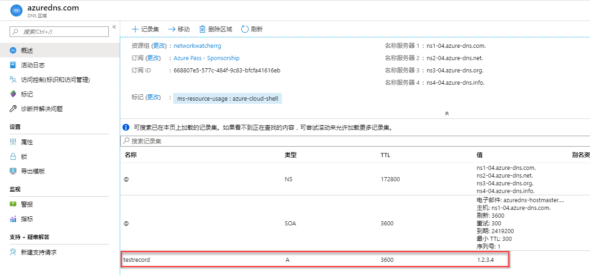
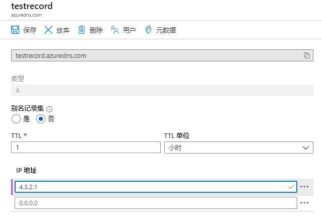
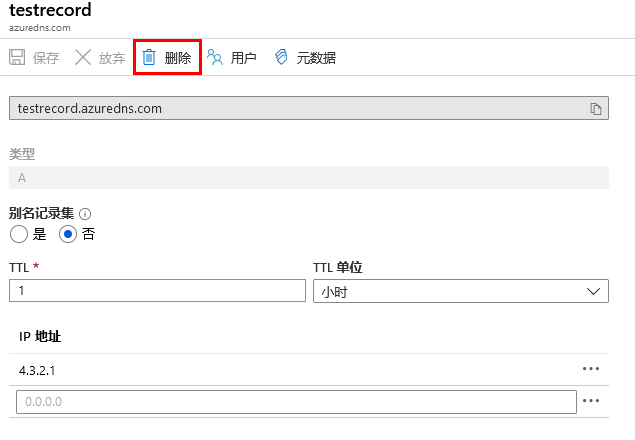

---
lab:
    title: '实验室教学 9：Azure DNS'
    module: '模块 2 - 实施平台保护'
---

# 实验室教学 9：Azure DNS

**场景**

在本模块中，你将了解 DNS 的基础知识以及实现 Azure DNS 的具体方法。在 DNS 基础知识课程中，你将查看 DNS 域、区域、记录类型和解析方法。在 Azure DNS 课程中，我们将介绍委托、指标、警报和 DNS 托管方案。 

**目标**

课程包括：

 * Azure DNS 基础知识
 * 实施 Azure DNS

## 练习 1：DNS 区域

### 任务 1：创建 DNS 区域

1.  登录至 Azure 门户。
2.  在中心菜单上，单击 **所有服务** 并搜索选择 **DNS 区域**。

     

1. 单击**+ 添加**。

     

4.  在 **创建 DNS 区域** 刀片服务器中，输入以下值，然后单击 **审阅 + 创建**，然后单击 **创建**：

     | **设置** | **值** | **详情** |
     |------|---|---|
     |**订阅**|_**你的订阅**_|选择一个订阅，在其中创建 DNS 区域。|
     |**资源组**|新建：**_myResourceGroup_**|创建一个资源组。你选定订阅中的资源组名必须是唯一的。 
     |**名称**|**_查看详情**_|DNS 区域的名称（必须是唯一的） |
     |**位置**|美国东部||

     

## 练习 2：使用 Azure 门户管理 DNS 记录和记录集

本练习向你介绍了如何使用 Azure 门户管理 DNS 区域的记录集和记录。

### 任务 1：将新记录添加到记录集

1.  在 Azure 门户中，导航到**所有资源**，然后选择在上一个任务中创建的 DNS 区域。

**注：**每个 DNS 区域都是其自有资源，并且可以从此视图中查看诸如记录集数量和名称服务器之类的信息。 

 
3.  单击 **+ 记录集**。
 
     

4.  在名称中输入 **测试记录**和 **1.2.3.4** 作为 IP 地址，然后单击**确定**。

     

### 任务 2：更新记录

1.  在 DNS 区域的概览刀片服务器中，选择你创建的测试记录。

      
 
2.  在 IP 地址下，添加以下测试地址：**4.3.2.1**，然后单击**保存**。

     
 
### 任务 3：删除记录集中的一个记录

你可以使用 Azure 门户，从记录集中删除记录。请注意，从记录集中删除最后一个记录不会删除该记录集。

1.  在 DNS 区域的概述窗格中，选择创建的测试记录。

     

2.  选择**删除**，然后在提示时单击**是**。

      
 

**使用 NS 和 SOA 记录**

自动创建的 NS 和 SOA 记录的管理方式与其他记录类型不同。

**修改 SOA 记录**

你不能从区域顶点（名称=“ \ @”）处自动创建的 SOA 记录集中添加或删除记录。但是，你可以修改 SOA 记录（“主机”除外）和记录集 TTL 中的任何参数。

**在区域顶点处修改 NS 记录**

区域顶点处的 NS 记录集随每个 DNS 区域自动创建。其中包含分配给该区域 的Azure DNS 名称服务器名。

你可以将其他名称服务器添加到此 NS 记录集中，以支持具有多个 DNS 提供程序的共同托管域。你也可以为此记录集修改 TTL 和元数据。但是，你不能删除或修改预填充的 Azure DNS 名称服务器。

请注意，这仅适用于区域顶点处的 NS 记录集。区域中的其他 NS 记录集（用于委托子区域）可以不受限制地进行修改。

**删除 SOA 或 NS 记录集**

你不能删除在创建区域时自动创建的区域顶点（名称=“ \ @”）上的 SOA 和 NS 记录集。删除区域时，这些记录集将被自动删除。

然后提示你确认要删除的 DNS 区域。删除 DNS 区域还会删除该区域中包含的所有记录。

| 警告：在继续之前，你应该删除此实验室教学使用的所有资源。  为此，应在**“Azure 门户”**中，单击**“资源组”**。  选择你创建的任何资源组。  在资源组边栏选项卡上，单击**删除资源组**，输入资源组名称，然后单击**删除**。  对你创建的任何其他资源组重复该过程。**否则可能会导致其他实验室出现问题。** |
| --- |
