---
lab:
    title: '实验室教学 10 - 负载均衡器'
    module: '模块 2 - 实施平台保护'
---

# 模块 2：实验室教学 10 - 负载均衡器


**场景**

在本模块中，你将学习三种分配网络流量的方法：Azure 负载均衡器，Azure 流量管理器和 Azure 应用程序网关。Azure Load Balancer为应用程序提供高可用性和网络性能。你可以通过 Azure 流量管理器控制用户流量到服务终结点的分配。Azure 应用程序网关是一种网络流量负载均衡器，可用于管理网络应用程序的流量。 

**课程包括：**

- Azure 负载均衡器
- Azure 流量管理器 
- Azure 应用程序网关


## 练习 1：使用标准负载均衡器分配网络流量


在本节中，你将创建一个公共负载均衡器，以帮助虚拟机实现负载均衡。标准负载均衡器仅支持标准公共 IP 地址。创建标准负载均衡器时，还必须创建一个配置为前端的新标准公共 IP 地址（默认名为 *LoadBalancerFrontend*）。 


### 任务 1：创建公共负载均衡器。

1.  在屏幕的左上角，单击 **创建资源** > **联网** > **负载均衡器**。  

2.  在**创建负载均衡器**页面中，输入或选择以下信息，接受其余的默认设置，然后选择 **审阅 + 创建**：

    | 设置                 | 值                                              |
    | ---                     | ---                                                |
    | 订阅               | 选择你的订阅。    |
    |资源组 | 选择**新建**，然后输入myResourceGroupLB    |
    | 名称                   | *myLoadBalancer*                                   |
    | 区域           | 选择**“美国东部”**。                          |
    | 类型          | 公共                                        |
    | SKU           | 标准版                          |
    | 公共 IP 地址 | 在名称框中选择**新建**和类型*myPublicIP*。  |
    | 可用区域：               | **Zone-redundant**    |
    
      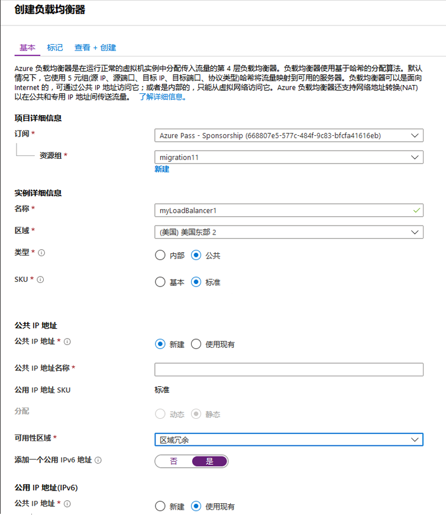

1.  在验证屏幕上，单击**创建**。

### 任务 2：创建虚拟网络

1.  在屏幕的左上角单击**+ 创建资源** > **联网** > **虚拟网络**，并为虚拟网络输入以下值：
    - **myVnet** - 虚拟网络名。
    - **10.0.0.0/16** - 地址空间
    - **myResourceGroupLB** - 现有资源组名
    - **myBackendSubnet** - 子网名。
    - **10.0.0.0/24** - 子网地址范围
    </br>

2.  单击**创建**，创建虚拟网络。

     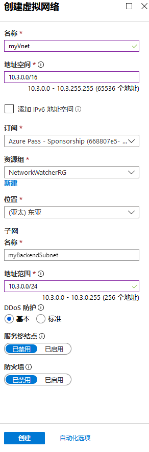

### 任务 3：创建虚拟机

1.  在屏幕的左上角，单击**创建资源** > **计算** > **虚拟机**，并为虚拟机输入以下值：
          
    - **myResourceGroupLB** -  **资源组**，从下拉菜单中选择 *myResourceGroupLB*。
    - **myVM1** - 虚拟机名。  
    - **Image** - Windows 服务器 2019 数据中心。
    - **localadmin** -  **用户名**
    - **Pa55w.rd1234** -  **密码**
    - **HTTP (80) & RDP (3389)** - 入站端口规则。
</br>

     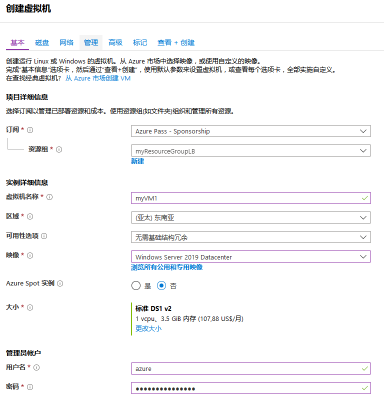

1.  单击网络选项卡，然后在公共 IP 下单击**新建**。  命名 IP 地址为 **myPIP1**，然后单击**标准 SKU**和**确定**。

    **注**：如果你在此处未选择标准 SKU，则稍后将在实验室教学中遇到问题。


     

2.  选择**管理**选项卡并确保所有单选按钮均为**打开**或**关闭**。

1.  单击**审阅 + 创建**，然后单击**创建**。

7.  重复上述步骤，使用_** myPIP2 **_ 作为新的公共 IP 地址，创建另一个名为***myVM2***的 VM。 
 
### 任务 4：安装 IIS

1.  在左侧菜单中单击**所有资源**，然后从资源列表中单击 **myVM1**，位于 *myResourceGroupLB* 资源组中。

2.  在**概览**页面上，单击**连接**，将 RDP 连接到 VM。
3.  使用用户名 *localadmin* 登录 VM。
4.  打开 PowerShell，然后运行以下命令来安装 IIS。

     ```powershell
    Install-WindowsFeature Web-Server
     ```

7.  对虚拟机 *myVM2* 重复步骤 1 至 4。

### 任务 5：创建负载均衡器资源


在本部分中，你将为后端地址池和运行状况探测器配置负载均衡器设置并指定负载均衡器规则。

为了将流量分配给 VM，后端地址池包含连接到负载均衡器的虚拟 NIC 的 IP 地址。创建后端地址池 *myBackendPool*，纳入 *VM1* 和 *VM2*。


1.  在左侧菜单中单击**所有资源**，然后单击资源列表中的 **myLoadBalancer**。

2.  在**设置**中，单击**后端池**，然后单击**添加**。

     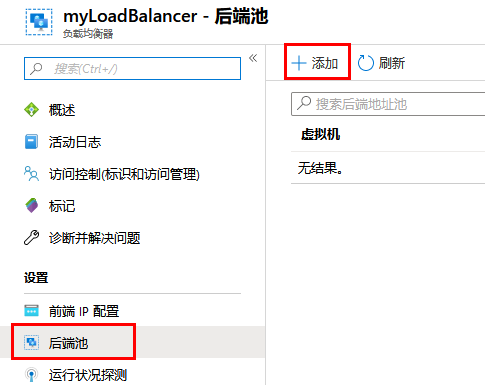

3.  在**添加后端池**页面上，执行以下操作：
   - 输入名称 *myBackendPool*，作为你的后端池名。
   - 对于**虚拟网络**，选择 *myVNet*。
   - 在**虚拟机**下添加 *myVM1* 和 *my VM2*以及它们相应的 IP 地址，然后选择**添加**。
 </br>
 
     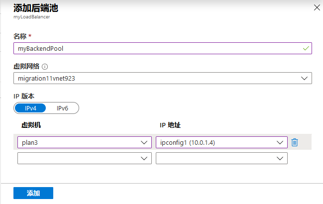

3.  检查并确保你的负载均衡器后端池设置同时显示两个 VM，**VM1** 和 **VM2**。

     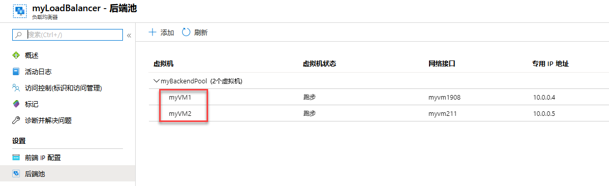

### 任务 6：创建运行状况探测器


要允许负载均衡器监视应用程序的状态，请使用运行状况探测器。运行状况探测器根据对运行状况检查的响应，动态地从负载均衡器轮换中添加或删除 VM。创建运行状况探测器 *myHealthProbe*，监视 VM 的运行状况。


1.  在负载均衡器刀片服务器上，在**设置**中，单击**运行状况探测器**，然后单击**添加**。

     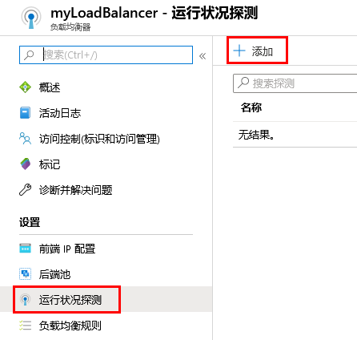

3.  使用以下值创建运行状况探测器：
    - *myHealthProbe* - 运行状况探测器名。
    - **HTTP** - 协议类型。
    - *80* - 端口号。
    - */* - URI 路径。 
    - *15* - 两次尝试之间**间隔**的秒数。
    - *2* -  **异常阈值**或连续探测器故障数，这些故障必须在 VM 被认为异常之前发生。
</br>
 
     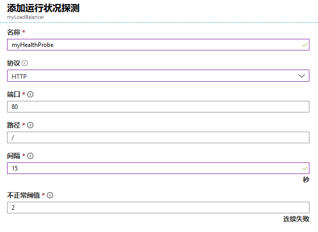


4.  单击**确定**。


### 任务 7：创建负载均衡器规则


负载均衡器规则用于定义如何将流量分配到 VM。你可以为传入流量和后端 IP 池定义前端 IP 配置，以接收流量以及所需的资源和目标端口。创建负载均衡器规则 *myLoadBalancerRuleWeb*，用于监听前端 *FrontendLoadBalancer* 的端口 80 并使用该端口，将负载均衡的网络流量发送到后端地址池 *myBackEndPool*。 


1.  在负载均衡器刀片服务器上，在**设置**中，单击**负载均衡规则**，然后单击**添加**。

     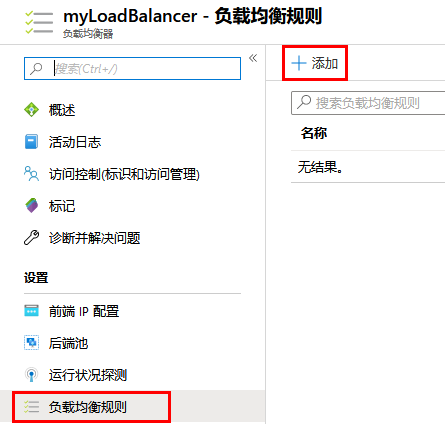


3.  使用以下值来配置负载均衡规则：
    - *myHTTPRule* - 负载均衡规则名称。
    - **HTTP** - 协议类型。
    - *80* - 端口号。
    - *80* - 后端端口。
    - *myBackendPool* - 后端池名称。
    - *myHealthProbe* - 运行状况探测器名。
    </br>
    
      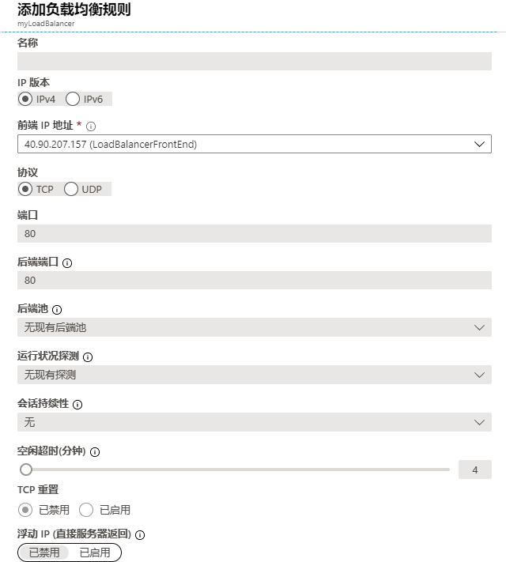
    
4.  单击**确定**。
    
### 任务 8：测试负载均衡器。

1.  在**概览**屏幕上找到负载均衡器的公共 IP 地址。

     
  
2.  复制公共 IP 地址，然后将其粘贴到浏览器的地址栏中。IIS 网络服务器的默认页面显示在浏览器上。

     

1.  请注意，IIS 默认页面已加载。

1.  在 Azure 门户的中心菜单中，单击**虚拟机**。  选择 myVM1，然后在**概览**刀片服务器中，单击**停止**并选择**确定**。

     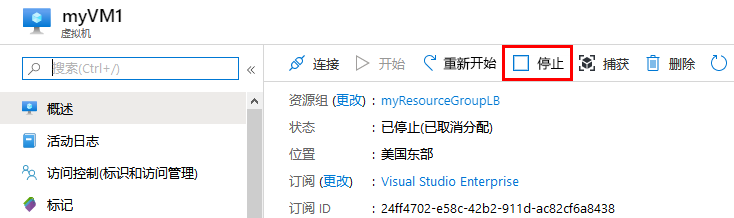
 
1.  等待，直到 myVM1 虚拟机停止，然后返回带有负载均衡器公共 IP 的浏览器选项卡，然后单击刷新，确认 myVM2 继续为请求提供服务，并且负载均衡器按照预期运行。

## 练习 2：  负载均衡器 ARM 部署

### 任务 1：部署一个 ARM 模板 


此模板允许你在负载均衡器下创建2个虚拟机，并在端口80上配置负载均衡规则。此模板还部署存储帐户、虚拟网络、公共IP地址、可用性集和网络接口。在此模板中，我们使用资源循环功能来创建网络接口和虚拟机


1.  在浏览器的新标签中，导航到以下网址 **`https：// aka.gd / 2E2MAjh`**

1.  请点击**“部署到 Azure”**

     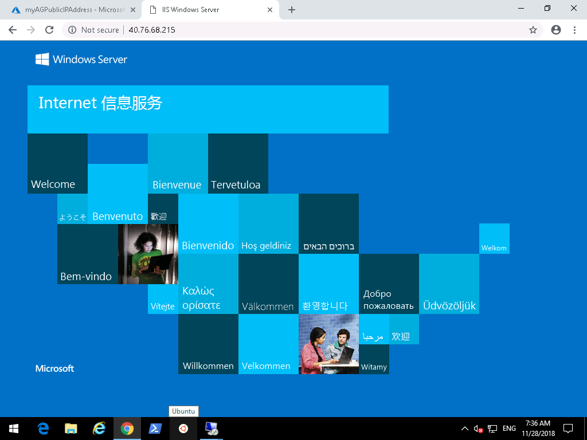

1.  在打开的模板刀片服务器上，输入以下详细信息：

      - 资源组：  **myResourceGroupLB**
      - 管理员用户名：  **localadmin**
      - 管理员密码：  **Pa55w.rd1234**

1.  单击**我同意....** 然后单击**购买**。
# 练习 3：部署应用程序网关

### 任务 1：创建应用程序网关。


你创建的资源之间的通信需要虚拟网络。在此示例中，创建了两个子网：一个用于应用程序网关，另一个用于后端服务器。你可以在创建应用程序网关的同时创建虚拟网络。


1.  首先，你需要为要驻留的应用程序网关创建一个子网。单击中心菜单上的**虚拟网络**，然后选择**myVNet**。

     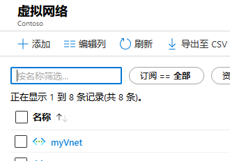
 
1.  单击**子网**，然后单击**+ 子网**。

     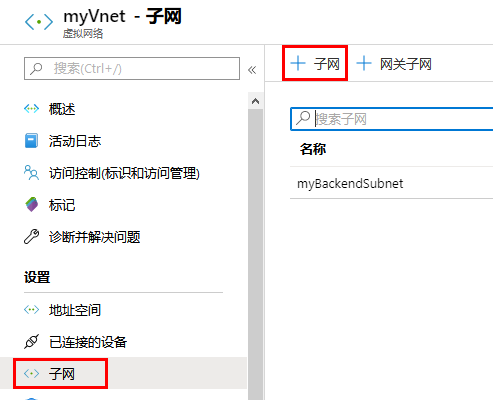
 
1.  输入**myAppGWSubnet**作为名称，然后单击**确定**。

     

1.  在 Azure 门户的左上角，单击**创建一个资源**链接。

2.  单击**联网**，然后在精选列表中单击**应用程序网关**。

     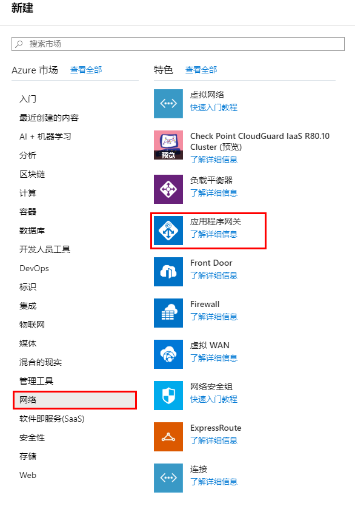

1.  输入应用程序网关基础刀片服务器的这些值，然后单击**下一个**：

    - *myAppGateway* - 应用程序网关的名称。
    - *myResourceGroupLB* - 选择已经存在的资源组。
    - *myVnet* - 选择已经存在的虚拟网络。
</br>
    
        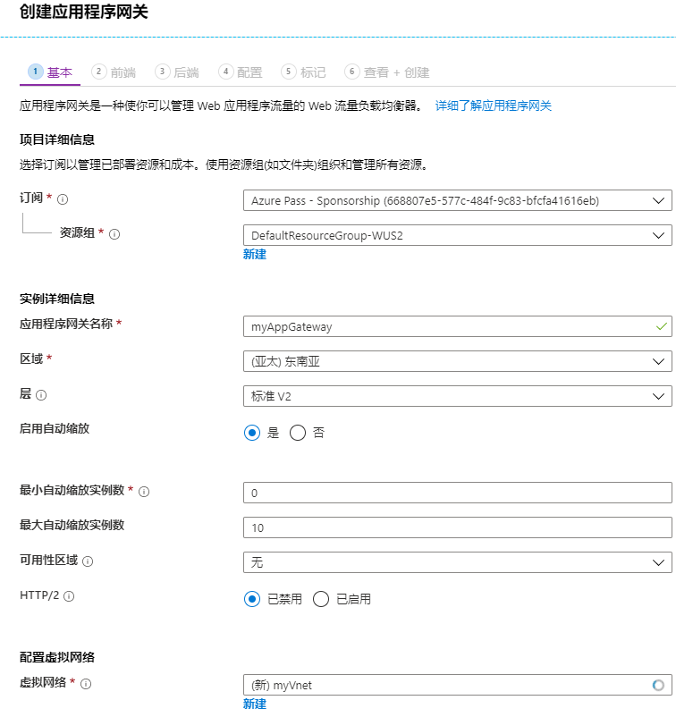

7.  在**前端配置**刀片服务器中，确保**IP 地址类型**设置为**公共**，在**公用 IP 地址**中，单击**新建**。键入***myAGPublicIPAddress*** 作为公共 IP 地址名称，然后单击**确定**。

     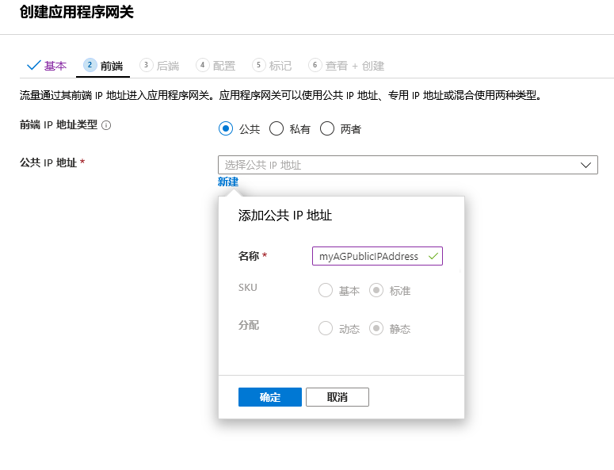
 
1. 单击**下一步**。

1. 选择**+ 添加后端池**。

1. 输入名称 **appGatewayBackendPool**。  在后端目标下，选择 **虚拟机** 并添加 myVM1 和 myVM2 虚拟机及其关联网络接口，然后单击**添加**。

     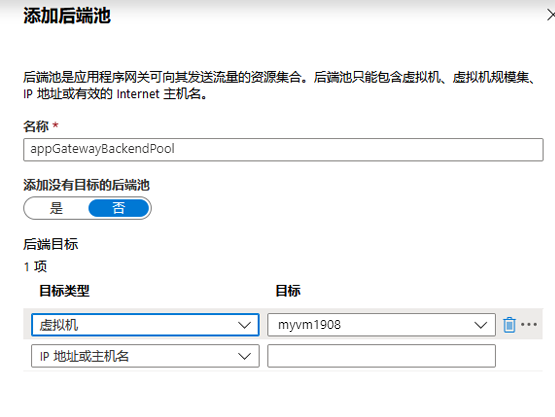

1. 单击**下一步**。

1. 在**配置**标签中，你将连接使用路由规则创建的前端池和后端池。

1. 在**路由规则**列中，选择**添加规则**。

2. 在打开的**添加路由规则**窗口中，输入 *myRoutingRule* 作为**规则名**。

3. 路由规则需要一个侦听器。在**侦听器**标签内，**添加路由规则** 窗口，为侦听器输入以下值：

    - **侦听器名称**：输入 *myListener* 作为侦听器名称。
    - **前端 IP**：选择 **公共**，选择你为前端创建的公共 IP。
  
      在**侦听器**标签中，接受其他设置的默认值，然后选择**后端目标**标签，配置其余路由规则。

       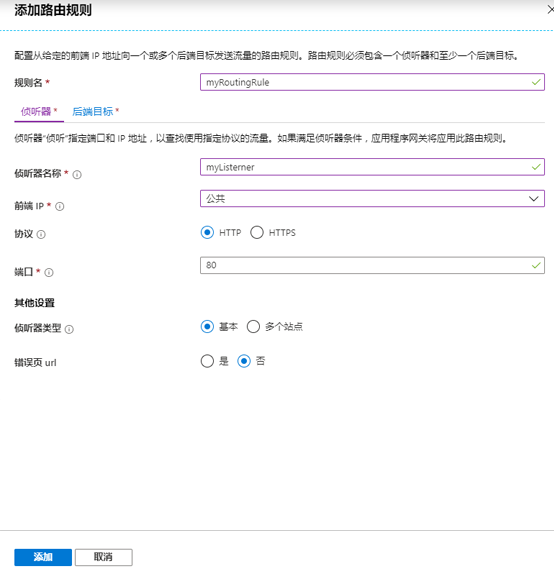

4. 在**后端目标**标签中，选择 **myBackendPool** 作为**后端目标**。

5. 对于 **HTTP 设置**，选择**新建**，创建一个新的 HTTP 设置。HTTP 设置将确定路由规则的运行方式。在打开的**添加 HTTP 设置**窗口，输入 *myHTTPSetting* 作为 **HTTP 设置名称**。在**添加 HTTP 设置**窗口中接受其他默认设置，然后选择**添加**，返回到**添加路由规则**窗口。 


    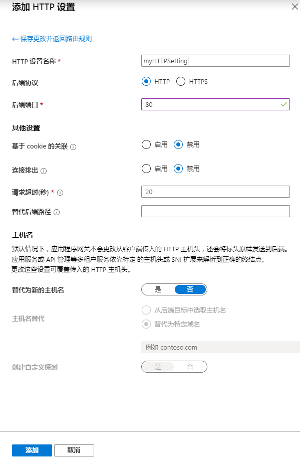

6. 在**添加路由规则**窗口中，选择**添加**，保存路由规则并返回到**配置**标签。

      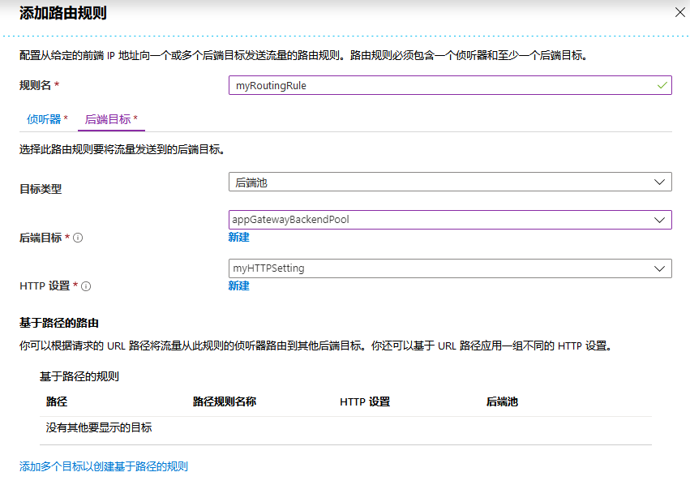

7. 选择**下一步：标签**，然后选择**下一个：审阅 + 创建**。


### 任务 2：测试应用程序网关。

1.  在概述屏幕上找到应用程序网关的公共 IP 地址。单击**所有资源**，然后单击 **myAGPublicIPAddress**。

     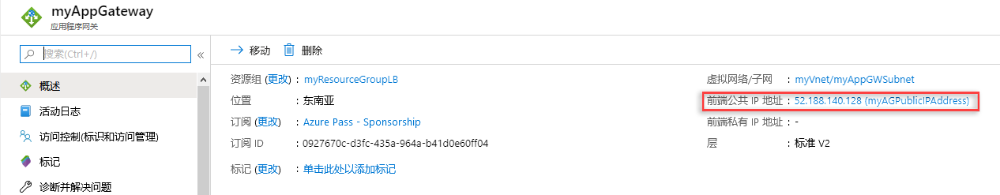
 
2.  复制公共 IP 地址，然后将其粘贴到浏览器的地址栏中。

     


| 警告：在继续之前，你应该删除此实验室教学使用的所有资源。  为此，应在**“Azure 门户”**中，单击**“资源组”**。  选择你创建的任何资源组。  在资源组边栏选项卡上，单击**删除资源组**，输入资源组名称，然后单击**删除**。  对你创建的任何其他资源组重复该过程。**否则可能会导致其他实验室出现问题。** |
| --- |
**“结果”**：现在你已经完成了本实验室教学。
