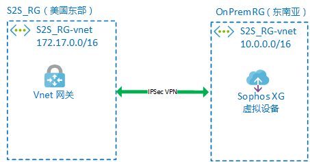
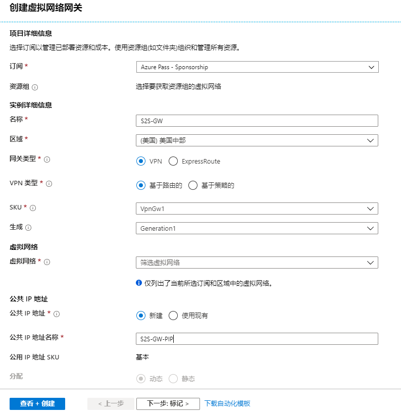
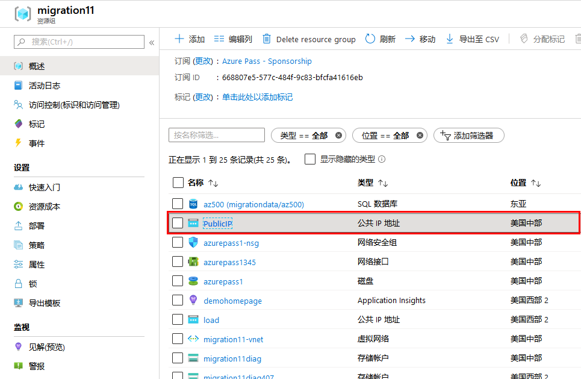
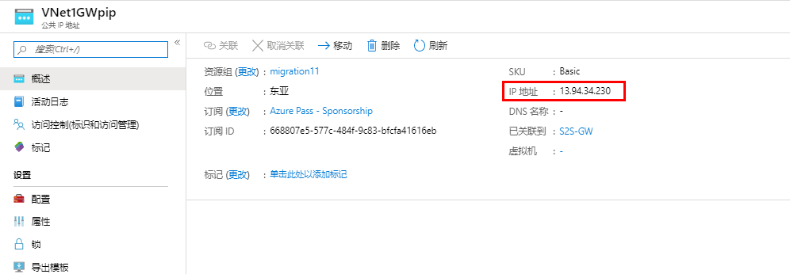
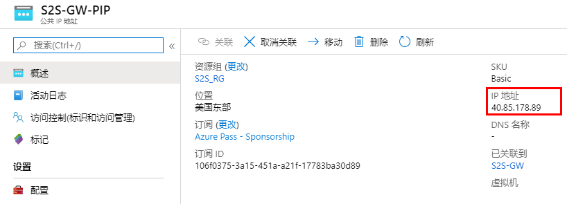
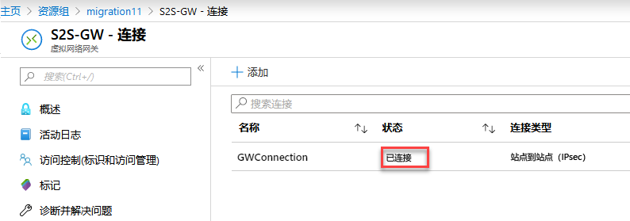

---
lab:
    title: '实验室教学 11：本地到 Azure 连接 - VPN 网关和隧道技术'
    module: '模块 2 - 实施平台保护'
---

# 模块 2：实验室教学 11：本地到 Azure 连接 - VPN 网关和隧道技术

## 练习 1：部署虚拟设备和网关，实现站点间连接。

### 任务 1：部署网络虚拟设备。


在此任务中，你将创建一个 Sophos XG 虚拟设备，该设备将模拟本地设备。  下图描述了具体布局

   

1.  打开 PowerShell，然后运行以下命令。

     ```powershell
    start "https://portal.azure.com/#create/Microsoft.Template/uri/https%3A%2F%2Fraw.githubusercontent.com%2FMicrosoftLearning%2FAZ-500-Azure-Security%2Fmaster%2FAllfiles%2FLabs%2FMod2_Lab11%2Ftemplate.json"
     ```
 
2.  如果需要，请登录到门户。

3.  在自定义部署上，输入或选择以下详细信息：

 | 设置 | 值 |
 |---|---|
 | 资源组 | _新建_ **OnPremRG** |
 | 地点 | **东南亚** |
 | 管理员密码 | **Pa55w.rd1234** |
 | 公共 IP DNS | _输入唯一名称_ |
 | 储存名称 | _输入唯一名称_ |
 
4.  滚动到刀片服务器的底部，然后单击我同意条款和条件.....旁边的复选框，然后单击**购买**。 
 
### 任务 2：创建资源组和 VNet。


在此任务中，你将在新的资源组内创建虚拟机和虚拟网络，这些资源组将用于连接到模拟的本地环境。


1.  登录到你的 Azure 门户 **https://portal.azure.com**

1.  单击**创建资源** > **联网** > **虚拟网络**

1.  更改**创建虚拟网络**刀片服务器中的值，将值更改为与以下输出相同：

      - **名称** S2S_RG-vnet
      - **地址空间** 172.17.0.0/16
      - **资源组** 新建：S2S_RG
      - **位置**：美国东部
      - **子网地址范围** 172.17.0.0/24

1.  单击**创建**。
**注：**  你可以继续执行下一个任务，而不必等待部署完成。


### 任务 2：创建一个网关子网和一个虚拟网络网关。


在此过程中，你将创建一个网关子网和虚拟网络网关，使你能够在本地和 Azure VNet 之间创建连接。


1.  在 Azure 门户的中心菜单上单击**资源组**。
 
1.  单击你创建的 **S2S_RG** 资源组。

1.  在 S2S_RG 资源组刀片服务器中，单击 **S2S_RG-vnet**。

1.  在 **S2S_RG-vnet** 菜单中，单击 **子网**。

1.  选择**+ 网关子网**。  

    **注：**你需要创建一个网关子网，使网关计算机驻留在其中。所有路由均由 Azure 软件定义的网络完成。


1.  在**添加子网**刀片服务器中保留默认选项并单击**确定**。

1.  单击 **+ 创建资源**。

1.  搜索虚拟网络网关，然后选择**虚拟网络网关**。

1.  单击**创建**。

1.  在**创建虚拟网络网关**刀片服务器中，输入以下信息：

      - **名称**: S2S-GW
      - **名称**: 美国东部
      - **网关类型**：VPN
      - **VPN类型**：基于路由
      - **SKU**：基本版
      - **虚拟网络**：选择 S2S_RG-vnet（这是在部署 VM 时创建的）
      - **公共 IP 地址**：（新建）名称：S2S-GW-PIP


     

1.  单击**审阅 + 创建**，然后在摘要屏幕上单击**创建**

**注：**  不过，该网关最多可能需要45分钟才能部署。多数情况下，速度要快得多。  单击响铃图标对此进行监视。你可以在部署网关时继续执行下一个任务。


### 任务 3：配置 Sophos 虚拟设备。

1.  在 Azure 门户中心菜单上单击**资源组**。

1.  选择**OnPremRG**资源组。

1.  选择**公共 IP**资源。

     

1.  记下分配的公共 IP 地址。

     

1.  打开一个新的浏览器会话并导航到 **`https：// xxxx：4444`**（其中xxxx是上面提到的公共 IP 地址）。

1.  根据你的浏览器，可能会有不同的选项继续进行连接。

     

1.  使用以下凭证登录到防火墙：

      - Admin
      - Pa55w.rd1234
 
1.  接受许可协议。

1.  在注册你的防火墙页面上，单击**我没有序列号（开始试用）**，然后选择**我现在不想注册**，然后单击**继续**。

     

1.  在警告弹出窗口上，单击**继续**。

1.  返回 Azure 门户。  打开 **S2S_RG** 资源组，然后选择 **S2S-GW-PIP** 公共 IP 并记录。

    **注**：这是你的公共 IP，你将通过 IPSec VPN 连接 Sophos 虚拟设备。


     
 
1.  返回 Sophos 门户网站。

1.  转到 **VPN> IPsec 连接**，选择**添加**并配置以下设置：

    **常规设置部分：**

      - **名称**: On_Prem_to_Azure
      - **IP 版本**：IPv4.
      - **在保存时激活：**已选择。
      - **创建防火墙规则：**已选择。
      - **描述**：从本地到Azure VNet的站点到站点连接。
      - **连接类型**：站点到站点
      - **网关类型**：仅响应。

     

    **加密部分**：

      - **策略**：Microsoft Azure。
      - **身份验证类型**：预共享密钥。
      - **预共享密钥**：123456789
      - **重复预共享密钥**：123456789

     

    **网关设置部分**：

      - **监听界面**：保留默认设置。
      - **网关地址**：输入前面记录的 Azure VPN 网关的公共 IP。
      - **本地 ID**：IP 地址。
      - **远程 ID**：IP 地址。
      - **本地 ID**：输入本地 Sophos XG 防火墙的公共 IP。
      - **远程 ID**：输入你先前记下的 Azure VPN 网关的公共 IP。
      - **本地子网**：输入本地子网 10.0.0.0 / 16 (255.255.0.0)


      

      - **远程子网**：输入远程子网 172.17.0.0 / 16 (255.255.0.0)
</br>

        

1.  **高级**：保留默认设置。

1.  单击**保存**后，将激活 IPsec 连接。

**注**：不要单击**连接**列中的按钮，因为该操作将覆盖 IPsec 连接上设置的配置设定（**网关类型：仅响应**）。这是为了避免出现问题，因为 Azure 必须启动隧道。


### 任务 4：创建 Azure 连接。


在此任务中，你将在 Azure 网关上创建到本地防火墙的连接并建立连接。


1.  单击**中心菜单**中的**资源组**。

2.  选择 **S2S_RG** 资源组。 
 
1.  选择你的 **S2S-GW** 网关。 

1.  在 S2S-GW 菜单中单击 **连接数**。

1.  单击**添加**。

1.  在**添加连接**刀片服务器中输入以下信息。

      - **名称：**GWConnection
      - **连接类型：**站点到站点 (IPSec)
      - **虚拟网络网关：**S2S-GW

1.  单击**本地网络网关**

1.  单击**“新建”**。

1.  在**创建本地网络网关**刀片服务器中输入以下信息：

      - **名称：**OnPremGW
      - **IP 地址：**_输入你先前记录的 Sophos 本地防火墙的 IP 地址_
      - **地址空间：**10.0.0.0/16 _（注意：  这是本地服务器的 IP 范围）_

 
1.  单击**确定**。

2.  在**共享密钥 (PSK)** 对话框输入“ 123456789”，然后单击**确定**。

    **注：**  该密钥仅用于此实验室教学。  在实际操作中，你可以使用更复杂的组合。


1.  刷新页面，连接已建立。

    **注：**  建立连接可能需要 30 秒。

 
     


| 警告：在继续之前，你应该删除此实验室教学使用的所有资源。  为此，应在**“Azure 门户”**中，单击**“资源组”**。  选择你创建的任何资源组。  在资源组边栏选项卡上，单击**删除资源组**，输入资源组名称，然后单击**删除**。  对你创建的任何其他资源组重复该过程。**否则可能会导致其他实验室出现问题。** |
| --- |  


**“结果”**：现在你已经完成了本实验室教学。
