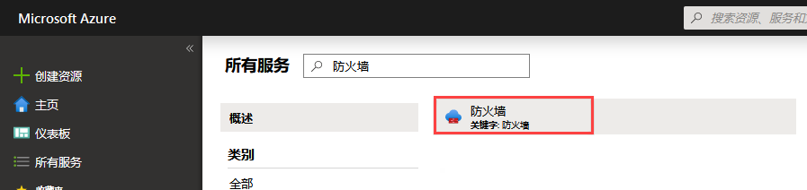
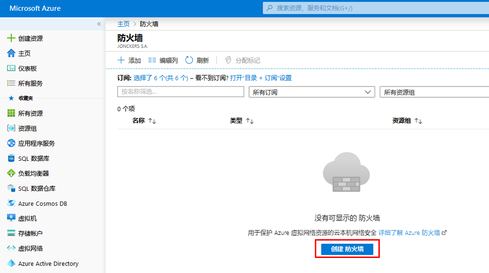
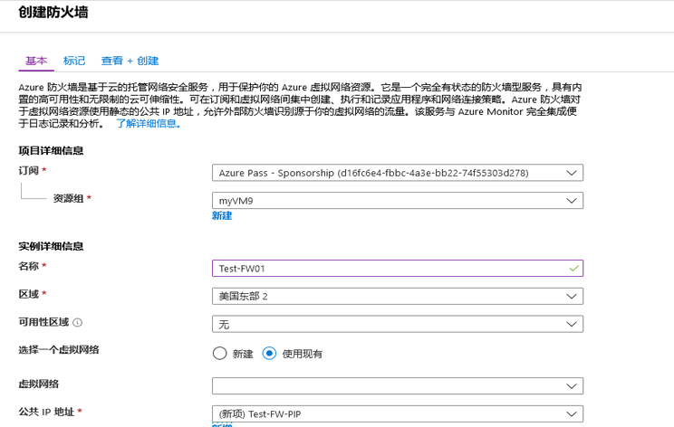
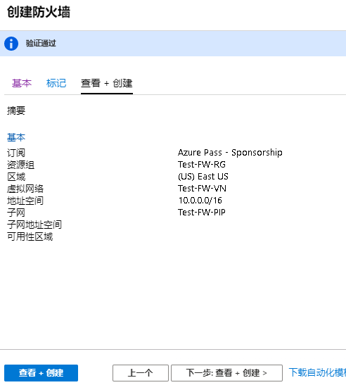
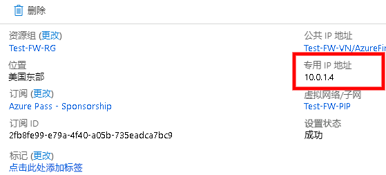

---
lab:
    title: '实验室教学 12 - Azure 防火墙'
    module: '模块 2 - 实施平台保护'
---

# 模块 2：实验室教学 12 - Azure 防火墙


**场景**

控制出站网络访问是整个网络安全计划的重要组成部分。例如，你会希望限制对网站或出站 IP 地址和端口的访问。

Azure 防火墙是一种可以控制 Azure 子网出站网络访问的方法。使用 Azure 防火墙，你可以配置：

* 定义可从子网访问的完全限定域名 (FQDN) 的应用程序规则。
* 定义源地址、协议、目标端口和目标地址的网络规则。

将网络流量作为子网默认网关路由到防火墙时，将受到配置防火墙规则约束的网络流量。

## 练习 1：部署 Azure 防火墙

### 任务 1：实验室教学设置

1.  打开 Powershell 并运行以下 Powershell 命令，打开一个 ARM 模板，用于部署本实验室教学中使用的资源。  _如果出现提示，选择 Chrome 作为浏览器。_

     ```powershell
    start "https://portal.azure.com/#create/Microsoft.Template/uri/ https%3A%2F%2Fraw.githubusercontent. com%2FGoDeploy%2FAZ500%2Fmaster%2FAZ500%20Mod2%20Lab%207%2Ftemplate.json"
     ```
 
2.  在资源组下，单击**新建**并使用资源组名称 **Test-FW-RG**  

3.  选择位置**美国东部**  

4.  所有其他字段保留为预先填充的默认值

5.  选中我同意...复选框，然后单击**购买**并等待部署完成。

    该实验室教学设置模板将为实验室教学设置以下资源

 |名称     |类型     | 地点|
 |---------|---------|---------|
Azure 防火墙-IP|	公共 IP 地址|	美国东部	
防火墙 - 路由 |	路由表|	美国东部	
服务器 - 跳转|	虚拟机|	美国东部	
Srv-Jump_OsDisk|	磁盘|	美国东部	
srv-jump121	|网络接口|	美国东部	
Srv-Jump-nsg|	网络安全组|	美国东部	
Srv-Jump-PIP|	公共 IP 地址|	美国东部	
Srv-Work|	虚拟机|	美国东部	
Srv-Work_OsDisk_1 |	磁盘|	美国东部	
srv-jump121|	网络接口|	美国东部	
Srv-Work-nsg|	网络安全组|	美国东部	
Test-FW-VN|	虚拟网络|	美国东部


### 任务 2：部署防火墙。


在此任务中，你需要将 Azure 防火墙部署到 VNet 中。


1.  在 Azure 门户中，单击**所有服务**并搜索选择**Azure 防火墙**。

     

3.  在**防火墙**刀片服务器中，单击**创建防火墙**。 

     

4.  在**创建防火墙**刀片服务器中，使用下表配置防火墙：

   |设置  |值  |
   |---------|---------|
   |订阅     |_你的订阅_|
   |资源组     |**使用现有**：Test-FW-RG |
   |名称     |Test-FW01|
   |地点     |美国东部|
   |选择一个虚拟网络     |**使用现有的**：测试-FW-VN|
   |公共 IP 地址     |**新建**。**TEST-FW-PIP** 公共 IP 地址必须是标准 SKU 类型。|
   
   

5.  单击**审阅 + 创建**。
6.  查看摘要，然后单击**创建**，创建防火墙。

     

    部署将花费几分钟时间。

7.  部署完成后，转到 **Test-FW-RG** 资源组，然后单击 **Test-FW-RG** 防火墙。

8.  记下**个人 IP** 地址。你将在以后创建默认路由时使用该地址。

     

### 任务 3：创建一个默认路由


对于 **Test-FW-RG** 子网，配置出站默认路由以通过防火墙。


1.  在 Azure 门户主页上，单击**所有服务**。
2.  在**联网**中，单击**路由表**。
3.  单击**添加**。
4.  对于**名称**，输入**Firewall-route**。
5.  对于**订阅**，选择你的订阅。
6.  对于**资源组**，选择**使用现有**，然后选择**Test-FW-RG**。
7.  对于**位置**，选择**美国东部**。
8.  单击**创建**。
9.  单击 **刷新**，然后单击**防火墙 - 路由**路由表。
10.  单击**子网** > **关联**。
11.  单击**虚拟网络** > **Test-FW-VN**。
12.  对于**子网**，单击**Workload-SN**。确保对该路由仅选择了**Workload-SN**子网，否则你的防火墙将无法正常运行。

13.  单击**确定**。
14.  单击**路由** > **添加**。
15.  对于**路由名称**，输入 **FW-DG**。
16.  对于**地址前缀**，输入 **0.0.0.0/0**
17.  对于**下一跃点类型**，选择**虚拟设备**。

        Azure 防火墙实际上是一项托管服务，但是在这种情况下虚拟设备可以运行。

18.  对于**下一跃点地址**，键入你之前记下的防火墙的专用 IP 地址。
19.  单击**确定**。

### 任务 4：配置应用程序规则


在此任务中，你将创建一个应用程序规则，该允许出站访问`msn.com`。


1.  打开**Test-FW-RG**资源组，然后单击**Test-FW01**防火墙。

2.  在**Test-FW01**页面，在**设置**部分，单击**规则**。
3.  单击**应用规则收集**选项卡。
4.  单击**添加应用程序规则集合**。
5.  对于**名称**，输入 **App-Coll01**。
6.  对于**优先级**，输入 **200**。
7.  对于**操作**，选择**允许**。
8.  在**规则**、**目标 FQDN**中，对于**名称**，输入**允许 GH**。
9.  对于**源地址**，输入**10.0.2.0/24**。
10.  对于**协议：端口**，输入**http，https**。
11.  对于**目标 FQDNS**，输入**msn.com**
12.  单击**添加**。

 Azure 防火墙包括默认情况下允许的用于基础结构 FQDN 的内置规则集合。这些 FQDN 特定用于平台，不能用于其他目的。 

### 任务 5：配置一个网络规则


在此任务中，你将创建一个网络规则，允许出站访问端口 53 (DNS) 上的两个 IP 地址。


1.  单击**网络规则集合**选项卡。
2.  单击**添加网络规则集合**。
3.  对于**名称**，输入**Net-Coll01**。
4.  对于**优先**，类型 **200**。
5.  对于**行动**，选择**允许**。

6.  在**IP地址** 部分的**规则**中，对于**名称**，输入**允许 DNS**。
7.  对于**协议**，选择**UDP**。
8.  对于**源地址**，类型 **10.0.2.0/24**。
9.  对于目标地址，输入 **209.244.0.3,209.244.0.4**
10.  对于 **目标端口**，输入 **53**。
11.  单击**添加**。

### 任务 6：对于**Srv-Work** 网络接口，更改主要和次要 DNS 地址


为了在本教程中进行测试，你需要配置主要 DNS 地址和次要 DNS 地址。这不是一般 Azure 防火墙要求。


1.  在 Azure 门户中，打开 **Test-FW-RG** 资源组。

2.  单击 **Srv-Work** 虚拟机的网络界面。

3.  在**设置**中，单击 **DNS 服务器**。

4.  在 **DNS 服务器**中，单击 **自定义**。

5.  在 **添加 DNS 服务器**文本框中，输入 **209.244.0.3**，以及在下一个文本框中输入 **209.244.0.4**。

6.  单击**“保存”**。 

7.  重新启动 **Srv-Work** 虚拟机。

### 任务 7：测试防火墙。


在此任务中，你将测试防火墙，确认其是否按预期工作。


1.  在 Azure 门户中，查看 **Srv-Work** 虚拟机的网络设置并记下私有 IP 地址。

2.  使用 RDP 连接到 **Srv-Jump** 虚拟机，然后从那里打开到 **Srv-Work** 私有 IP 地址的远程桌面连接。

	--	**用户名**：localadmin
    -	**密码**：Pa55w.rd1234
</br>
3.  打开网络浏览器并浏览到 **https://msn.com**

4.  单击 **确定** > **关闭** 安全警报。

   你应该能看到 MSN 主页。

5.  浏览到 **https://www.msn.com**

       - 你应该受到防火墙阻止。
       - 因此，现在你已经验证了防火墙规则是否有效：
          - 你可以浏览一个允许的 FQDN，但不能浏览到其他任何 FQDN。
          - 你可以使用配置的外部 DNS 服务器来解析 DNS 名称。


1. 将所有资源保留，用于下一个实验室教学。


**“结果”**：现在你已经完成了本实验室教学。


