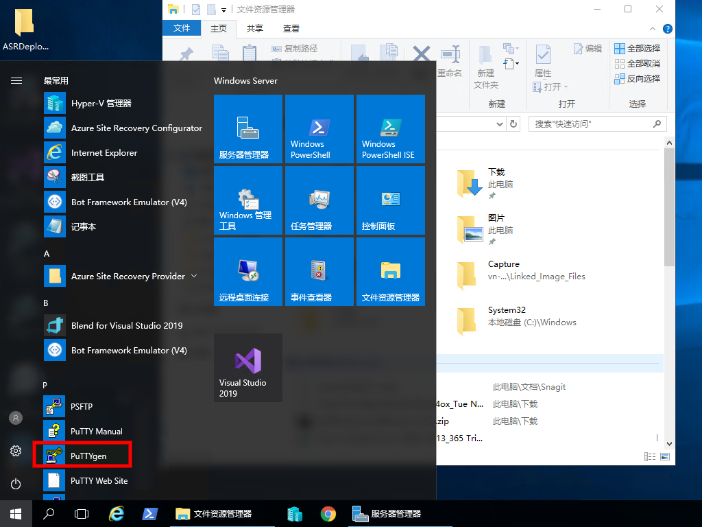
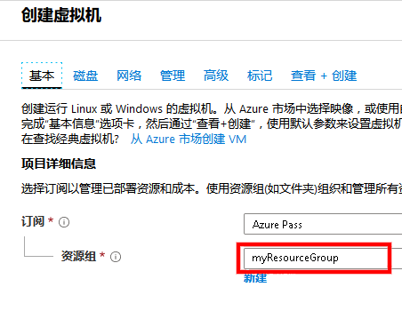
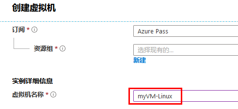
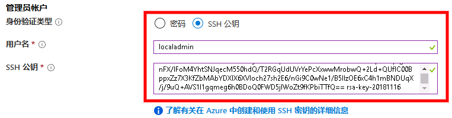
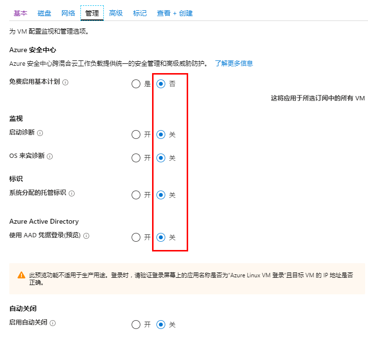
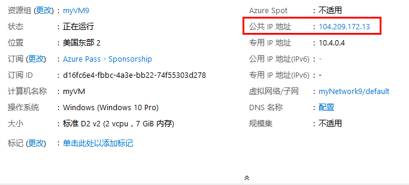
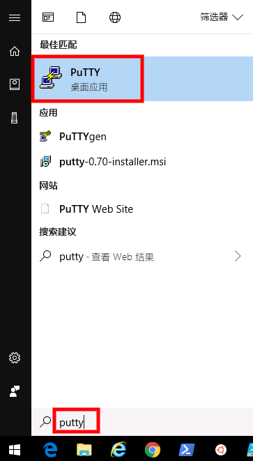

---
lab:
    title: '实验室教学 13 - 安全管理访问'
    module: '模块 2 - 实施平台保护'
---

# 模块 2 - 实施平台保护 

## 实验室教学 13 - 安全管理访问 


安全外壳 (SSH) 是一种加密连接协议，允许通过不安全的连接进行安全登录。SSH 是 Azure 中托管的 Linux VM 的默认连接协议。虽然 SSH 本身提供加密连接，但使用具有 SSH 连接的密码仍然会使VM容易受到暴力破解攻击或猜测密码。使用 SSH 连接到 VM 的更为安全的首选方法是使用公开-私有密钥对，也称为 SSH 密钥。

- 该公钥置于 Linux VM 或你希望与公钥加密一起使用的任何其他服务上。

- 连接到 Linux VM 时，SSH 客户端将使用本地系统上的私人密钥来验证你的身份。保护此私钥。请勿共享。

- 根据组织安全策略，你可以重用单个公开-私有密钥对来访问多个 Azure VM 和服务。对于希望访问的每个 VM 或服务，无需单独的密钥对。

你的公钥可以与任何人共享，但只有你（或你的本地安全基础架构）可以拥有你的私钥。

## 练习 1：安全部署并连接至 Azure VM

### 任务 1：使用 PuTTYgen 创建 SSH 密钥

1.  打开浏览器并导航到以下 URL：

     ```cli
    http://www.chiark.greenend.org.uk/~sgtatham/putty/download.html 
     ```

1.  下载并安装 **Putty 安装程序**。

     

1.  单击 **开始** 并导航到 **PuTTYgen**。

     

1.  单击生成。默认情况下，PuTTYgen 会生成 2048 位 SSH-2 RSA 密钥。

     

1.  在空白区域四处移动鼠标，提供密钥的随机性。

     

1.  生成公开密钥后，可以选择输入并确认密码。使用 SSH 私钥对 VM 进行身份验证时，系统将提示你输入密码。输入 **Pa55w.rd1234** 作为密码。

    如果没有密码，一旦有人获得了你的私钥，就可以登录使用该密钥的任何 VM 或服务。因此建议你创建密码。但是，如果你忘记了密码，将无法找回密码。


1.  公钥显示在窗口顶部。你可以复制整个公钥，然后在创建 Linux VM 时将其粘贴到 Azure 门户或 Azure 资源管理器模板中。将公钥保存到计算机上的某个位置并调用文件 **公共**：

     

2.  将私钥与文件名**私人**保存到相同位置。

     
 
1.  在顶部窗口突出显示并复制公钥。

     

### 任务 2：在 Azure 门户中创建一个 Linux 虚拟机

1.  返回 **Azure 门户**。

1.  在 Azure 门户网站的左上角选择 **创建资源**。

1.  在 Azure 市场资源列表上方的搜索框中，搜索并选择**Windows 服务器 18.04 数据中心**，之后选择**创建**。

1.  在**项目详情**下方的**基本信息**选项卡中，确保选择了正确的订阅，然后选择**资源组***myResourceGroup*。 

     

1.  在**实例详情**下方，输入*myVM-Linux*作为**虚拟机名称**，并选择*美国东部*作为你的**地区**。保留其他默认值。
 
     

1.  在**管理员帐号**下，选择 **SSH 公钥**，输入用户名 **localadmin**，然后将你的公钥粘贴到文本框中。删除公钥中的任何前导或尾随空格。

       

1.  在**入站端口规则** > **公共入站端口**中，选择**允许选定的端口**，然后从下拉列表中选择**SSH (22)**和**HTTP (80)**。 

    

1.  对于所有选项，单击**管理**选项卡并选择**开启**或**关闭**。

     

1.  保留其余默认值，然后选择页面底部的**查看+创建**按钮。

1.  在**创建一个虚拟机**页面上，你可以看到有关将要创建的 VM 的详细信息。准备好后，选择 **创建**。

     
 

可能需要几分钟时间才能部署 VM。部署完成后，请转到下一部分。 


### 任务 3：连接到你的 VM


从 Windows 建立与 Linux VM 的 SSH 连接的一种方法是使用 SSH 客户端。如果你在 Windows 系统上安装了 SSH 客户端，或者在 Azure Cloud Shell 的 Bash 中使用了 SSH 工具，这是首选方法。如果你更喜欢基于 GUI 的工具，则可以连接 PuTTY。  在此任务中，你将使用 PuTTY。


1.  在 **Azure 门户中心菜单**中，单击 **虚拟机**，然后选择 **myVM-Linux** 虚拟机。


1.  在概览刀片服务器中，记下或复制你的虚拟机的 **公共 IP 地址**。

    **注：**你的公共 IP 不同于屏幕截图中显示的 IP。


     

1.  通过单击开始菜单并搜索 PuTTY，启动 **PuTTy**。

     

2.  在你的 Linux Azure Linux VM 的公共 IP 地址中输入或粘贴：

       

3.  选择 **连接** > **SSH** > **身份验证** 类别。浏览并选择你的 PuTTY 私钥（.ppk文件）：

     

4.  单击 **打开**，连接到你的 VM。

5.  单击 **确定**，在弹出窗口中继续。

1.  在“登录”屏幕上，输入 **localadmin** 并按下 **Enter**。

     
 
1.  现在，你已登录到 Azure 托管的 Linux VM。

     


**“结果”**：现在你已经完成了本次实验室教学。
