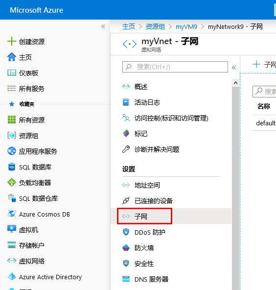
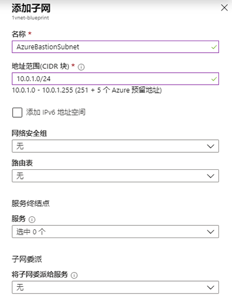
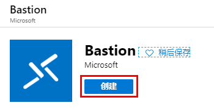
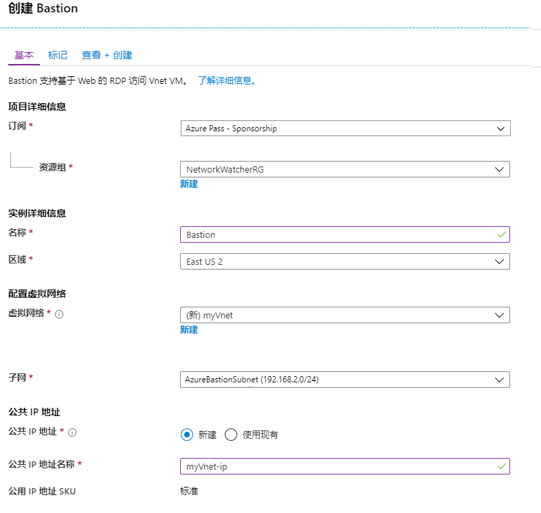
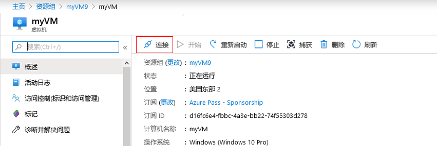
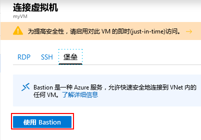
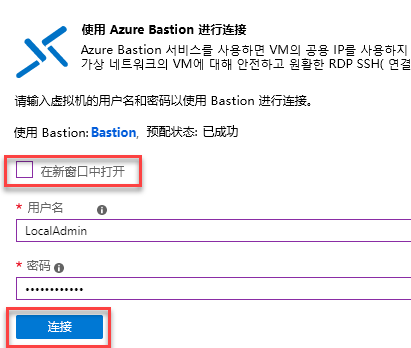
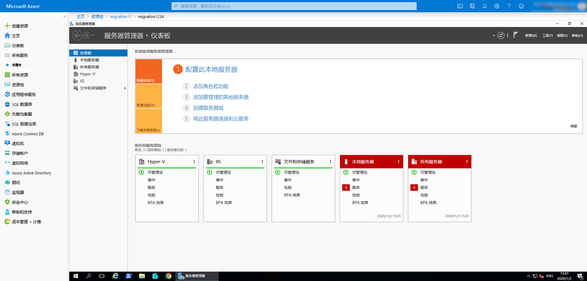

---
lab:
    title: '实验室教学 14 - Azure Bastion'
    module: '模块 2 - 实施平台保护'
---

# 模块 2：实验室教学 14 - Azure Bastion


**场景**

Azure Bastion 服务是一项新的完全由平台管理的 PaaS 服务，你可以在虚拟网络中进行配置。该服务通过 SSL 直接在 Azure 门户中提供与虚拟机的安全无缝 RDP / SSH 连接。通过 Azure Bastion 进行连接时，你的虚拟机不需要使用公共 IP 地址。

Bastion 为虚拟网络（禁止连接）中的所有 VM 提供安全的 RDP 和 SSH 连接。使用 Azure Bastion 可以保护你的虚拟机，避免将 RDP / SSH 端口暴露给外界，同时仍可以使用 RDP / SSH 提供安全访问。使用 Azure Bastion，你可以直接从 Azure 门户连接到虚拟机。不需要其他客户端、代理或软件。


## 练习 1：实施 Azure Bastion

### 任务 1：在你的订阅上启用 Azure Bastion

1.  打开 **Cloud Shell (PowerShell)**并根据需要创建存储。

1.  运行以下 2 个命令，创建资源组、虚拟机和 VNet，测试 Azure Bastion 服务。

     ```powershell
    New-AzureRmResourceGroup -Name myResourceGroup -Location "East US"
     ```
    
     ```powershell
    New-AzVm -ResourceGroupName "myResourceGroup" -Name "myVM" -Location "East  US" -VirtualNetworkName "myVnet" -SubnetName "mySubnet" -SecurityGroupName   "myNetworkSecurityGroup" -OpenPorts 80,3389
     ```

    **注**：创建虚拟机时未使用公共 IP 地址。


1.  提示时，输入 **LocalAdmin** 和 **P55w.rd1234** 作为凭证。

1.  在 Azure 门户中导航到 **myVnet**，然后单击 **子网**。

     
 
1.  单击 **+ 子网**并创建具有以下详细信息的子网：

      - 名称：**AzureBastionSubnet** _（请注意，区分大小写）_
      - 地址范围：**192.168.2.0/24**

1.  单击**确定**。

     

### 任务 2：创建 bastion 主机

1.  在 **Azure** 门户的主页中，单击 **创建资源**。 

1.  在**新**页面，在*搜索市场*字段中，输入 **Bastion**，然后单击 **Enter**，获得搜索结果。

1.  在结果中，单击 **Bastion**。 

     

1.  在 **Bastion** 页面，单击 **创建**，打开 **创建一个堡垒** 页面。

     

1.  在 **创建一个堡垒** 页面上，配置新的 Bastion 资源。在下面指定配置设置。

    * **订阅**：选择你的订阅
    * **资源组**：myResourceGruop
    * **名称**：Bastion
    * **区域**：美国东部
    * **虚拟网络**：**myVnet**
    * **公共 IP 地址**：将在其上访问 RDP / SSH 的 Bastion 资源的公共 IP（通过端口 443）。创建一个新的公共 IP 或使用现有 IP。公用 IP 地址必须与你要创建的 Bastion 资源位于同一区域。
    * **公共 IP 地址名**：保留默认设置
    * **公共 IP 地址 SKU**：默认预填充为**标准**。Azure Bastion 仅使用/支持标准公共 IP SKU。
    * **分配**：默认预填充为 **静态**。
</br>

1.  完成指定设置后，单击 **审阅 + 创建**。这将验证值。验证通过后，你可以开始创建过程。

     

1.  在创建 bastion 页面上，单击**创建**。
1.  你将看到一条消息，通知你部署正在进行中。创建资源后，状态将显示在此页面上。要创建和部署 Bastion 资源，大约需要 5 分钟。

### 任务 3：使用 Bastion 主机连接到 VM 


如果你使用现有的 VM 在门户中创建 Bastion 主机，则各种设置将自动默认对应于你的虚拟机和/或虚拟网络。


1.  在 **Azure 门户 - Bastion 预览**中，导航到你的虚拟机，然后单击 **连接**。

       

1.  在右侧栏上，单击 **Bastion**，然后单击**使用 Bastion**。

       

1.  取消选择在新窗口中打开，然后输入 **LocalAdmin** 和 **Pa55w.rd1234** 作为凭据，然后单击**连接**。

     

1.  现在，你已连接到 VM。

     
 

| 警告：在继续之前，你应该删除此实验室教学使用的所有资源。  为此，应在**“Azure 门户”**中，单击**“资源组”**。  选择你创建的任何资源组。  在资源组边栏选项卡上，单击**删除资源组**，输入资源组名称，然后单击**删除**。  对你创建的任何其他资源组重复该过程。**否则可能会导致其他实验室出现问题。** |
| --- |

**“结果”**：现在你已经完成了本实验室教学。

