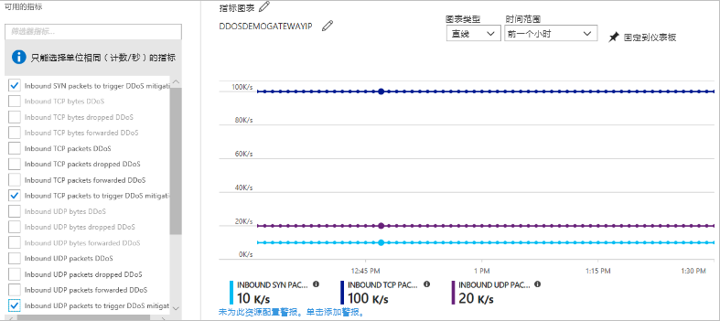

---
lab:
    title: '实验室教学 15 - 管理 Azure DDoS 防护标准'
    module: '模块 2 - 实施平台保护'
---

# 模块 2：实验室教学 15 - 管理 Azure DDoS 防护标准

在本实验室教学中，你将学习如何启用和禁用分布式拒绝服务 (DDoS) 防护，以及如何使用遥测技术通过 Azure DDoS 防护标准缓解 DDoS 攻击。DDoS 防护标准可保护分配有 Azure 公共 IP 地址的 Azure 资源，例如虚拟机、负载均衡器和应用程序网关。 

## 练习 1：在 Azure 中实施 DDoS 防护。

### 任务 1：创建 DDoS 防护计划

DDoS 防护计划定义了一组在订阅中启用 DDoS 防护标准的虚拟网络。你可以为组织配置一个 DDoS 防护计划，并将多个订阅中的虚拟网络链接到同一计划。DDoS 保护计划与你在计划创建期间选择的订阅相关联。DDoS 防护计划适用于各个地区和订阅。示例 - 你可以在美国东部地区创建计划并链接到租户中的订阅＃1。可以将同一计划链接到整个租户中不同区域中其他订阅的虚拟网络。如果受保护的公共 IP 地址数超过 100 个，则该订阅会产生计划的每月定期账单和超额费用。 

大多数组织不需要创建多个计划。计划不能在订阅之间移动。如果要更改计划所在的订阅，请删除现有计划，然后创建新计划。

1.  在 Azure 门户网站的左上角选择**创建资源**。
2.  搜索 *DDoS*。搜索结果中显示 **DDoS 防护计划**时，选中。
3.  选择**“创建”**。
4.  输入或选择你自己的值，或使用下表中的示例值，然后选择**创建**。

    |设置        |值                                              |
    |---------      |---------                                          |
    |名称           | myDDosProtectionPlan                              |
    |订阅   | 选择你的订阅。                         |
    |资源组 | 选择**新建**，输入 *MyResourceGroup*。 |
    |位置       | 美国东部                                           |

### 任务 2：为新的虚拟网络启用 DDoS

1.  在 Azure 门户网站的左上角选择**创建资源**。
2.  选择 **联网**，然后选择 **虚拟网络**。
3.  输入或选择你自己的值，或使用下表中的示例值，保留其他默认设置，然后选择**创建**。

    | 设置         | 值                                                        |
    | ---------       | ---------                                                    |
    | 名称            | 虚拟网络                                             |
    | 订阅    | 选择你的订阅。                                    |
    | 资源组  | 选择**使用现有**，然后选择**myResourceGroup**。 |
    | 位置        | 美国东部                                                      |
    | DDoS 防护 | 选择 **标准**，然后在 **DDoS 防护**中，选择 **myDdos 防护计划**。你选择的计划可以与虚拟网络位于相同或不同的订阅中，但两个订阅都需要与同一 Azure 活动目录租户关联。|

 为虚拟网络启用 DDoS 标准后，不能将虚拟网络移动到另一个资源组或订阅。如果需要在启用 DDoS 标准的情况下移动虚拟网络，请先禁用 DDoS 标准，然后移动虚拟网络，然后再启用 DDoS 标准。移动后，将重置虚拟网络中所有受保护的公共 IP 地址的自动调整策略阈值。

### 任务 3：为现有虚拟网络启用 DDoS

1.  在 Azure 门户网站的左上角选择**创建资源**。

3.  在门户顶部，在**搜索资源、服务和文档对话框**中输入要启用 DDoS 防护标准的虚拟网络名称。当搜索结果显示虚拟网络名时，选中。
4.  在**设置**中选择 **DDoS 防护**。
5.  选择**标准**。在 **DDoS 防护计划**中，选择现有的 DDoS 防护计划或你在步骤 1 中创建的计划，然后选择**保存**。你选择的计划可以与虚拟网络位于相同或不同的订阅中，但两个订阅都需要与同一 Azure 活动目录租户关联。

### 任务 3：禁用虚拟网络的 DDoS

1.  在门户顶部，在**搜索资源、服务和文档对话框**中输入要禁用 DDoS 防护标准的虚拟网络名。当搜索结果显示虚拟网络名时，选中。

2.  在**设置**中选择 **DDoS 防护**。
3.  在 **DDoS 防护计划** 中选择 **基本**，然后选择 **保存**。

### 任务 4：使用 DDoS 防护计划

1.  在门户左侧的顶部选择**所有服务**。

2.  在**筛选程序**对话框中输入 *DDoS*搜索结果中显示 **DDoS 防护计划**时，选中。
3.  从列表中选择要查看的防护计划。
4.  列出了与该计划关联的所有虚拟网络。
5.  如果要删除计划，必须首先从计划中解除所有虚拟网络的关联。 

### 任务 5：配置 DDoS 防护指标的警报

你可以使用 Azure 监视器警报配置选择任何可用的 DDoS 防护指标，将在攻击过程中存在有效缓解措施时向你发出警报。满足条件后，指定的地址将收到一封警报电子邮件：

1.  在门户左侧的顶部选择**所有服务**。
2.  在**筛选程序**对话框中输入*监视器*。结果中显示**监视器**时，选中。
3.  选择**共享服务**中的**指标**。
4.  输入或选择你自己的值，或使用下表中的示例值，保留其他默认设置，然后选择**确定**。

    |设置                  |值                                                                                               |
    |---------                |---------                                                                                           |
    |名称                     | myDdosAlert                                                                                        |
    |订阅             | 选择包含你要接收警报的公共 IP 地址的订阅。        |
    |资源组           | 选择包含要为其接收警报的公共 IP 地址的资源组。      |
    |资源                 | 选择包含要为其接收警报的公共 IP 地址的公共 IP 地址。DDoS 监视分配给虚拟网络中资源的公共 IP 地址。                   |
    |指标                   | 是否受到 DDoS 攻击                                                                            |
    |阈值                | 1- **1** 表示受到攻击。**0** 表示没有受到攻击。                         |
    |时间段                   | 选择你选择的任何值。                                                                   |
    |通过电子邮件通知         | 选中复选框                                                                                  |
    |其他管理员 | 如果你不是电子邮件所有者、参与者或读取者，请输入你的电子邮件地址。 |

    在检测到攻击后的几分钟内，你会收到来自 Azure 监视器指标的电子邮件，类似于下图：

       

### 任务 6：使用 DDoS 防护遥测

攻击的遥测是通过 Azure 监视器实时提供的。遥测功能仅在缓解公共 IP 地址期间可用。在缓解攻击之前或之后，你无法看到遥测。

1.  在门户左侧的顶部选择**所有服务**。

2.  在“**过滤器**”框中输入“*监视器*”。当**网络观察程序**出现在结果中时，选择它。
3.  在**共享服务**中，选择**指标**。
4.  选择包含你要进行遥测的公共 IP 地址的 **订阅** 和 **资源组**。
5.  选择 **资源类型**的**公共 IP 地址**，然后选择要进行遥测的特定公共 IP 地址。
6.  一系列 **可用指标** 出现在屏幕的左侧。选择这些指标后，这些指标会在概览屏幕上，以 **Azure 监视器指标图表**的形式显示。
7.  选择 **集合**，输入**最大**

 指标名称表示不同的数据包类型、字节和数据包，每个指标上的标记名称的基本结构如下：

  - **放弃的标记名称** （例如，**入站数据包放弃的DDoS **）：DDoS 防护系统放弃/清除的数据包数。
  - **转发的标记名称** （例如**入站数据包转发的 DDoS **）：DDoS 系统转发到目标 VIP 的数据包数 - 未过滤的流量。
  - **无标记名称** （例如** 入站数据包 DDoS **）：进入清理系统的数据包总数 - 表示丢弃和转发的数据包的总和。

### 任务 7：查看 DDoS 缓解策略

在启用了 DDoS 的虚拟网络中，DDoS 防护标准对受保护资源的每个公共 IP 地址应用三种自动调整的缓解策略（TCP SYN、TCP 和 UDP）。你可以通过选择**入站 TCP 数据包触发 DDoS 缓解** 和 **入站 UDP 数据包触发 DDoS 缓解** 指标，以及**集合** 键入为“最大”，查看策略阈值，如下图所示：

   

策略阈值是通过基于 Azure 机器学习的网络流量分析自动配置的。只有在超出策略阈值时，受攻击的 IP 地址才会发生 DDoS 缓解。

### 任务 8：配置 DDoS 攻击缓解报告

缓解攻击报告使用 Netflow 协议数据，这些数据经过汇总可提供有关对资源的攻击的详细信息。如果公共 IP 资源受到攻击，缓解措施就会立即开始生成报告。每 5 分钟将生成一个增量报告，而在整个缓解期间将生成一个缓解后的报告。这是为了确保在 DDoS 攻击持续较长时间的情况下，你能够每隔 5 分钟查看一次最新的缓解报告快照，并在攻击缓解结束后查看完整的摘要。 

1.  在门户左侧的顶部选择**所有服务**。

2.  在**筛选程序**对话框中输入*监视器*。结果中显示**监视器**时，选中。
3.  在**设置**中，选择**诊断设置**。
4.  选择包含要记录公共 IP 地址的 **订阅** 和 **资源组**。
5.  选择**资源类型**的**公共 IP 地址**，然后选择要为其记录指标的特定公共 IP 地址。
6.  选择**打开诊断，收集 DDoS 缓解报告日志**，然后根据需要选择以下多个选项：

    - **存档到存储帐户**：数据被写入 Azure 存储帐户。 
    - **传输到事件中心**：允许日志接收器使用 Azure 事件中心拾取日志。事件中心可与 Splunk 或其他 SIEM 系统集成。 
    - **发送到日志分析**：将日志写入 Azure 监视器服务。 
 

 增量和攻击后缓解报告均包括以下字段
 
  - 攻击向量
  - 流量统计
  - 放弃数据包的原因
  - 涉及的协议
  - 前 10 个来源国家或地区
  - 前 10 个来源 ASN

### 任务 9：配置 DDoS 攻击缓解流日志

你可以通过攻击缓解流日志，在活动的 DDoS 攻击期间，实时查看放弃的流量、转发的流量和其他有价值的数据点。你可以通过事件中心将这些数据源不断引入 SIEM 系统中，以进行近乎实时的监视，采取潜在的措施并满足防御操作的需求。 

1.  在门户左侧的顶部选择**所有服务**。

2.  在**筛选程序**对话框中输入*监视器*。结果中显示**监视器**时，选中。
3.  在**设置**中，选择**诊断设置**。
4.  选择包含要记录公共 IP 地址的**订阅**和**资源组**。
5.  选择**资源类型**的**公共 IP 地址**，然后选择要为其记录指标的特定公共 IP 地址。
6.  选择**打开诊断以收集 DDoSMitigationFlowLogs 日志**，然后根据需要选择以下多个选项：

    - **存档到存储帐户**：数据被写入 Azure 存储帐户。了解更多有关此选项的信息。
    - **传输到事件中心**：允许日志接收器使用 Azure 事件中心拾取日志。事件中心可与 Splunk 或其他 SIEM 系统集成。 
    - **发送到日志分析**：将日志写入 Azure 监视器服务。 
1.  在 Azure 分析仪表板中查看流日志数据。

 流日志将具有以下字段： 

  - 源 IP
  - 目标 IP
  - 源端口 
  - 目标端口 
  - 协议类型 
  - 缓解期间采取的措施

### 任务 10：验证 DDoS 检测（可选，不属于 AZ-500 课程）

**注**：仅在你愿意的情况下执行此任务。  该任务不构成课程的一部分，对于希望这样做的学生来说是一项扩展训练。

微软已经与 [BreakingPoint云](https://www.ixiacom.com/products/breakingpoint-cloud) 合作建立一个接口，你可以在该接口上针对启用了 DDoS 防护的公共 IP 地址生成流量。你可以通过 BreakPoint Cloud 模拟：

- 验证 Microsoft Azure DDoS 防护如何保护你的 Azure 资源免受 DDoS 攻击
- 在遭受 DDoS 攻击时优化你的事件响应流程
- 文档 DDoS 合规性
- 训练你的网络安全团队

**权限**

要使用 DDoS 防护计划，必须将你的帐户分配给网络参与者角色或分配给下表中列出的相关操作的角色：

| 操作                                            | 名称                                     |
| ---------                                         | -------------                            |
| Microsoft.Network/ddosProtectionPlans/read        | 读取 DDoS 防护计划              |
| Microsoft.Network/ddosProtectionPlans/write       | 创建或更新 DDoS 防护计划  |
| Microsoft.Network/ddosProtectionPlans/delete      | 创建 DDoS 防护计划            |
| Microsoft.Network/ddosProtectionPlans/join/action | 加入 DDoS 防护计划              |

要为虚拟网络启用 DDoS 防护，还必须为你的帐户分配针对虚拟网络的相应操作。

| 警告：在继续之前，你应该删除此实验室教学使用的所有资源。  为此，应在**“Azure 门户”**中，单击**“资源组”**。  选择你创建的任何资源组。  在资源组边栏选项卡上，单击**删除资源组**，输入资源组名称，然后单击**删除**。  对你创建的任何其他资源组重复该过程。**否则可能会导致其他实验室出现问题。** |
| --- |

**“结果”**：现在你已经完成了本实验室教学。
