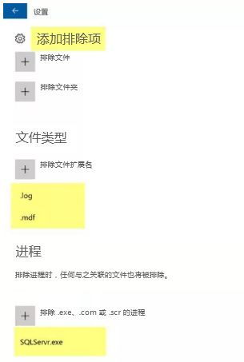

---
lab:
    title: '实验室教学 16 - VM 的反恶意软件'
    module: '模块 2 - 实施平台保护'
---

# 模块 2：实验室教学 16 - VM 的反恶意软件

**场景**

Azure 安全中心监视反恶意软件保护的状态并在其上报告终结点保护问题边栏选项卡。安全中心会记录可能使你的虚拟机和计算机容易受到恶意软件威胁的问题，例如检测到的威胁和保护不足。 
通过使用有关终结点保护问题的信息，你可以制定计划以解决任何已识别的问题。 

安全中心报告以下终结点保护问题： 

- Azure VM 上未安装终结点保护。这些 Azure VM 上未安装受支持的反恶意软件解决方案。 
- 未在非 Azure 计算机上安装终结点保护。这些非 Azure 计算机上未安装受支持的反恶意软件解决方案。
- 终结点保护健康问题：  

- **签名过期**。这些 VM 和计算机上安装了反恶意软件解决方案，但该解决方案没有最新的反恶意软件签名。 
  - **没有实时保护**。这些 VM 和计算机上安装了反恶意软件解决方案，但它未配置为实时保护。该服务可能已禁用，或者安全中心可能无法获取状态，因为不支持该解决方案。 
 - **不报告**。已安装了反恶意软件解决方案，但未报告数据。 
 - **未知**。已安装了反恶意软件解决方案，但其状态未知或报告未知错误。

## 练习 1：为 Azure VM 部署反恶意软件。

## 任务 1：创建具有反恶意软件扩展名的 Azure 虚拟机

为 VM 启用并配置反恶意软件要在配置 VM 时使用 Azure 门户为 Azure VM 启用和配置 Microsoft Antimalware，请完成以下步骤： 

1.  登录到 **Azure 门户**，网址：**https://portal.azure.com**

2.  要创建新 VM，请导航至**虚拟机**，选择添加，然后选择 **图像下拉列表中的 Windows 服务器**。

1.  输入 VM 的以下详细信息：

 | 可选。 | 答案 |
 | - | -|
 | 资源组 | 新建> **myResourceGroup** |
 | VM 名 | **myVM** |
 | 区域 | **美国东部** |
 | 映像 | **Windows 服务器 2019 数据中心** |
 | 用户名 | **localadmin** |
 | 密码 | **Pa55w.rd1234** |

1.  单击 **管理** 标签并确保所有单选按钮均设置为 **关**。

1.  单击 **高级** 选项卡并单击 **选择要安装的扩展**。

1.  选择 **Microsoft 反恶意软件** 延期。  _你可能需要单击列表底部的“加载更多”以查看扩展。_

11.  在** Microsoft 反恶意软件**刀片服务器中，单击**创建**。 
12.  在安装扩展部分，你可以配置文件、位置、进程排除和其他扫描选项。 

1.  在排除的文件类型中，输入.mdf; .log

1.  在排除的程序中，输入 **SQLServr.exe** 

1.  选择**确定**。 

14.  回到设置部分，选择**审阅 + 创建**。 
15.  单击验证屏幕上的**创建**。 
16.  创建 VM 后，通过 RDP 登录到 VM，然后打开 Microsoft 反恶意软件 > 排除，验证部署是否成功。

     

| 警告：在继续之前，你应该删除此实验室教学使用的所有资源。  为此，应在**“Azure 门户”**中，单击**“资源组”**。  选择你创建的任何资源组。  在资源组边栏选项卡上，单击**删除资源组**，输入资源组名称，然后单击**删除**。  对你创建的任何其他资源组重复该过程。**否则可能会导致其他实验室出现问题。** |
| --- |

**“结果”**：现在你已经完成了本实验室教学。

