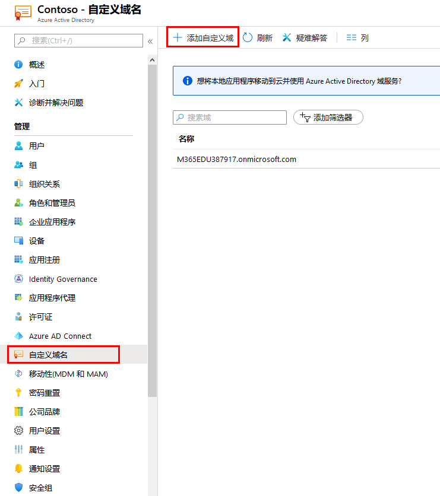
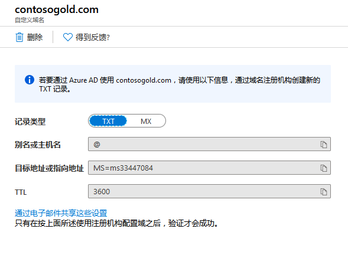
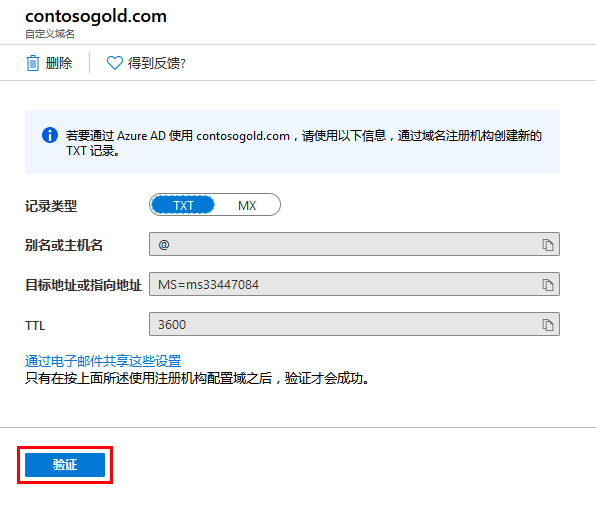
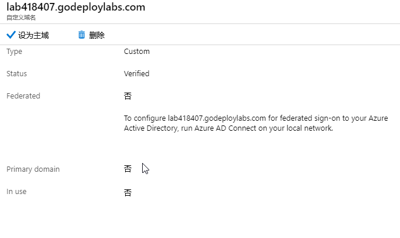

---
lab:
    title: '实验室教学 18 - 自定义域'
    module: '模块 2 - 实施平台保护'
---

# 模块 2：实验室教学 18 - 自定义域

**场景**

每个新的 Azure AD 租户都附带一个初始域名 domainname.onmicrosoft.com。你不能更改或删除初始域名，但是可以将组织名添加到列表中。添加自定义域名可以帮助你创建用户熟悉的用户名，例如 alain@contoso.com。

### 练习 1：使用 Azure 活动目录门户添加自定义域名

### 任务 1：将自定义域名添加到 Azure AD

1.  在 Azure 门户中，选择 **Azure 活动目录**。

1.  选择 **自定义域名**，然后选择 **添加自定义域**。

       

2.  导航到实验室教学环境中的 DNS 选项卡，以标识已分配的唯一自定义域名。  格式为 labxxxxxx.customdomainname.com。

1.  在自定义域名字段中，输入在上一步中确定的域名，然后单击**添加域**。

    添加未验证的域，显示 **labxxxxx.customdomainname.com** 页面，包括你的 DNS 信息。

4.  从 **labxxxxx.customdomainname.com** 页面复制 DNS 信息。例如，MS=ms64983159。

       

### 任务 2：将你的 DNS 信息添加到域名注册

将自定义域名添加到 Azure AD 后，必须返回到域名注册并从复制的 TXT 文件中添加 Azure AD DNS 信息。为你的域创建此 TXT 记录可“验证”你的域名的所有权。

1.  返回实验室教学环境中的 DNS 选项卡，并根据复制的 DNS 信息，为你的域创建新的 TXT 记录。  你只需要输入值记录。  名称字段留空，然后单击 **保存**。

**注**：你可以根据需要自己测多个域名。但是，每个域都会从 Azure AD 获取自己的 TXT 记录。在域名注册中输入 TXT 文件信息时请务必小心谨慎。如果输入错误或错误地复制了信息，则必须等到 TTL 超时（60 分钟）后才能重试。

### 任务 2：验证你的自定义域名

注册自定义域名后，需要确保其在 Azure AD 中有效。从你的域名注册到 Azure AD 的传播可能是瞬时的，也可能需要几天的时间，具体取决于你的域名注册。

1.  返回到 Azure 门户 **labxxxxx.customdomainname.com** 页面并单击 **验证**。

     

1.  你的域现在应该已通过验证。

     

1.  验证自定义域名后，你可以删除验证 TXT 记录。

**“结果”**：现在你已经完成了本实验室教学。

