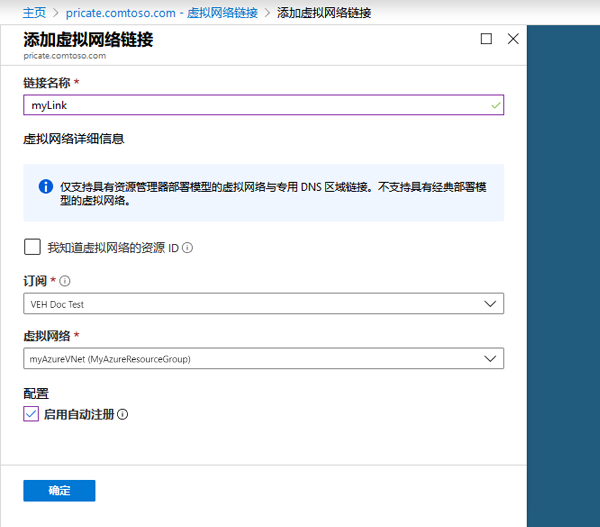

---
lab:
    title: '实验室教学 19 - 专用 DNS'
    module: '模块 2 - 实施平台保护'
---

# 模块 2：实验室教学 19 - 专用 DNS


**场景**

DNS 区域用于托管特定域的 DNS 记录。要在 Azure DNS 中开始托管你的域，需要为该域名创建 DNS 区域。然后，在此 DNS 区域内创建域的每个 DNS 记录。要将专用 DNS 区域发布到你的虚拟网络，请指定允许解析该区域内记录的虚拟网络列表。  这些叫做*已链接*虚拟网络。启用自动注册后，无论何时创建虚拟机，更改其 IP 地址或删除虚拟机，Azure DNS 都会更新区域记录。

在本节课中，你将学习如何：

> * 创建专用 DNS 区域
> * 创建虚拟网络
> * 链接虚拟网络
> * 创建测试虚拟机
> * 创建一个额外的 DNS 记录
> * 测试专用区域


## 练习 1：使用 Azure 门户，创建 Azure 专用 DNS 区域。

### 任务 1：创建专用 DNS 区域


以下示例在称为 **MyAzureResourceGroup** 的资源组中创建了一个名为 **private.contoso.com** 的 DNS 区域。

DNS 区域包含域的 DNS 条目。要在 Azure DNS 中开始托管你的域，请为该域名创建 DNS 区域。


1.  在门户网站搜索栏上，在搜索文本框中键入**专用 DNS 区域**，然后按 **Enter**。
1.  选择**专用 DNS 区域**。
2.  选择**创建专用 DNS 区域**。

1.  在**创建专用 DNS 区域**页面，键入或选择以下值：

   - **资源组**：选择**新建**，输入 *MyResourceGroup*，然后选择**确定**。Azure 订阅中的资源组名称必须是唯一的。 
   -  **名称**: 为该示例键入 *private.contoso.com*。
</br>   
1.  对于**资源组位置**，选择**美国中西部**。

1.  选择**审阅 + 创建**。

1.  选择**“创建”**。

创建区域可能需要几分钟时间。

### 任务 2：创建虚拟网络

1.  在左上方的门户页面上，选择**创建资源**，选择**联网**，然后选择**虚拟网络**。

2.  对于**名称**，输入**myAzureVNet**。
3.  对于**资源组**，选择**MyAzureResourceGroup**。
4.  对于 **地点**， 选择 **美国东部**。
5.  保留其他默认设置，然后选择**创建**。

### 任务 3：链接虚拟网络


要将专用 DNS 区域链接到虚拟网络，请创建一个虚拟网络链接。


1.  打开 **MyAzureResourceGroup** 资源组，然后选择 **private.contoso.com** 专用区域。

2.  在左窗格中，选择**虚拟网络链接**。
3.  选择**“添加”**。
4.  输入 **myLink** 作为**链接名称**。
5.  对于**虚拟网络**，选择**myAzureVNet**。
6.  选择**启用自动注册**复选框。
7.  选择**确定**。

     

### 任务 4：创建测试虚拟机


现在，创建两个虚拟机，以便你可以测试专用 DNS 区域：


1.  在左上方的门户页面上，选择**创建资源**，然后选择**Windows 服务器 2016 数据中心**。

1.  选择**MyAzureResourceGroup**，用于资源组。
1.  输入 **myVM01** -  作为虚拟机名称。
1.  对于**地区**，选择**美国东部**。
1.  输入 **LocalAdmin**，作为管理员用户名。
2.  输入 **Pa55w.rd1234**，作为密码并确认密码。

5.  对于**公共入站端口**，选择**允许选择的端口**，然后选择 **RRDP (3389)** 作为**选择入站端口**。
10.  接受页面的其他默认设置，然后单击**下一个：磁盘 >**。
11.  在**磁盘**页面接受默认值，然后单击**下一个：联网 >**。
1.  确保为虚拟网络选定 **myAzureVNet**。
1.  接受页面的其他默认设置，然后单击**下一个：管理 >**。
2.  对于**开机诊断**，选择**关**，接受其他默认设置，然后选择**审阅 + 创建**。
1.  查看设置，然后单击 **创建**。

1.  重复这些步骤并创建另一个名为 **myVM02**的虚拟机。

可能需要几分钟时间才能完成 VM 部署。

### 任务 5：创建一个额外的 DNS 记录


下面的示例在 DNS 区域 **private.contoso.com** 中、在资源组 **MyAzureResourceGroup**中创建了一个具有相对名称 **db** 的记录。记录集的标准名称是 **db.private.contoso.com**。记录类型为“A”，IP 地址为 **myVM01**。


1.  打开 **MyAzureResourceGroup** 资源组，然后选择 **private.contoso.com** 专用区域。

2.  选择 **+ 记录集**。
3.  对于**名称**，输入 **db**。
4.  对于 **IP 地址**，输入你看到的 IP 地址 **myVM01**。虚拟机启动时应自动注册。
5.  选择**确定**。

### 任务 6：测试专用区域


现在，你可以测试你的名称解析 **private.contoso.com** 专用区域。

你可以使用 ping 命令测试名称解析。因此，在两个虚拟机上都配置了防火墙，允许入站 ICMP 数据包。


1.  连接到 myVM01，然后使用管理员权限打开 Windows PowerShell 窗口。

2.  运行以下命令：

       ```powershell
       New-NetFirewallRule -DisplayName "Allow ICMPv4-In" -Protocol ICMPv4
       ```

1.  对 myVM02 重复这些步骤。

### 任务 7：按名称 ping 虚拟机

1.  在 myVM02 Windows PowerShell 命令提示符下，使用自动注册的主机名 ping myVM01：

       ```cli
       ping myVM01.private.contoso.com
       ```
   
    你应该看到类似于以下内容的输出：

    ```cli
    Pinging myvm01.private.contoso.com [10.2.0.4] with 32 bytes of data:
    Reply from 10.2.0.4: bytes=32 time<1ms TTL=128
    Reply from 10.2.0.4: bytes=32 time=1ms TTL=128
    Reply from 10.2.0.4: bytes=32 time<1ms TTL=128
    Reply from 10.2.0.4: bytes=32 time<1ms TTL=128
    ```
   
2.  现在 ping 你之前创建的 **db** 名称：
   
       ```cli
       ping db.private.contoso.com
       ```
       你应该看到类似于以下内容的输出：
   
       ```cli
       PS C:\> ping db.private.contoso.com

       Pinging db.private.contoso.com [10.2.0.4] with 32 bytes of data:
       Reply from 10.2.0.4: bytes=32 time<1ms TTL=128
       Reply from 10.2.0.4: bytes=32 time<1ms TTL=128
       Reply from 10.2.0.4: bytes=32 time<1ms TTL=128
       Reply from 10.2.0.4: bytes=32 time<1ms TTL=128

       Ping statistics for 10.2.0.4:
           Packets: Sent = 4, Received = 4, Lost = 0 (0% loss),
       Approximate round trip times in milli-seconds:
           Minimum = 0ms, Maximum = 0ms, Average = 0ms
       PS C:\>
       ```


| 警告：在继续之前，你应该删除此实验室教学使用的所有资源。  为此，应在**“Azure 门户”**中，单击**“资源组”**。  选择你创建的任何资源组。  在资源组边栏选项卡上，单击**删除资源组**，输入资源组名称，然后单击**删除**。  对你创建的任何其他资源组重复该过程。**否则可能会导致其他实验室出现问题。** |
| --- |

**“结果”**：现在你已经完成了本实验室教学。
