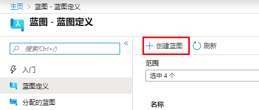
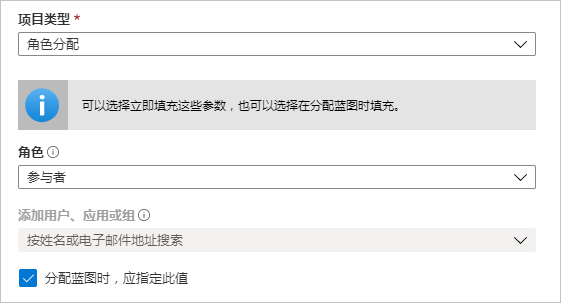
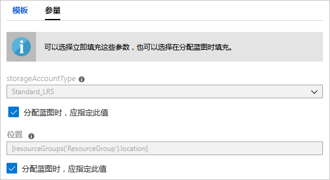
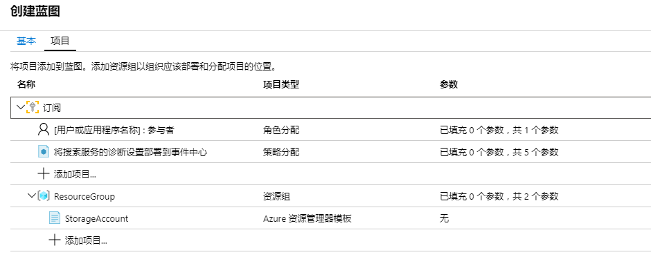
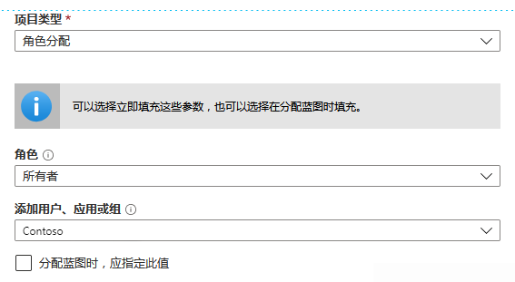
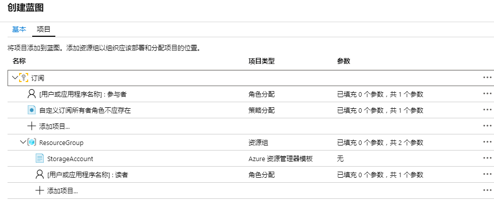
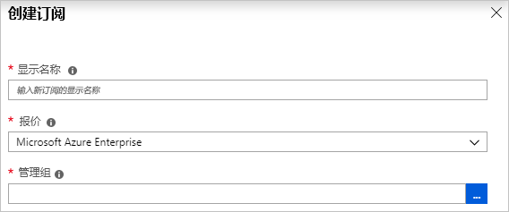
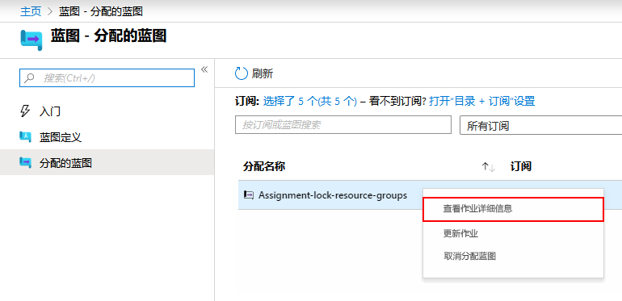

---
lab:
    title: '实验室教学 20 - Azure 蓝图'
    module: '模块 2 - 实施平台保护'
---

# 模块 2：实验室教学 20 - Azure 蓝图


**场景**

当你学习如何创建和分配蓝图时，你可以基于 Azure 资源管理器模板、策略、安全等定义通用模式，从而开发可重用和可快速部署的配置。在本课程中，你将学习如何使用 Azure 蓝图执行与在整个组织中创建、发布和分配蓝图相关的一些更常见的任务。这些任务包括：

- 创建一个新的蓝图并添加各种受支持的工件
- 对仍在草稿中的现有蓝图进行更改
- 将蓝图标记为已就绪，通过发布进行分配
- 将蓝图分配给现有订阅
- 检查分配蓝图的状态和进度
- 删除已分配给订阅的蓝图


## 练习 1：在门户中创建一个蓝图

### 任务 1：创建一个蓝图


定义合规性标准模式的第一步是从可用资源中构成一个蓝图。在此示例中，创建一个名为 **MyBlueprint** 的新蓝图，配置订阅的角色和策略分配。然后添加一个新的资源组，并在新的资源组上创建资源管理器模板和角色分配。


1.  在左侧窗格中选择**所有服务**。搜索并选择**蓝图**。

1.  从左侧的页面中选择**蓝图定义**，然后在页面顶部选择**+ 创建蓝图**
   按钮。

    或者，在**入门**页面中选择**创建**，直接创建蓝图。

       

1.  输入一个**蓝图名**，如**MyBlueprint**。（最多使用 48 个字母和数字，但不能使用空格或特殊字符）。保留**蓝图描述**为空白。

1.  在**定义位置**对话框中，选择右侧的省略号，选择要保存蓝图的订阅，然后单击**选择**。

1.  验证信息是否正确。**蓝图名称**和**定义位置**字段以后不能更改。然后选择**下一步：**页面底部的**工件**或页面顶部的**工件**标签。

1.  在订阅级添加角色分配：

   1. 在**订阅**中选择**+添加工件**行。**添加工件**窗口在
      浏览器的右侧打开。

   1. 选择**工件类型**的**角色分配**。

   1. 在**角色**中，选择**参与者**。保留**添加用户、应用程序或组**对话框，
      其中的复选框指示动态参数。

   1. 选择**添加**，将此工件添加到蓝图中。

      

        **注**：大多数工件都支持参数。在创建蓝图期间分配值的参数是*静态参数*。如果在蓝图分配期间分配参数，则该参数为*动态参数*。


1.  在订阅级添加策略分配：

   1. 在角色分配工件下，选择**+ 添加工件**行。

   1. 选择**工件类型**的**策略分配**。

   1. 将**类型**更改为**内置**。在**搜索**中，输入**标签**。

   1. 点击退出**搜索**进行过滤。选择**附加标签及其默认值
      到资源组**。

   1. 选择**“添加”**将工件添加到蓝图。

1.  选择策略分配行 **将标签及其默认值附加到资源组**。

1.  作为蓝图定义的一部分，将打开提供工件参数的窗口，同时允许基于该蓝图，而不是在分配期间（动态参数），为所有分配（静态参数）设置参数。本示例在分配蓝图期间使用动态参数，因此保留默认值并选择**取消**。

1.  在订阅级添加一个资源组：

   1. 选择**“订阅”**下的**“添加工件”**。

   1. 选择**工件类型**的**资源组**。

   1. 保留**工件显示名**、**资源组名**和**位置**对话框为空，但请确保已选中每个参数属性的复选框，使其成为动态参数。

   1. 选择**“添加”**将工件添加到蓝图。

1.  在资源组下添加一个模板：

   1. 在**资源组**条目中，选择**+ 添加工件**行。

   1. 选择**工件类型**的**Azure 资源管理器模板**，将**工件显示名**设置为**StorageAccount**，然后保留**描述**为空白。

   1. 在编辑器对话框的**模板**标签中，粘贴下列资源管理器模板。  粘贴模板后，选择**参数**标签并注意模板参数**storageAccountType**和**位置**。自动检测并填充每个参数，但将其配置为动态参数。

        ```json
              {
                  "$schema": "https://schema.management.azure.com/schemas/      2015-01-01/deploymentTemplate.json#",
                  "contentVersion": "1.0.0.0",
                  "parameters": {
                      "storageAccountType": {
                          "type": "string",
                          "defaultValue": "Standard_LRS",
                          "allowedValues": [
                              "Standard_LRS",
                              "Standard_GRS",
                              "Standard_ZRS",
                              "Premium_LRS"
                          ],
                          "metadata": {
                              "description": "Storage Account type"
                          }
                      },
                      "location": {
                          "type": "string",
                          "defaultValue": "[resourceGroup().location]",
                          "metadata": {
                              "description": "Location for all resources."
                          }
                      }
                  },
                  "variables": {
                      "storageAccountName": "[concat('store', uniquestring      (resourceGroup().id))]"
                  },
                  "resources": [{
                      "type": "Microsoft.Storage/storageAccounts",
                      "name": "[variables('storageAccountName')]",
                      "location": "[parameters('location')]",
                      "apiVersion": "2018/7/1",
                      "sku": {
                          "name": "[parameters('storageAccountType')]"
                      },
                      "kind": "StorageV2",
                      "properties": {}
                  }],
                  "outputs": {
                      "storageAccountName": {
                          "type": "string",
                          "value": "[variables('storageAccountName')]"
                      }
                  }
              }
        ```

1. 清除**storageAccountType**复选框，注意下拉列表仅包含
      **allowedValues** 资源管理器模板中包含的值。选择框，
      将其设置回动态参数。

1. 选择**“添加”**将工件添加到蓝图。

      

1.  你完成的蓝图应该如下所示。请注意，在**参数**栏，每个工件都有 **_y_ 中的 _x_ 参数已填充**。在每次分配蓝图期间设置动态参数。

       

1.  现在已经添加了所有计划的工件，选择页面底部的**保存草稿**。

### 任务 2：  编辑蓝图


在创建蓝图中，你并未提供描述或将角色分配添加到新资源组。你可以通过以下步骤修复这两个问题：


1.  在左侧的页面选择**蓝图定义**。

1.  在蓝图列表中，右键单击你先前创建的蓝图，然后选择**编辑。
   蓝图**。

1.  在**蓝图描述**中，提供有关蓝图和构成蓝图工件的一些信息。在这种情况下，请输入以下内容：**该蓝图在订阅上设置标签策略和角色分配，创建一个 ResourceGroup，并将资源模板和角色分配部署到 ResourceGroup。**

1.  选择**下一步：**页面底部的**工件**或页面顶部的**工件**标签。
   页面。

1.  在资源组下添加一个角色分配：

   1. 直接在**资源组**条目中选择**+ 添加工件**行。

   1. 选择**工件类型**的**角色分配**。

   1. 在**角色**中，选择**所有者**，然后清除**添加用户、应用程序或组**对话框的复选框。

   1. 搜索并选择要添加的用户、应用程序或组。该工件在此蓝图的每次分配中都使用相同的静态参数集。

1. 选择**“添加”**将工件添加到蓝图。

   

1.  你完成的蓝图应该如下所示。请注意，新添加的角色分配显示**填充 1 个参数中的 1 个**。这意味着它是一个静态参数。

       
   
1.  现在，选择已更新的**保存草稿**。

### 任务 3：发布蓝图


现在，所有计划工件都已添加到蓝图中，现在应进行发布。发布使蓝图可用于分配给订阅。


1.  在左侧的页面选择**蓝图定义**。

1.  在蓝图列表中，右键单击先前创建的蓝图，然后选择**发布。
   蓝图**。

1.  在打开的窗格中，提供一个**版本**（字母、数字和连字符，最长为 20 个字符），例如**v1**。（可选）在**变更记录**中输入文本，如**首次发布**。

1.  选择页面底部的**发布**。

### 任务 4：  分配一个蓝图


蓝图发布后，可以将其分配到订阅。将你创建的蓝图分配给管理组层次结构下的一个订阅。如果蓝图已保存到订阅，则只能将其分配给该订阅。 


1.  在左侧的页面选择**蓝图定义**。

1.  在蓝图列表中，右键单击先前创建的蓝图（或选择省略号），然后选择**分配蓝图**。

1.  在**分配蓝图**页面，在**订阅**下拉列表中，选择要将此蓝图部署到的订阅。

       如果 Azure Billing 提供了受支持的企业产品，则在订阅框中将激活创建新链接。按照下列两个步骤执行：

    a. 选择**新建**链接以创建新订阅，而不是选择现有订阅。

    b. 提供新订阅的**显示名**。

    c. 从下拉列表中选择可用的**订购**。

    d. 使用省略号选择该订阅将成为其子级的管理组。

    e. 选择页面底部的**创建**。

    

    **重要事项**：选择**创建**后立即创建新的订阅。

    **注**：系统将为你选择的每个订阅创建一个分配。你可以在以后的时间对单个订阅分配进行更改，而不必对其余选定订阅进行更改。


1.  对于**分配名**，为此分配提供唯一的名称。

1.  在**位置**中，为要在其中创建的托管身份和订阅部署对象选择一个区域。Azure 蓝图使用此托管身份在分配的蓝图中部署所有工件。 

1.  保留**蓝图定义版本**下拉选择的**已发布**版本为 **v1** 条目。（默认值为最新发布的版本。）

1.  对于**锁定分配**，保留默认值**不要锁定**。 

       

1.  在**托管身份**中，保留默认值**已分配系统**。

1.  对于订阅级别角色分配**[用户组或应用程序名称]：参与者**，搜索并选择用户、应用程序或组。

1.  对于订阅级策略分配，设置**标签名**为**CostCenter**，**标签值**设置为**ContosoIT**。

1.  对于**资源组**，在下拉列表中，提供**名称**为**StorageAccount**，**位置**为**美国东部2**。

    **注**：对于在蓝图定义期间在资源组下添加的每个工件，该工件都会缩进，与将用于部署它的资源组或对象对齐。  仅列出不带参数或在赋值时没有定义参数的工件，用于上下文信息。


1.  在 Azure 资源管理器模板**存储帐户**中，选择 **Standard_GRS** 作为 **storageAccountType** 参数。

1.  阅读页面底部的信息框，然后选择 **分配**。

### 任务 5：跟踪蓝图的部署


将蓝图分配给一个或多个订阅后，会发生两件事：

- 蓝图已添加到**分配的蓝图**每个订阅的页面。
- 开始部署由蓝图定义的所有工件过程。

    现在已将蓝图分配给订阅，请验证部署进度：


1.  在左侧的页面中选择**分配的蓝图**。

1.  在蓝图列表中，右键单击你先前分配的蓝图，然后选择**查看
   分配详细信息**。

       

1.  在**蓝图分配**页面上，确认所有工件均已成功部署，并且
   部署期间没有错误。如果发生错误，请参阅[蓝图故障排除](./troubleshoot/general.md)
   了解确定错误原因的步骤。

### 任务 6：  取消分配蓝图


如果你不再需要蓝图分配，将其从订阅中删除。该蓝图可能已被具有更新的模式、策略和设计的更新蓝图所替代。删除蓝图后，作为该蓝图一部分分配的工件会被保留。要删除蓝图分配，请按照下列步骤操作：


1.  在左侧的页面中选择**分配的蓝图**。

1.  在蓝图列表中，选择要取消分配的蓝图。然后选择
   页面顶部的**取消分配**按钮。

1.  读取确认信息，然后选择**“确定”**。

### 任务 6：删除蓝图

1.  在左侧的页面选择**蓝图定义**。

1.  右键单击要删除的蓝图，然后选择**删除蓝图**。然后在确认对话框中选择
   **是**。


**注**：用这种方法删除蓝图还会删除所选蓝图的所有已发布版本。要删除单个版本，请打开蓝图，然后选择**已发布版本**选项卡，选择要删除的版本，然后选择**删除这个版本**。另外，在删除该蓝图定义的所有蓝图分配之前，你无法删除该蓝图。


| 警告：在继续之前，你应该删除此实验室教学使用的所有资源。  为此，应在**“Azure 门户”**中，单击**“资源组”**。  选择你创建的任何资源组。  在资源组边栏选项卡上，单击**删除资源组**，输入资源组名称，然后单击**删除**。  对你创建的任何其他资源组重复该过程。**否则可能会导致其他实验室出现问题。** |
| --- |

**“结果”**：现在你已经完成了本实验室教学。

