---
lab:
    title: '实验 1 - Azure Monitor'
    module: '模块 3：管理安全操作'
---

# 模块 3：实验 1 - Azure Monitor


Azure Monitor 通过提供一个全面的解决方案来从你的云和本地环境中收集、分析和执行遥测功能，从而最大程度地提高应用程序和服务的可用性和性能。它可以帮助你了解应用程序的执行情况，并主动识别影响它们的问题及其所依赖的资源。

在本实验中，你将 Azure Monitor 配置为：

- 从 Azure 虚拟机收集数据。
- 使用 Application Insights 监视你的网站。


 
## 练习 1：使用 Azure Monitor 从 Azure 虚拟机收集数据


Azure Monitor 可以直接将 Azure 虚拟机中的数据收集到 Log Analytics 工作区中，以进行详细的分析和关联。通过安装适用于 Windows 和 Linux 的 Log Analytics VM 扩展，Azure Monitor 可以从 Azure VM 收集数据。本练习通过几个简单的步骤向你展示了如何使用 VM 扩展名从 Azure Linux 或 Windows VM 配置和收集数据。  


### 任务 1：部署 Azure VM 以进行监视。

1.  打开 Azure Cloud Shell，然后运行以下两个命令来创建资源组和将用于监视的 Azure VM：

     ```powershell
    New-AzResourceGroup -Name myResourceGroup -Location EastUS
     ```

     ```powershell
    New-AzVm -ResourceGroupName "myResourceGroup" -Name "myVM" -Location "East  US" -VirtualNetworkName "myVnet" -SubnetName "mySubnet" -SecurityGroupName   "myNetworkSecurityGroup" -PublicIpAddressName "myPublicIpAddress"     -OpenPorts 80,3389
     ```

1.  当提示输入凭据时，输入**“本地管理员”**作为用户并使用密码 **Pa55w.rd1234**

### 任务 2：创建工作区。

1.  在 Azure 门户中，选择**“所有服务”**。在资源列表中，键入**日志分析**。开始键入时，列表会根据你的输入进行筛选。选择**日志分析工作区**。

       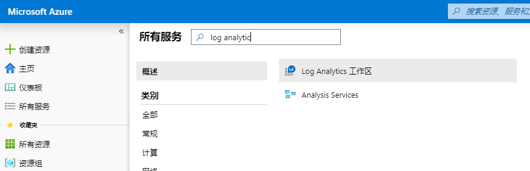

2.  选择**“添加”**，然后选择以下项目的选项：

       * 为新**“日志分析工作区”**命名，例如*“myWorkspaceDemo”*。  
       * 选择一个要连接的**“订阅”**，如果默认选择的值不合适，则从下拉列表中选择。
       * 对于**“资源组”**，选择**“myResourceGroup”**，这是包含你在任务 1 中创建的 VM 的资源组。
       * 选择 **“EastUS”** 作为位置。 
       * 将定价层保留为**“每 Gb (2018)”**
  
           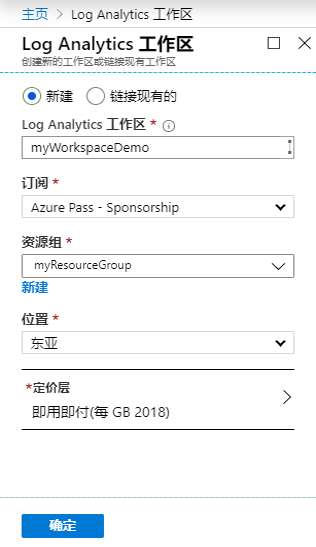

3.  在**“Log Analytics 工作区”**窗格上提供所需信息后，选择**“确定”**。  

1.  在验证信息和创建工作区期间，你可以在菜单中的**“通知”**下跟踪其进度。 

### 任务 2：启用 Log Analytics VM 扩展


对于已经在 Azure 中部署的 Windows 和 Linux 虚拟机，请使用 Log Analytics VM Extension 安装 Log Analytics 代理。使用扩展名可简化安装过程，并自动配置代理以将数据发送到你指定的 Log Analytics 工作区。发行较新版本时，代理也会自动升级，以确保你具有最新的功能和修补程序。在继续之前，请验证 VM 是否正在运行，否则该过程将无法成功完成。 
 

1.  在 Azure 门户中，在左侧边栏中选择**“所有服务”**。在资源列表中，键入**日志分析**。开始键入时，列表会根据你的输入进行筛选。选择**日志分析工作区**。

2.  在 Log Analytics 工作区列表中，选择之前创建的**“myWorkspaceDemo”**。

    **注**：你的工作区名可能与**“myWorkspaceDemo”**不同。


3.  在左侧菜单上的“工作区数据源”下，选择**“虚拟机”**。  

4.  在**“虚拟机”**列表中，选择要在其上安装代理的虚拟机。请注意，VM 的**“Log Analytics 连接状态”**指示其**“未连接”**。

5.  在虚拟机的详细信息中，选择**“连接”**。将为你的 Log Analytics 工作区自动安装和配置代理。此过程需要几分钟，在此期间**“状态”**显示**“连接中”**。

6.  安装并连接代理后，**“Log Analytics 连接状态”**将更新为**“此工作区”**。

### 任务 3：收集 Windows VM 的事件和性能。


Azure Monitor 可以从你指定用于长期分析和报告的 Windows 事件日志或 Linux Syslog 和性能计数器中收集事件，并在检测到特定情况时采取措施。请按照以下步骤配置 Windows 系统日志和 Linux Syslog 中事件的收集，以及几个常见的性能计数器。  


1.  在“Log Analytics”工作区边栏选项卡上，选择**“高级设置”**。

       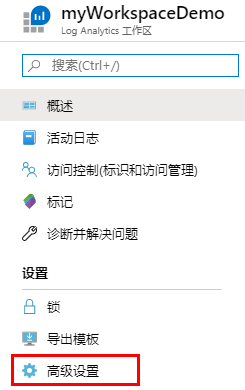

2.  选择**“数据”**，然后选择**“Windows 事件日志”**。

3.  通过输入日志名来添加事件日志。  输入**“系统”**然后选择加号**“+”**。

4.  在表格中，检查**“错误”**和**“警告”**严重程度。

5.  在页面顶部选择**“保存”**，以保存配置。

6.  选择**“Windows 性能数据”**，在 Windows 计算机上启用性能计数器的收集。

7.  首次为新的 Log Analytics 工作区配置 Windows 性能计数器时，可以选择快速创建多个通用计数器。它们将被列出，每个旁边都有一个复选框。

       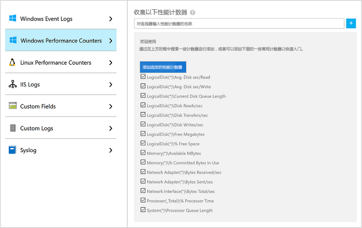

    选择**“添加选定的性能计数器”**。  以十秒的采样间隔添加和预设它们。
  
8.  在页面顶部选择**保存**以保存配置。


### 任务 4：查看收集到的数据


现在，你已经启用了数据收集，让我们运行一个简单的日志搜索示例，以查看目标 VM 中的一些数据。  


1.  在选定的工作区中，从左侧窗格中选择**“日志”**。

2.  在“日志查询”页面上的查询编辑器中输入“Perf”，然后选择**“运行”**。

       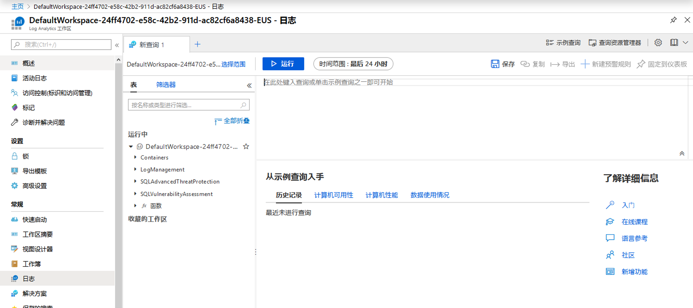

    例如，下图中的查询返回了 10,000 条性能记录。由于虚拟机仅运行了几分钟，因此你的结果将大大减少。

       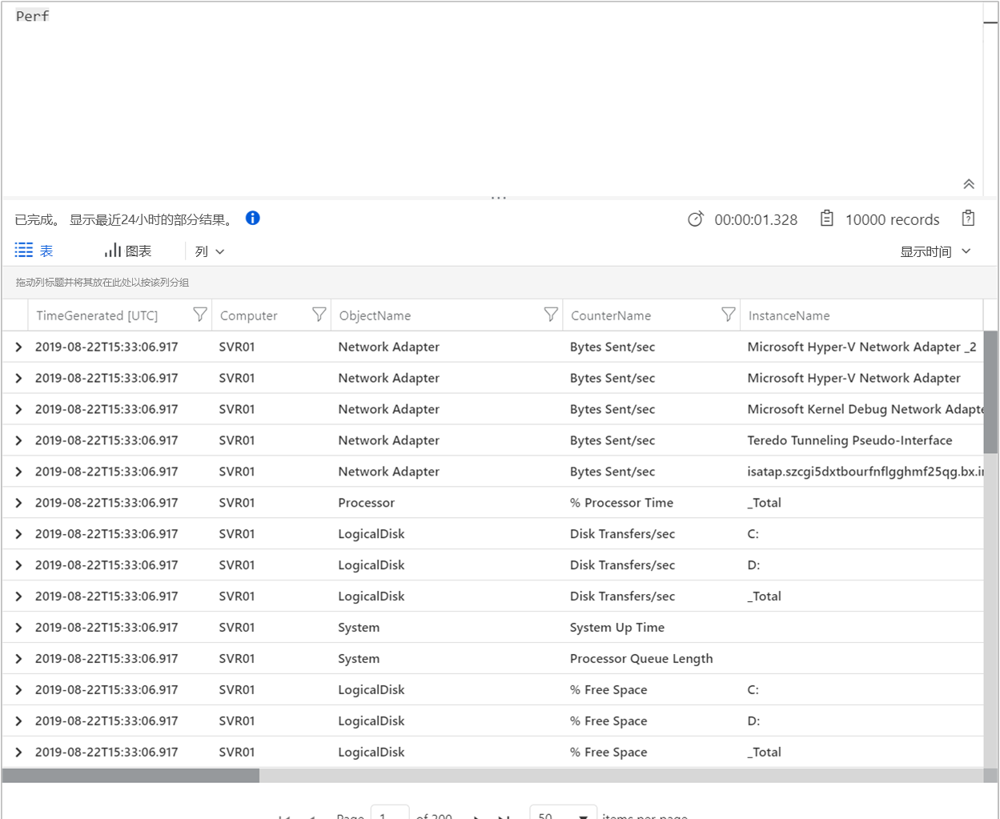

## 练习 2：使用 Azure Monitor Application Insights 监视网站


借助 Azure Monitor Application Insights，你可以轻松地监视网站的可用性、性能和使用情况。你还可以快速识别和诊断应用程序中的错误，而无需等待用户报告错误。Application Insights 提供服务器端监视以及客户端/浏览器端监视功能。

本练习将指导你添加开源的 Application Insights JavaScript SDK，使你能够了解网站访问者的客户端/浏览器端体验。


### 任务 1：启用 Application Insights


Application Insights 可以收集在本地或云中运行的任何与 Internet 连接的应用程序的遥测数据。使用以下步骤开始查看此数据。


1.  选择**“创建资源”** > **“管理工具”** > **“Application Insights”**。

    出现一个配置框；使用下表填写输入字段。

   | 设置        | 值   | 
   | ------------- |-----|
   | **名称**      | 输入全球唯一值 |
   | **资源组**     | mySResourceGroup |
   | **地点** | 美国东部 |

2.  单击**创建**。

### 任务2：创建一个 HTML 文件

1.  在本地计算机上，创建一个名为``hello_world.html``的文件。在此示例中，文件将放置在 C：驱动器的根目录`` C：\ hello_world.html``中。
2.  将以下脚本复制到``hello_world.html``中：

    ```html
    <!DOCTYPE html>
    <html>
    <head>
    <title>Azure Monitor Application Insights</title>
    </head>
    <body>
    <h1>Azure Monitor Application Insights 你好，世界！</h1>
    <p>你可以使用 Application Insights JavaScript SDK 对网站执行客户端/浏览器端监视。要了解更多高级 JavaScript SDK 配置，请访问<a href="https://github.com/Microsoft/ApplicationInsights-JS/blob/master/API-reference.md" title="API Reference">API reference</a>.</p>
    </body>
    </html>
    ```

### 任务 3：配置 App Insights SDK

1.  选择**“概述”** > **“必需品”** > ，复制你应用程序的**“检测密钥”**。

       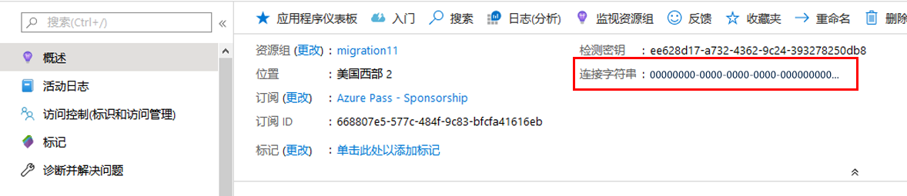

2.  在关闭``</head>``标签之前，将以下脚本添加到你的``hello_world.html``中：

       ```javascript
        <script type="text/javascript">
          var sdkInstance="appInsightsSDK";window[sdkInstance]="appInsights";   var aiName=window[sdkInstance],aisdk=window[aiName]||function(e)   {function n(e){t[e]=function(){var n=arguments;t.queue.push(function   (){t[e].apply(t,n)})}}var t={config:e};t.initialize=!0;var     i=document,a=window;setTimeout(function(){var n=i.createElement ("script");n.src=e.url||"https://az416426.vo.msecnd.net/scripts/b/   ai.2.min.js",i.getElementsByTagName("script")[0]   .parentNode.appendChild(n)});try{t.cookie=i.cookie}catch(e){}t.queue=  [],t.version=2;for(var r=["Event","PageView","Exception","Trace", "DependencyData","Metric","PageViewPerformance"];r.length;)n("track" +r.pop());n("startTrackPage"),n("stopTrackPage");var s="Track"+r[0]; if(n("start"+s),n("stop"+s),n("setAuthenticatedUserContext"),n   ("clearAuthenticatedUserContext"),n("flush"),! (!0===e.disableExceptionTracking||e.extensionConfig&&    e.extensionConfig.ApplicationInsightsAnalytics&&    !0===e.extensionConfig.ApplicationInsightsAnalytics.    disableExceptionTracking)){n("_"+(r="onerror"));var o=a[r];a[r] =function(e,n,i,a,s){var c=o&&o(e,n,i,a,s);return!0!==c&&t["_"+r](   {message:e,url:n,lineNumber:i,columnNumber:a,error:s}),c}, e.autoExceptionInstrumented=!0}return t}(
          {
             instrumentationKey:"INSTRUMENTATION_KEY"
          }
          );window[aiName]=aisdk,aisdk.queue&&0===aisdk.queue.length&&  aisdk.trackPageView({});
       </script>
       ```

3.  编辑``hello_world.html``并添加你的检测密钥。

4.  在本地浏览器会话中打开``hello_world.html``。这将创建一个单独的页面视图。你可以刷新浏览器以生成多个测试页面视图。

### 任务 4：在 Azure 门户中开始监视。

1.  你现在可以重新打开 Azure 门户中的 Application Insights**“概述”**页面，并在其中检索检测密钥，以查看有关当前正在运行的应用程序的详细信息。概述页面上的四个默认图表适用于服务器端应用程序数据。由于我们正在使用 JavaScript SDK 检测客户端/浏览器端的交互，因此除非我们还安装了服务器端 SDK，否则该特定视图将不适用。

2.  单击     应用程序映射图标**“分析”**。  这将打开**“分析”**，它提供丰富的查询语言来分析由 Application Insights 收集的所有数据。要查看与客户端浏览器请求相关的数据，请运行以下查询：

    ```json
    //按名称平均的平均页面浏览时间
    let timeGrain=1s;
    let dataset=pageViews
    //可以在此处应用其他过滤器
    | where timestamp > ago(15m)
    | where client_Type == "Browser" ;
    //计算所有 pageView 的平均 pageView 持续时间
    dataset
    | summarize avg(duration) by bin(timestamp, timeGrain)
    | extend pageView='Overall'
    //在图表中呈现结果
    | render timechart
    ```

       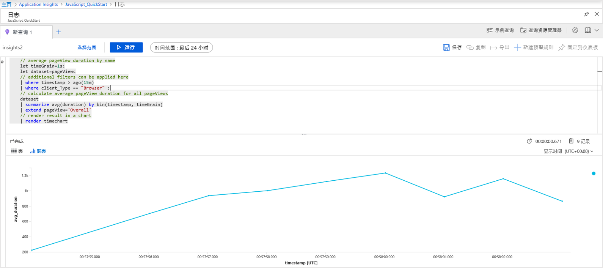

3.  回到**“概述”**页。单击**“调查”**标题下的**“浏览器”**，然后选择**“性能”**  在这里，你可以找到与网站性能相关的指标。还有一个相应的视图用于分析网站中的故障和异常。你可以单击**“样品”**，深入了解单个交易详细信息。从这里，你可以访问端到端交易详细信息。

       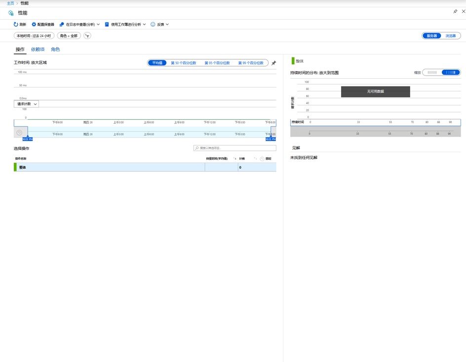

4.  要开始探索用户行为分析工具，请在**“使用情况”**标题下，从 Application Insights 主菜单中选择**“用户”**。由于我们是在一台机器上进行测试，因此只能看到一个用户的数据。对于实时网站，用户分布可能如下所示：

       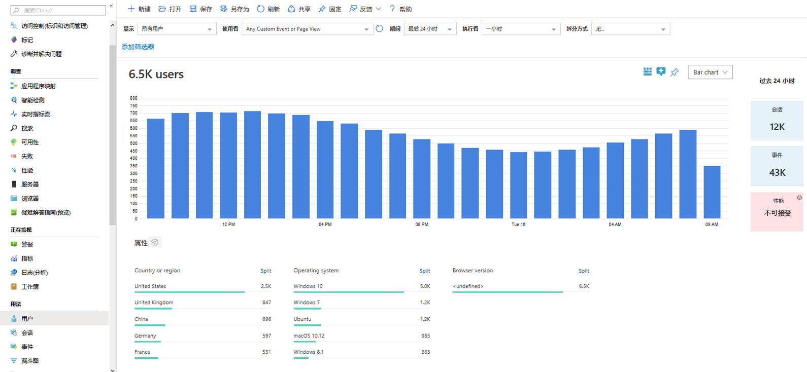
    
5.  如果我们已经建立了一个包含多个页面的更复杂的网站，那么另一个有用的工具是[**用户流**](../../azure-monitor/app/usage-flows.md)。使用**“用户流”**，你可以跟踪访问者浏览网站各个部分的途径。

      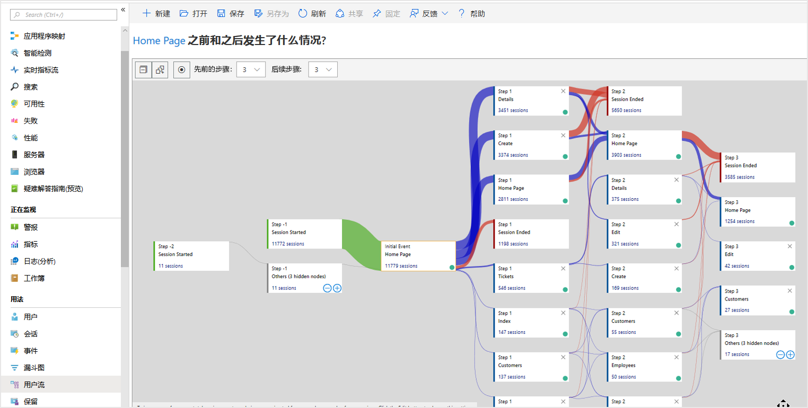

1.  保留所有资源。  你将在以后的实验中使用它们。


**“结果”**：在本实验中，你学习了如何使用 Azure Monitor 监视资源。

