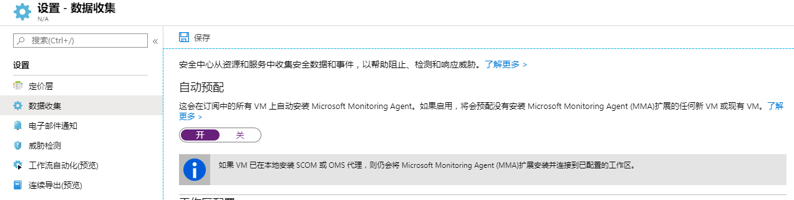
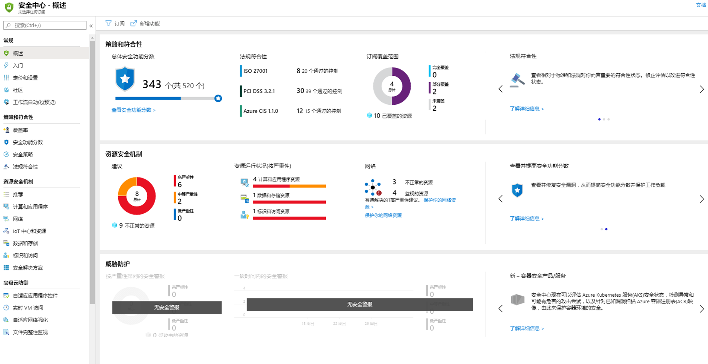
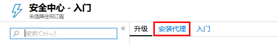
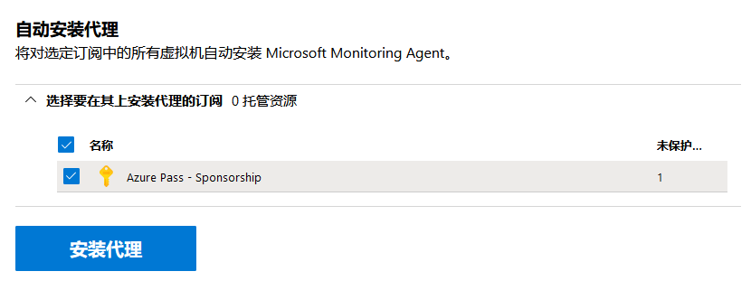
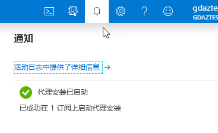
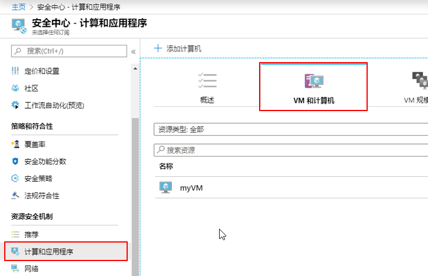
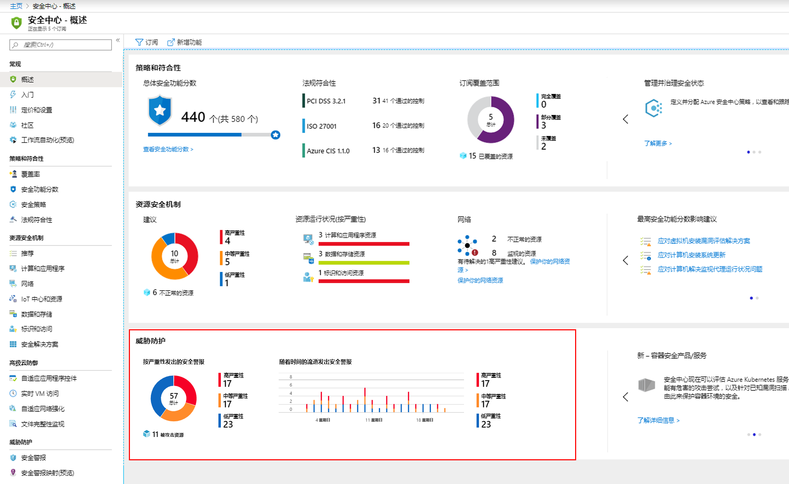
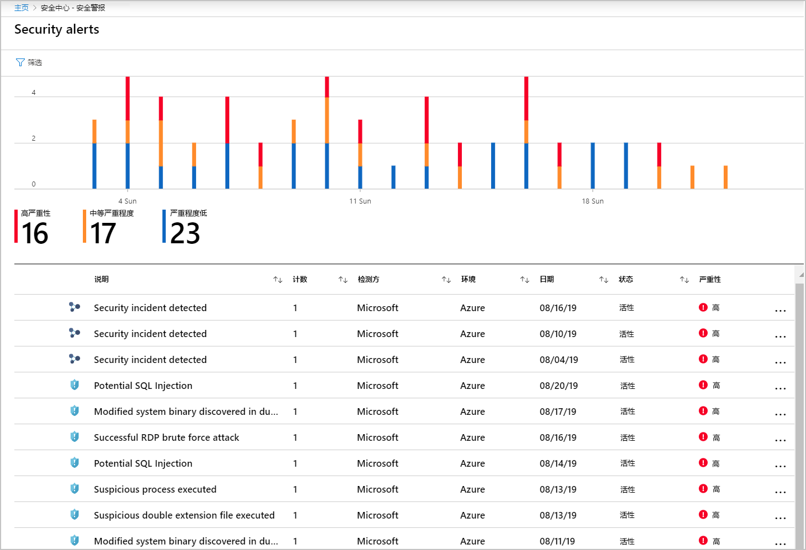
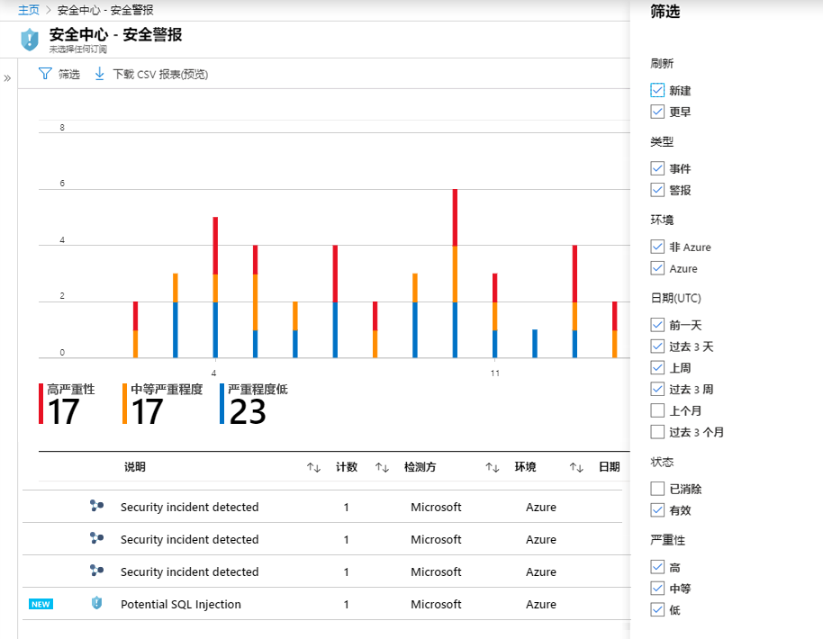
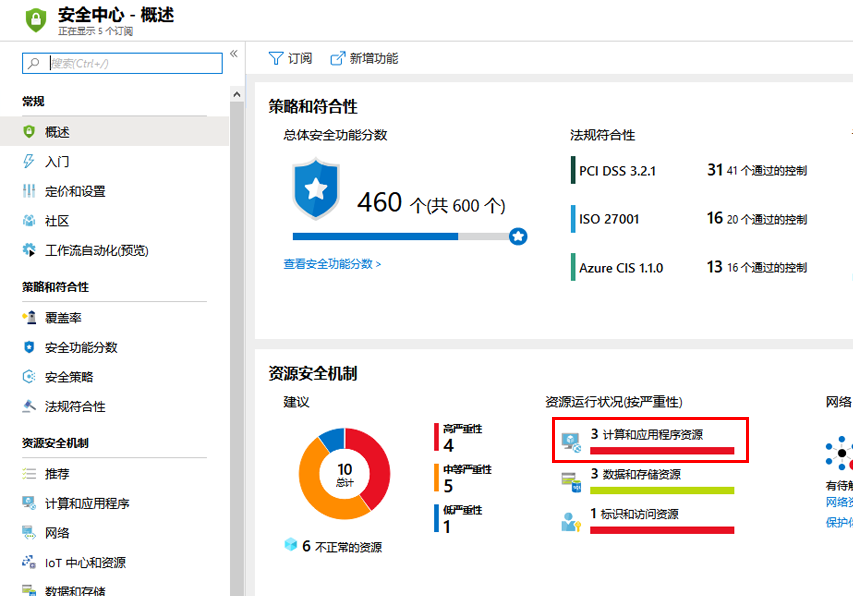

---
lab:
    title: '实验 2 - 安全中心'
    module: '模块 3：管理安全操作'
---

# 模块 3：实验 2 - 安全中心

Azure 安全中心是一个统一的基础架构安全管理系统，可以增强数据中心的安全状况，并为云中的混合工作负载提供高级威胁防护 - 无论是 Azure 还是本地。

保持资源安全是你的云提供商 Azure 和客户之间的共同努力。你必须确保在迁移到云时你的工作负载是安全的，同时，当你迁移到 IaaS（基础架构即服务）时，与 PaaS（平台即服务）和 SaaS（软件即服务）相比，客户责任更大。Azure 安全中心为你提供强化网络、保护服务并确保你处于最佳安全状态所需的工具。

## 练习 1：载入你对安全中心标准的的 Azure 订阅

Azure 安全中心为你的混合云工作负载提供统一的安全管理和威胁防护。虽然免费层仅为你的 Azure 资源提供有限的安全性，但标准层将这些功能扩展到本地和其他云。安全中心标准可帮助你查找和修复安全漏洞，应用访问和应用程序控制来阻止恶意活动，使用分析和智能检测威胁，以及在受到攻击时快速响应。你可以免费试用安全中心标准。要了解更多信息，请参阅定价页面。

在本练习中，你将升级到标准层以提高安全性，并在虚拟机上安装 Microsoft Monitoring Agent，以监视安全漏洞和威胁。

### 任务 1：自动化数据收集

安全中心从你的 Azure VM 和非 Azure 计算机收集数据，以监视安全漏洞和威胁。使用 Microsoft Monitoring Agent 收集数据，Microsoft Monitoring Agent 从计算机读取各种与安全性相关的配置和事件日志，并将数据复制到你的工作区中进行分析。默认情况下，安全中心将为你创建一个新的工作区。

启用自动配置后，安全中心会在所有受支持的 Azure VM 以及所创建的所有新 VM 上安装 Microsoft Monitoring Agent。强烈建议自动配置。

要启用 Microsoft Monitoring Agent 的自动配置：

1.  在 Azure 门户中，从“中心”菜单中选择**“安全中心”**。

     

1.  在**“入门”**边栏选项卡中单击**“升级”**。

     
     
1.  在安全中心主菜单下，选择**“定价和设置”**。

2.  在订阅的行上，单击要更改其设置的订阅。
3.  在**数据采集**选项卡里将**自动配置**设置为**开启**。
4.  退出边栏选项卡，**“没有”**保存。

    **注**：确保不单击保存，否则以下练习将按预期进行。

 
     

 借助对 Azure VM 的这种新见解，安全中心可以提供与系统更新状态、操作系统安全配置、endpoint protection 有关的其他建议，并生成其他安全警报。

## 练习 2：将载入 Windows 计算机连接到 Azure 安全中心

载入 Azure 订阅后，可以通过预配置 Microsoft Monitoring Agent，为在 Azure 外部运行的资源（例如本地或其他云）启用安全中心。

本练习向你展示如何在 Windows 计算机上安装 Microsoft Monitoring Agent。

### 任务 1：添加新的 Windows 计算机

1.  在 Azure 门户中，选中**“安全中心”**。**安全中心 - 概述**打开。

       

3.  在安全中心主菜单下，选择**“入门”**。
4.  选择**“安装代理”**选项卡。

       

5.  向下滚动到自动安装代理部分，然后单击**“安装代理”**。

     

1.  等待直到通过监视部署来安装代理。

     
 
1.  打开**“安全中心”**，并单击**“计算机与应用”**，然后单击**“VM 和计算机”**。

     
 
1.  请注意，你的虚拟机现已受到监视。

## 练习 3：管理和响应 Azure 安全中心的警报

安全中心自动收集、分析和集成 Azure 资源中的日志数据、网络和连接的合作伙伴解决方案，如防火墙和 endpoint protection 解决方案，以检测真实威胁并减少误报。安全中心显示优先安全警报列表、快速调查问题所需的信息以及如何修复攻击的建议。

### 任务 1：管理警报
 
1.  在“安全中心”仪表板上，查阅**“威胁防护”**磁贴以查看和概述警报。

    **注**：如果磁贴显示**“没有安全警报”**，你可能需要等待一段时间才能运行评估。

       

1.  要查看有关警报的更多详细信息，请单击“磁贴”。  下面的屏幕截图显示了你在现实世界中可能看到的潜在警报：

       

1.  要过滤显示的警报，请单击**“过滤器”**，并从打开的**“过滤器”**边栏选项卡中，选择要应用的过滤器选项。根据所选过滤器更新列表。筛选可能非常有帮助。例如，由于正在调查可能的系统漏洞，你可能想解决在过去 24 小时发生的安全警报。

       

### 任务 2：回应建议

1.  在 Azure 安全中心中单击**“概述”**。

1.  在**“资源运行状况的严重性”**部分的**“资源安全卫生”**列表中，选择**“计算和应用资源”**

     

1.  查看建议。

       

| 警告：在继续之前，你应该删除此实验室教学使用的所有资源。  为此，应在**“Azure 门户”**中，单击**“资源组”**。  选择你创建的任何资源组。  在资源组边栏选项卡上，单击**删除资源组**，输入资源组名称，然后单击**删除**。  对你创建的任何其他资源组重复该过程。**否则可能会导致其他实验室出现问题。** |
| --- |

**“结果”**：你现在已经完成了本实验，可以继续进行本系列的下一个实验

