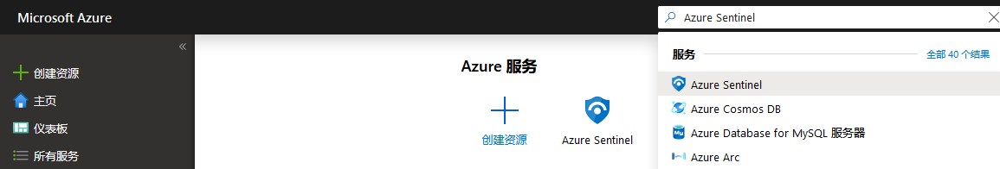
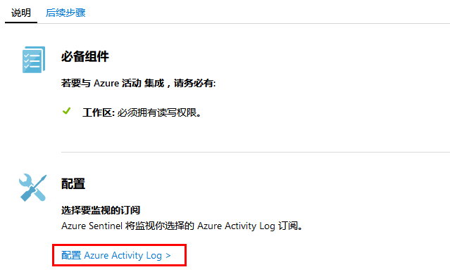
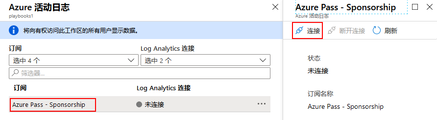

---
lab:
    title: '实验 4 - Azure Sentinel'
    module: '模块 3：管理安全操作'
---

# 模块 3：实验 4 - Azure Sentinel

Azure Sentinel 是整个企业的鸟瞰图。将数十年 Microsoft 安全经验积累的云和大规模智能投入工作中。借助人工智能 (AI) 使你的威胁检测和响应更加智能快速

## 练习 1：板载 Azure Sentinel

对于板载 Azure Sentinel，首先需要启用 Azure Sentinel，然后连接数据源。Azure Sentinel 附带了许多用于 Microsoft 解决方案的连接器，它们现成可用并提供实时集成，包括 Microsoft 威胁防护解决方案、Microsoft 365 来源（包括 Office 365、Azure AD、Azure ATP 和 Microsoft Cloud App Security）等等。此外，还有用于非 Microsoft 解决方案更广泛安全生态系统的内置连接器。你还可以使用通用事件格式，Syslog 或 REST-API 将数据源与 Azure Sentinel 连接。  

连接数据源后，请从专业创建的工作簿库中进行选择，这些工作簿将根据你的数据显示见解。这些工作簿可以轻松地根据你的需求进行自定义。

### 任务 1：启用 Azure Sentinel

1.  在 Azure 门户中，搜索 Azure Sentinel。 

       

1.  单击**“+ 添加”**。
1.  如有必要，使用美国东部地区在新的资源组中创建一个新工作区。

    **注**：  -由 Azure 安全中心创建的默认工作区将不会出现在列表中；你不能在它们上安装 Azure Sentinel。  -Azure Sentinel 可以在 Log Analytics 的任何 GA 区域的工作区运行，但中国、德国和 Azure 政府区域除外。Azure Sentinel 生成的数据（例如事件、书签和警报规则，可能包含来自这些工作区的某些客户数据）保存在西欧（位于欧洲的工作区）或美国东部（所有在美国的工作区，以及欧洲以外的任何其他地区）。

6.  点击**添加 Azure Sentinel**。
  

### 任务 3：连接数据源

Azure Sentinel 通过连接到服务并将事件和日志转发到 Azure Sentinel 来创建与服务和应用程序的连接。对于计算机和虚拟机，你可以安装 Azure Sentinel 代理收集日志并将其转发到到 Azure Sentinel。对于防火墙和代理，Azure Sentinel 使用 Linux Syslog 服务器。代理程序安装在服务器上，并从这里收集日志文件并将其转发到 Azure Sentinel。 

1.  在 Azure 门户中，选择“所有资源”，然后选择在上一个任务中创建的 Log Analytics 工作区。

1.  在菜单上，选择**“数据连接器”**。此页面使你可以查看 Azure Sentinel 提供的连接器的完整列表及其状态。选择要连接的连接器，然后选择**“打开连接器页面”**。 

       

1.  选择**“Azure 活动”**，然后单击**“打开连接器页面”**。

1.  选择**“配置 Azure 活动日志”**。

     

1.  在特定的连接器页面上，确保已满足所有先决条件，并按照说明将数据连接到 Azure Sentinel。日志可能需要一些时间才能开始与 Azure Sentinel 同步。连接后，你将在**“收到的数据”**图中看到数据摘要，以及数据类型的连接状态。

   

1.  选择你的 Azure 订阅，然后单击**“连接”**。

     
 

**“结果”**：现在你已经完成了本实验室教学。
