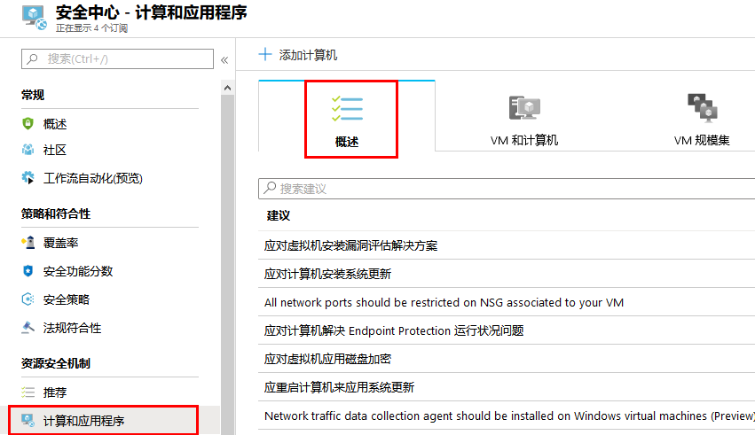
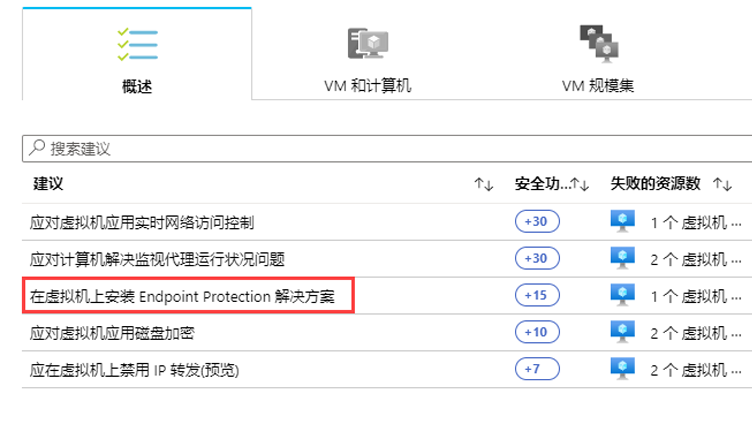

---
lab:
    title: '实验 5 - 使用 Azure 安全中心管理 endpoint protection 问题'
    module: '模块 3：管理安全操作'
---

# 模块 3：实验 5 - 使用 Azure 安全中心管理 endpoint protection 问题

Azure 安全中心监视反恶意软件保护的状态并在终结点保护问题边栏选项卡下报告。安全中心突出显示检测到的威胁和保护不足等问题，这些问题可能会使你的虚拟机 (VMs) 和计算机容易受到反恶意软件威胁。通过使用下的信息**终结点保护问题**，你可以确定一个计划来解决所发现的任何问题。

安全中心报告以下终结点保护问题：

- Azure VM 上未安装 endpoint protection - 这些 Azure VM 上未安装受支持的反恶意软件解决方案。
- 非 Azure 计算机上未安装 endpoint protection - 这些非 Azure 计算机上未安装受支持的反恶意软件。
- Endpoint protection 健康：

  - 签名过期 - 这些 VM 和计算机上安装了反恶意软件解决方案，但该解决方案没有最新的反恶意软件签名。
  - 没有实时保护 - 这些 VM 和计算机上安装了反恶意软件解决方案，但它未配置为实时保护。 
  - 没有报告 - 安装了反恶意软件解决方案但未报告数据。
  - 未知 - 安装了反恶意软件解决方案，但其状态未知或报告未知错误。

## 练习 1：实施建议

Endpoint protection 问题在安全中心作为建议提出。  如果你的环境容易受到反恶意软件威胁，则此建议将显示在**“建议”**和**“计算”**下。要看**“Endpoint protection 问题仪表板”**，请遵循计算流程。

在本练习中，我们将使用**“计算”**。  我们将研究如何在 Azure VM 和非 Azure 计算机上安装反恶意软件。

### 任务 1：在 Azure VM 上安装反恶意软件

1.  在安全中心主菜单或**“概述”**下，选择**“计算和应用”**。

       

2.  在**“计算”**下，选择**“在虚拟机上安装 endpoint protection 解决方案”**。该**终结点保护问题**仪表板打开。

       

1.  在**“Azure VM 上未安装 endpoint protection”**边栏选项卡中，单击**“在 1 个 VM 上安装”**。

     

5.  在**选择终结点保护**下，选择要使用的终结点保护解决方案。在此示例中，选择 **Microsoft Antimalware**。

6.  将显示有关 endpoint protection 解决方案的其他信息。选择**确定**。

**“结果”**：现在你已经完成了本实验室教学。
