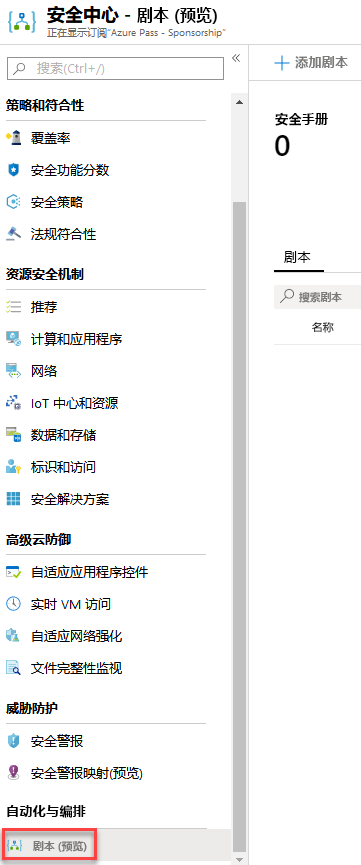
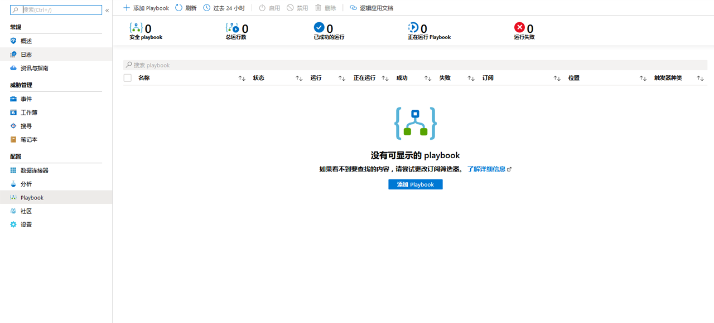
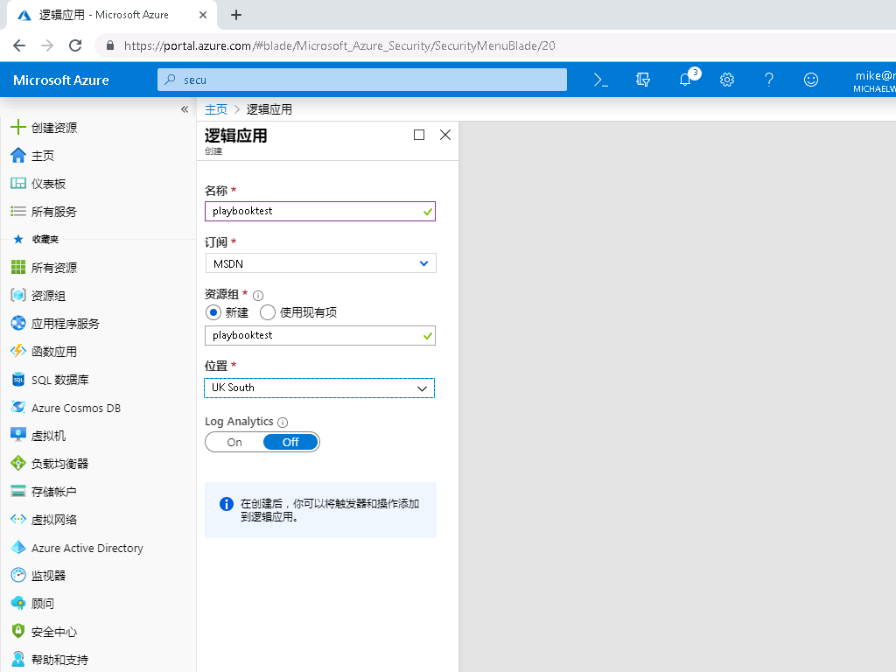
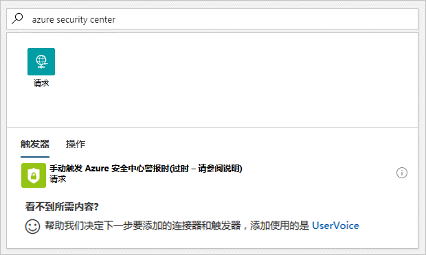
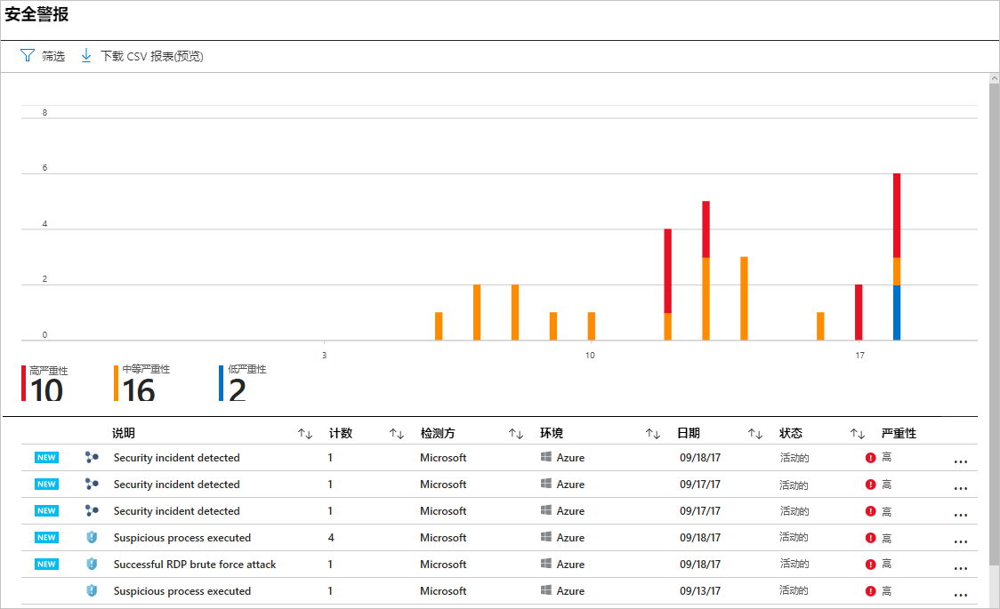
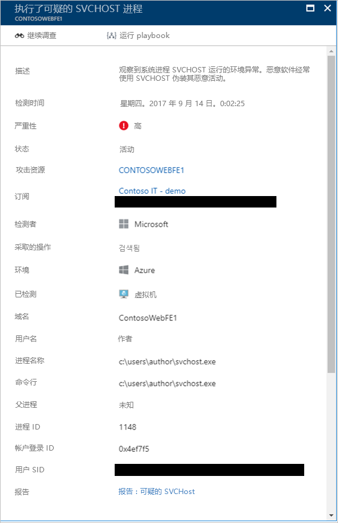
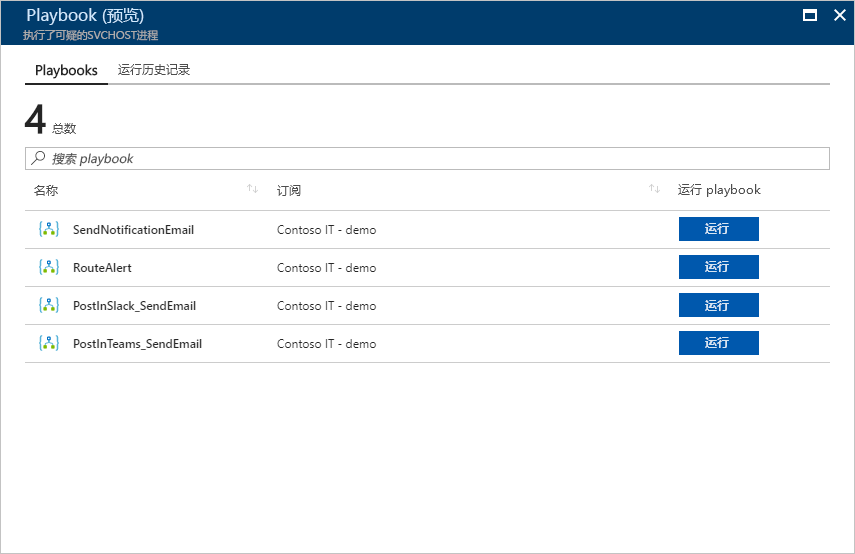
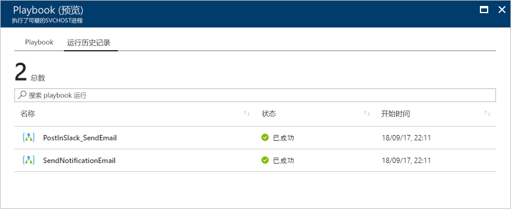

---
lab:
    title: '实验 6 - Azure 安全中心的安全 playbook'
    module: '模块 3：管理安全操作'
---

# 模块 3：实验 6 - Azure 安全中心的安全 playbook

安全 playbook 是在从选定的警报触发某个 playbook 后可以从安全中心执行的一系列过程。安全 playbook 可以帮助自动化处理和安排你对安全中心检测到的特定安全警报的响应。安全中心的安全 playbook 基于 Azure Logic 应用，这意味着你可以使用 Logic Apps 模板的安全类别中的模板，根据需要进行修改，或者使用 Azure Logic Apps 工作流程并使用安全中心作为触发器。

## 练习 1：在 Azure 中创建和管理安全 playbook 。

### 任务 1：如何从安全中心创建安全 playbook？

请按照以下步骤从安全中心创建新的安全 playbook：

1.  打开**“安全中心”**仪表板。

如果发现安全中心选项显示为灰色，请单击“入门”窗格，然后单击**“开始试用”**

2.  在左侧窗格的**“自动化处理与安排”**部分，单击**“Playbook（预览）”**。

       

	

3.  在**“安全中心 - Playbook（预览）”**页面上，单击**“添加 Playbook”**按钮。

     

 

4.  在**“创建逻辑应用”**页面上，输入一个唯一名称以创建新逻辑应用，然后单击**“创建”**按钮。**“创建具有唯一名称的新资源组”** 创建完成后，新 Playbook 将出现在列表中。如果没有出现，请单击**“刷新”**按钮。看到它后，单击它开始编辑此 playbook。

      
    
5.  **“逻辑应用设计器”**出现。请单击**“空白逻辑应用”**以创建一个新 playbook。你也可以在类别下选择**“安全”**，并使用其中一个模板。

    

6.  在**“搜索所有连接器和触发器”**字段中，输入*“Azure 安全中心”*，然后选择**“触发对 Azure 安全中心警报的响应时”**。

    

7.  现在，你可以定义触发 playbook 时发生的情况。你可以添加操作、逻辑条件、切换案例条件或循环。请单击**“新步骤”**，浏览可以在安全警报上执行的操作列表。自定义操作和代码也可以在警报上触发。

8.  单击“保存”以保存有或没有触发器操作的 playbook

### 任务 2：如何在安全中心运行安全 playbook？

当你希望安排、从其他服务中获取更多信息或需要进行补救时，可以在安全中心运行安全 playbook。要访问此 palybook，请按照下列步骤操作：

1.  打开**安全中心**仪表板。

2.  在左窗格中的**“威胁防护”**下，单击**“安全警报”**。

    

3.  单击你要调查的警报。

**注**：在你的实验室环境中，可能没有任何安全警报，如果是这种情况，则可以参考屏幕截图以预览警报的外观

4.  在警报页面的顶部，单击**“运行 playbook”**按钮。

    
    
5.  在“Playbook”页面中，选择要运行的 playbook，然后单击**“运行”**按钮。如果希望在触发之前查看 playbook，则可以单击它，然后设计器将打开。

    

### 任务 3：历史

运行 playbook 后，你还可以访问以前的执行方式以及包含有关先前执行的 playbook 状态的更多信息的步骤。历史记录根据警报进行上下文关联，这表示你在此页面中看到的 playbook 的历史与触发该 playbook 的警报相关。

   

1.  要查看有关特定 playbook 执行的更多详细信息，请单击 playbook 本身，然后将显示逻辑应用运行页面以及整个工作流程。

     

2.  在此工作流程中，你可以看到执行每个任务所花费的时间，并且可以展开每个任务以查看结果。

**注**：有关如何使用 Azure 逻辑应用创建自己的 playbook 的更多信息，请阅读[创建你的第一个逻辑应用工作流程，以自动化云应用和云服务之间的流程](https://docs.microsoft.com/azure/logic-apps/logic-apps-create-a-logic-app)。

**“结果”**：在本实验中，你学习了如何在 Azure 安全中心使用 playbook。

