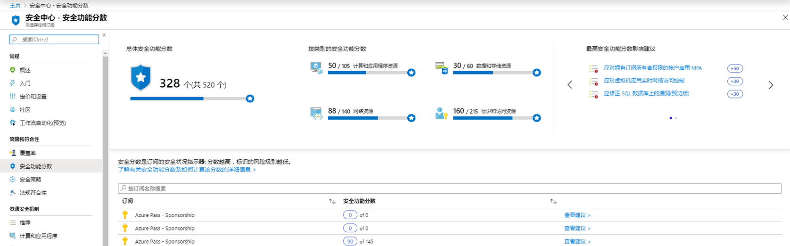
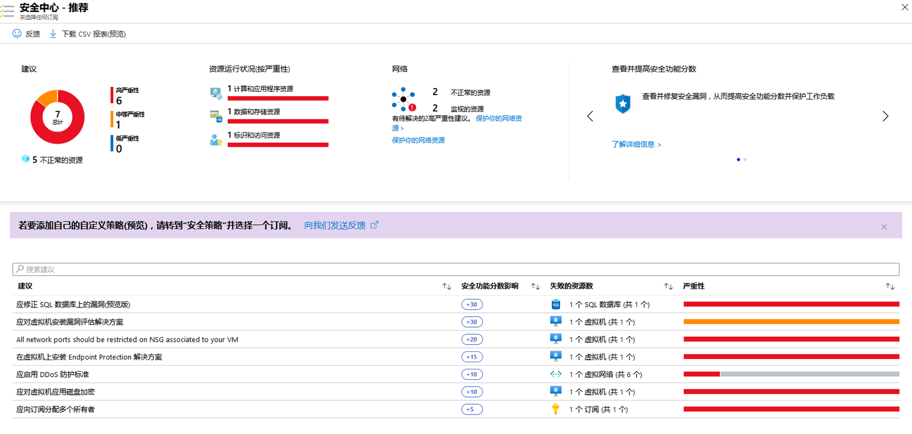

---
lab:
    title: '实验 7 - Azure 安全中心中的安全功能分数'
    module: '模块 3：管理安全操作'
---

# 模块 3：实验 7 - Azure 安全中心中的安全功能分数

有这么多服务提供安全好处，通常很难知道哪些步骤可以先保护和加强你的工作量。Azure 安全功能分数会审核你的安全建议并为你确定优先级，以便你了解要先执行哪些建议。这有助于你找到最严重的安全漏洞，以便可以确定调查的优先级。安全功能分数是可以帮助你评估工作负载安全状况的工具。

**安全功能分数计算**

安全中心模仿安全分析师的工作，审查你的安全建议并应用高级算法来确定每项建议的重要性。
Azure 安全中心会不断检查你的活动建议，并根据这些建议计算你的安全功能分数，该建议的分数来自其严重性和最佳安全实践，这将对工作负载的安全性产生最大影响。

安全中心还为你提供**“总体安全功能分数”**。 

**“总体安全功能分数”**是你所有推荐分数的累积。你可以在订阅或管理组中查看总体安全功能分数，具体取决于你选择的内容。分数根据所选订阅和这些订阅的有效建议而有所不同。

 
## 练习 1：提高你在 Azure 安全中心的安全功能分数。

### 任务 1：在 Azure 门户中查看安全功能分数。

1.  在 Azure 仪表板，选择**“安全中心”**，然后选择**“安全功能分数”**。
2.  在顶部，你可以看到安全功能分数重点：

       - **“总体安全功能分数”**表示每个选定订阅的每个策略的得分。
       - **“按类别安全功能分数”**列出哪些资源最需要关注。
       - **“安全功能分数影响的最佳建议”**在你实施这些建议时，为你提供最能提高你的安全功能分数的建议列表。

 
       

    
      **注**：每个订阅的安全功能分数的总和不等于总体安全功能分数。安全功能分数基于你的健康资源与每个建议的总资源之间的比率计算，而不是基于你的订阅的安全功能分数的总和。 

3.  选择**“查看建议”**，查看你可以修复的特定订阅的建议，以提高你的安全功能分数。
4.  在建议列表中，你可以看到，对于每个建议，都有一列代表**“安全功能分数影响”**。此数字表示如果你遵循建议，你的整体安全功能分数将提高多少。例如，在下面的屏幕中，如果你**“补救容器安全配置中的漏洞”**，你的安全功能分数将提高 35 点。

       

### 任务 2：查看个人安全功能分数。

此外，要查看个人安全功能分数，你可以在个人推荐边栏选项卡中找到这些分数。  

**“建议安全功能分数”**根据你的健康资源与总资源之间的比率计算得出。如果健康资源的数量等于资源总数，则获得建议的最大安全功能分数，即 50。要尝试使你的安全功能分数接近最高分，可以按照建议修复不健康的资源。

**“建议影响”**让你知道如果应用推荐步骤，你的安全功能分数会提高多少。例如，如果你的安全功能分数是42，而**“建议影响”**是 +3，执行建议中概述的步骤可将你的分数提高到 45。

1.  单击“安全功能分数”边栏选项卡中的任何建议。

    建议显示如果不采取补救措施，你的工作负载将面临哪些威胁。

     

**“结果”**：在本实验中，你学习了如何在 Azure 安全中心中提高安全功能分数。
