---
lab:
    title: '实验 8 — 创建安全基线'
    module: '模块 3：管理安全操作'
---

# 模块 3：实验 8 — 创建安全基线 

Azure 不会监视或响应客户责任区内的安全事件。Azure 确实提供了许多用于此目的的工具（例如 Azure 安全中心、Azure Sentinel）。默认情况下，还努力帮助使每项服务尽可能安全。也就是说，每个服务都附带一个基线，该基线旨在帮助为大多数常见用例提供安全性。但是，由于 Azure 无法预测服务的使用方式，因此你需要始终查看这些安全控制措施，以评估它们是否能够充分降低风险。

本实验将指导你完成 Azure 服务的安全基准。每个单元都会提供一份清单，以核实你在体系结构中使用的服务。

在本实验中，你将：

- 了解 Azure 平台安全性基准及其创建方式
- 为最常用的 Azure 服务创建和验证安全基准

 
## 练习 1：创建身份和访问管理 (IAM) 基线

身份管理是授予访问权限和公司资产安全性增强的关键。为了保护和控制基于云的资产，你必须为 Azure 管理员、应用程序开发人员和应用程序用户管理身份和访问。

**IAM 建议**

以下是有关身份和访问管理的建议。每个建议中都包含 Azure 门户中要遵循的基本步骤。 

### 任务 1：限制对 Azure AD 管理门户的访问

由于敏感数据和最小权限规则，所有非管理员都不应具有访问权限。

1.  登录至 Azure 门户。

2.  在左侧，选择**“Azure Active Directory”** > **“用户和组”**。

3.  前往**“用户设置”**。

4.  确保“对 Azure AD 管理门户的限制访问”被设置为“是”。将此值设置为“是”将限制所有非管理员访问管理门户中的任何 Azure AD 数据，但不限制使用 PowerShell 或其他客户端（例如 Visual Studio）进行此类访问。

       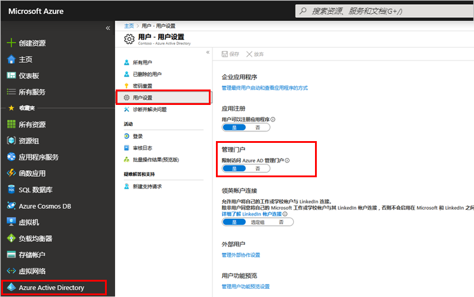

1.  单击**“保存”**。

### 任务 2：启用 Azure 多重身份验证 (MFA)

为特权和非特权用户启用它。

1.  登录至 Azure 门户。

2.  在左侧，选择**“Azure Active Directory”** > **“用户和组”**。

3.  单击**“+新建用户”**。

1.  在新用户边栏选项卡上，输入以下详细信息，然后单击创建：

      - **“用户名”**：阿比
      - **“名称”**: 阿比·斯金纳 (Abbi Skinner)
      - **“名字”**：阿比 
      - **“姓氏”**：斯金纳
      - **“角色”**。选择全局管理员

2.  在左侧，选择**“Azure Active Directory”** > **“用户”** > **“所有用户”**。

3.  选择多重身份验证。这将打开一个新窗口。

4.  选择阿比 斯金纳 (Abbi Skinner)，然后单击**“启用”**

       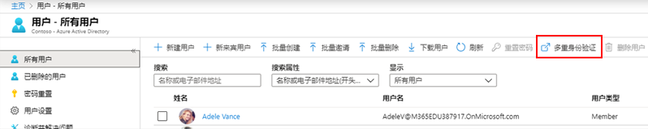

1.  选择**“启用多因素身份验证”**然后点击**“关闭”**。

     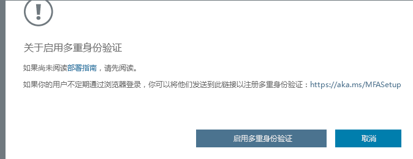
 
1.  阿比现在已启用 MFA。

### 任务 3：阻止在可信设备上记住 MFA 

记住用户信任的设备和浏览器的记忆多重身份验证功能是所有多重身份验证用户的免费功能。用户在使用多重身份验证成功登录设备后，可以在指定的天数内绕过后续验证。如果帐户或设备受到威胁，请记住可信设备的多重身份验证可能会对安全性产生负面影响。

1.  登录至 Azure 门户。

2.  在左侧，选择**“Azure Active Directory”** > **“用户”** > **“所有用户”**。

3.  选择多重身份验证。

4.  选择**“阿比·斯金纳 (Abi Skinner)”**，然后点击**“管理用户设置”**。

5.  确保选中**“在所有记忆设备上还原多事实身份验证”** 然后单击**“保存”**。

       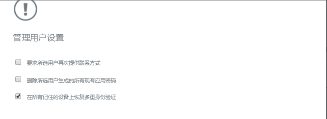

### 任务 4：关于客人 

在此任务中，你将确保不存在访客用户，或者，如果业务需要访客用户，请确保限制其权限。

1.  登录至 Azure 门户。

2.  在左侧，选择**“Azure Active Directory”** > **“用户”** > **“所有用户”**。

3.  选择显示下拉并选择**“仅限访客用户”**。

4.  确认没有列出访客用户 (`USER TYPE=Guest`)。

       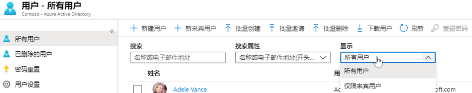

### 任务 5：密码选项

使用双重标识集，攻击者可能需要先破坏两种身份表，然后才能恶意重置用户密码。

1.  登录至 Azure 门户。

2.  在左侧，选择**“Azure Active Directory”** > **“用户和组”**。

3.  选择**“重设密码”**。

4.  前往“认证方法”。

5.  重置“所需的方法数”设置为 2。

1.  选择两种方法，然后单击**“保存”**。
    

### 任务 6：建立间隔以重新确认用户身份验证方法 

如果将身份验证重新确认设置为禁用，则不会提示注册用户重新确认其身份验证信息。

1.  登录至 Azure 门户。

2.  在左侧，选择**“Azure Active Directory”** > **“用户和组”**。

3.  前往**“重设密码”**。

4.  前往**“注册”**

5.  确保“要求用户重新确认其身份验证信息的天数”未设置为 0。默认值为 180 天。

       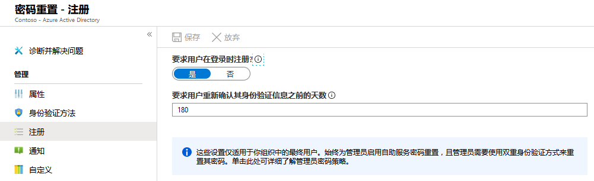

### 任务 7：成员和客人可以邀请 

应将其设置为“否”。通过管理员限制邀请只能确保只有授权帐户才能访问 Azure 资源。

1.  登录至 Azure 门户。

2.  在左侧，选择**“Azure Active Directory”** > **“用户和组”**。

3.  前往**“用户设置”**。

4.  转到外部用户，单击**“管理外部协作设置”**。

5.  确保会员可以邀请被设置为**“否”**。

       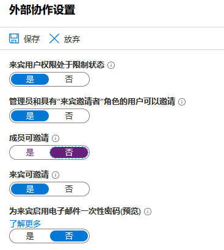

### 任务 8：用户创建和管理安全组 

启用此功能后，AAD 中的所有用户都可以创建新的安全组。安全组创建应仅限于管理员。

1.  登录至 Azure 门户。

2.  在左侧，选择**“Azure Active Directory”** > **“用户和组”**。

3.  前往设置部分下的**“一般”**。

4.  确保用户可以创建安全组被设置为**“否”**。

       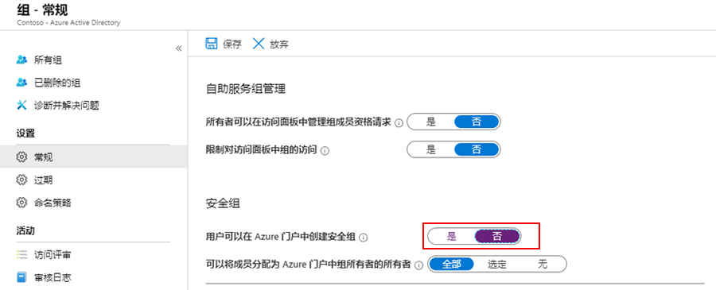

### 任务 9：自助服务组管理已启用 

在你的企业需要向各种用户授权之前，最佳做法是禁用此功能。

1.  登录至 Azure 门户。

2.  在左侧，选择**“Azure Active Directory”** > **“用户和组”**

3.  前往设置部分下的**“一般”**。

4.  确保启用自助组管理被设置为**“否”**。

       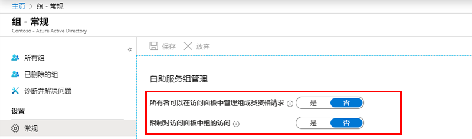

### 任务 10：应用程序选项 — 允许用户注册应用程序

要求管理员注册自定义应用程序。

1.  登录至 Azure 门户。

2.  在左侧，选择**“Azure Active Directory”** > **“用户和组”**。

3.  前往“用户设置”。

4.  确保**“User 可以注册申请”**被设置为**“否”**。

       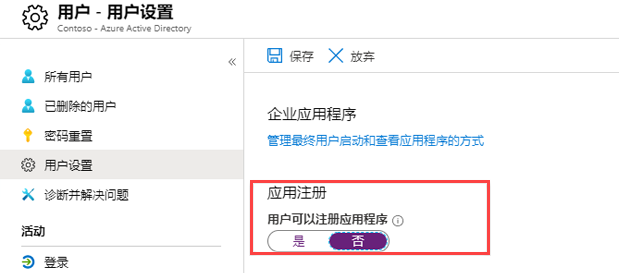

## 练习 2：创建 Azure 安全中心基线

Azure 安全中心 (ASC) 为在 Azure、本地和其他云中运行的工作负载提供统一的安全管理和高级威胁防护。以下是安全中心建议，如果遵循这些建议，将在 Azure 订阅上设置各种安全策略。

这些策略定义了使用 Azure 订阅为你的资源推荐的控件集。

### 任务 1：启用系统升级 

Azure 安全中心每日监视 Windows 和 Linux 虚拟机 (VMs) 以及计算机是否错过了操作系统更新。安全中心从 Windows Update 或 Windows Server Update Servicess (WSUS) 中检索可用安全性和关键更新的列表，具体取决于在 Windows 计算机上配置的服务。安全中心还会检查 Linux 系统中的最新更新。如果你的 VM 或计算机缺少系统更新，安全中心将建议你应用系统更新。

1.  登录至 Azure 门户。

2.  在**“安全中心”**主菜单中选择**“安全策略”**。

3.  屏幕出现**“策略管理”**。

4.  从显示的列表中选择你的订阅。

5.  检查政策中的一项是**“系统更新应安装在你的计算机上”**。

6.  单击“在 Azure 安全中心中启用监视”链接（此链接也可能显示为带有 GUID的ASC 默认值）。

       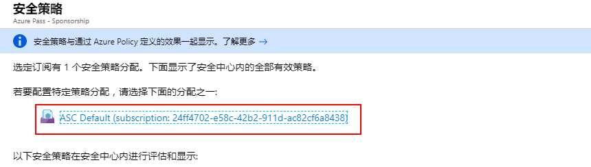

7.  在此示例中，ASC 代理尚未部署到 VM 或物理机，因此显示消息 AuditIfNotExists。AuditIfNotExists 启用对符合 if 条件的资源的审核。如果未部署资源，则显示“NotExists”。

       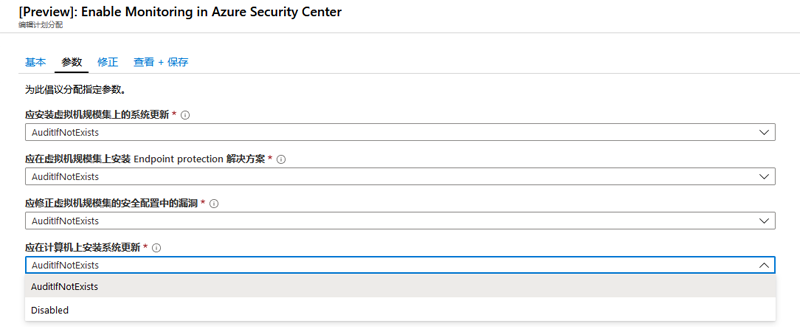

    如果启用，将显示“审核”。如果已部署但已禁用，则会显示“已禁用”。

       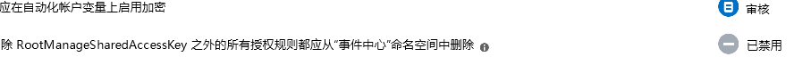

### 任务 2：启用安全配置

Azure 安全中心通过应用一组超过 150 条建议的操作系统规则来监控安全配置，包括与防火墙、审核、密码策略等相关的规则。如果发现计算机具有易受攻击的配置，则安全中心会生成安全建议。

1.  登录至 Azure 门户。

2.  在**“安全中心”**主菜单中选择**“安全策略”**。

3.  显示“策略管理”屏幕。

4.  从显示的列表中选择你的订阅。

5.  检查策略的其中一项是**“应纠正虚拟机规模集上的安全配置中的漏洞”**。

       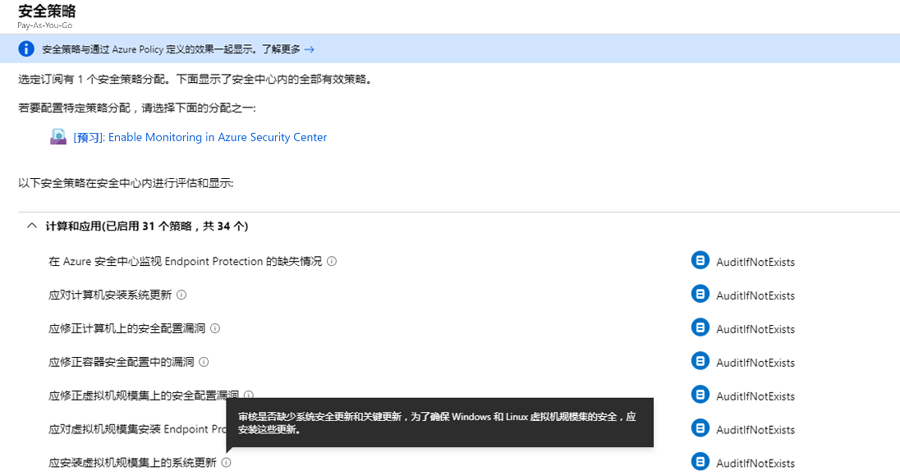

    **注**：如上所述，以下所有带有标题 (*) 的策略均在“安全策略”边栏选项卡中列出

      - **“启用终结点保护”** - “建议对所有虚拟机使用终结点保护”__。
      - **“启用磁盘加密”** - “如果你未使用 Azure 磁盘加密对 Windows 或 Linux VM 磁盘进行加密，则 Azure 安全中心会建议你应用磁盘加密。”_磁盘加密允许你加密 Windows 和 Linux IaaS VM 磁盘。建议对 VM 上的操作系统和数据卷进行加密。_
      - **“启用网络安全组”**“如果尚未启用，Azure 安全中心会建议你启用网络安全组 (NSG)。”_NSG 包含访问控制列表 (ACL) 规则列表，这些规则会允许或拒绝虚拟网络中 VM 实例的网络流量。NSG 可以与该子网内的子网或单个 VM 实例相关联。当 NSG 与子网关联时，ACL 规则适用于该子网中的所有 VM 实例。此外，通过将 NSG 直接与该 VM 相关联，可以进一步限制到单个 VM 的流量。_
      - **“启用Web应用程序防火墙”** - “Azure 安全中心可能会建议你从 Microsoft 合作伙伴添加 Web 应用程序防火墙 (WAF) 以保护你的 Web 应用程序。”__
      - **“启用漏洞评估”** - “Azure 安全中心中的漏洞评估是安全中心虚拟机 (VM) 建议的一部分。”_如果安全中心未在你的 VM 上找到已安装的漏洞评估解决方案，则会建议你安装一个漏洞评估解决方案。部署后，合作伙伴代理会开始向合作伙伴的管理平台报告漏洞数据。反之，合作伙伴的管理平台将漏洞和健康监控数据提供给安全中心。_
      - **“启用存储加密”** - “启用此设置后，Azure Blob 和文件中的所有新数据都将被加密。”__
      - **“启用 JIT 网络访问”** - “即时 (JIT) 虚拟机 (VM) 访问可用于锁定 Azure VM 的入站流量，减少攻击风险，同时在需要时提供连接到 VM 的轻松访问。”__
      - **“启用自适应应用程序控制”** - “自适应应用程序控制是 Azure 安全中心的智能、自动化端到端应用程序白名单解决方案。”_它可以帮助你控制哪些应用程序可以在 Azure 和非 Azure VM（Windows 和 Linux）上运行，除了其他好处之外，还可以帮助你加强 VM 对恶意软件的防御。安全中心使用机器学习来分析 VM 上运行的应用程序，并使用此智能帮助你应用特定的白名单规则。此功能大大简化了配置和维护应用程序白名单策略的过程。_
      - **“启用SQL审核和威胁检测”** - 如果尚未启用审核，Azure 安全中心将建议你为 Azure SQL 服务器上的所有数据库启用审核和威胁检测。审核和威胁检测可帮助维护合规性、了解数据库活动并获取有关可能指示业务关注点或可疑安全性违规的差异和异常信息。
      - **“启用 SQL 加密”** - “如果尚未启用 TDE，Azure 安全中心将建议你在 SQL 数据库上启用透明数据加密 (TDE)。”_TDE 通过加密你的数据库、关联的备份和静态事务日志文件来保护你的数据并帮助你满足合规性要求，而无需更改你的应用程序。_
      - **设置安全联系人电子邮件** - “Azure 安全中心将建议你提供 Azure 订阅的安全联系详细信息（如果尚未提供）。”_如果 Microsoft 安全响应中心 (MSRC) 发现你的客户数据已被非法或未授权方访问，Microsoft 将使用此信息与你联系。MSRC 对 Azure 网络和基础设施执行选择性安全监控，并接收来自第三方的威胁情报和滥用投诉。_

2.  选择**“成本管理帐单”**。

    **注**：以下步骤不适用于 Azure Pass 订阅，但已在本实验中进行了验证，以识别 Real World 场景中要求的步骤。

3.  显示“联系信息”屏幕。

4.  输入或验证显示的联系信息。

       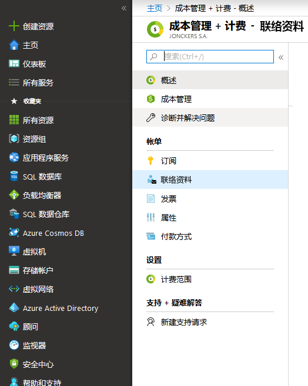

### 任务 3：启用“向我发送有关提醒的电子邮件设置”。 

Azure 安全中心将建议你提供 Azure 订阅的安全联系详细信息（如果尚未提供）。

1.  选择**“成本管理帐单”**。
3.  显示“定价和设置屏幕”。
4.  单击订阅。
5.  点击**“电子邮件通知”**。
6.  选择**“保存”**。 

     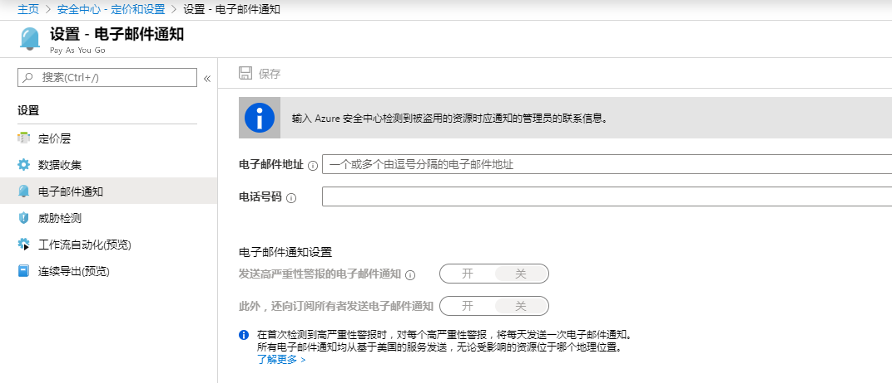

### 任务 4：启用“也向订阅所有者发送电子邮件”。 

Azure 安全中心将建议你提供 Azure 订阅的安全联系详细信息（如果尚未提供）。

1.  使用上面的电子邮件通知表单，可以添加其他电子邮件，并以逗号分隔。

1.  单击**“保存”**。

## 练习 3：创建 Azure 存储帐户基线 

Azure 存储帐户提供独特的命名空间，以存储和访问 Azure 存储数据对象。  存储帐户也需要保护。

### 任务 1：需要增强安全性的传输

为确保 Azure 存储数据的安全性，你应采取的另一个步骤是加密客户端和 Azure 存储之间的数据。执行此操作的最佳方法是始终使用 HTTPS 协议，以确保公共 Internet 上的安全通信。通过启用存储帐户所需的安全传输，可以在调用 REST API 以访问存储帐户中的对象时强制使用 HTTPS。启用此选项后，将拒绝使用 HTTP 的连接。

1.  前往**“所有服务”**下的**“储存帐号”**。

3.  选择存储帐户。

4.  在**“设置”**下，选择**“配置”**。

5.  确保**“需要安全传输”**设置为**“启用”**。

       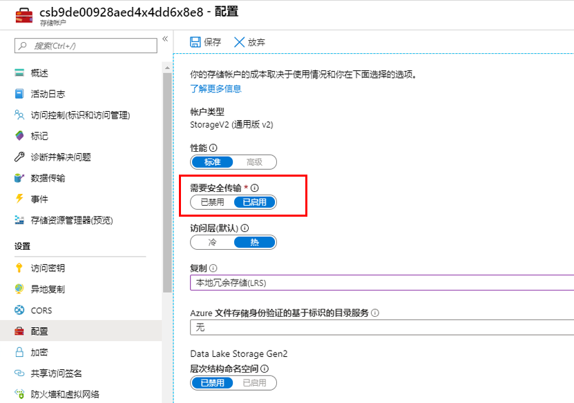

### 任务 2：启用二进制大对象 (blob) 加密

Azure Blob 存储是 Microsoft 提供的适用于云的对象存储解决方案。Blob 存储最适合用于存储大量非结构化数据。非结构化数据是不遵循特定数据模型或定义的数据，例如文本或二进制数据。存储服务加密可保护你的静态数据。Azure 存储会在数据写入数据中心时对其进行加密，并在你访问数据时自动为其解密。

1.  转到“Azure 服务”下的“存储帐户”。
3.  选择存储帐户。
4.  在**“设置”**下，选择**“加密”**。
5.  已为所有新存储帐户和现有存储帐户启用 Azure 存储服务加密，不能禁用。

     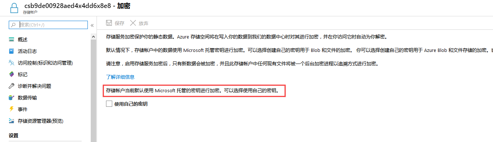

### 任务 3：定期重新生成访问密钥

创建存储帐户时，Azure 会生成两个 512 位存储访问密钥，用于在访问存储帐户时进行身份验证。定期轮换这些密钥防止无意中访问或暴露这些键可能会受到的破坏。

1.  前往在 Azure 服务下的**“储存帐号”**。

3.  选择存储帐户。
4.  对于存储帐户，请转到**“活动日志”**。
5.  时间“跨度下拉列表”中，选择**“习惯”**并选择“开始时间”和“时间结束”，由此产生 90 天的范围。
6.  单击**“应用”**。 
 
     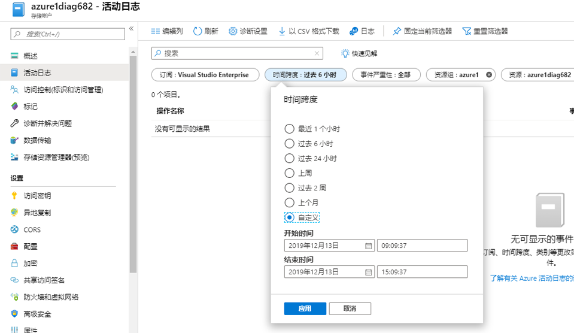

### 任务 4：要求共享访问签名 (SAS) 令牌，以便在一小时后失效

共享访问签名 (SAS) 是向 Azure 存储资源授予限制访问权限的 URI。你可以向不信任你的存储帐户密钥但希望向某些存储帐户资源授予访问权限的客户端提供共享访问签名。通过将共享访问签名 URI 分发给这些客户端，你可以使用特定的授权授予它们在指定时间段内访问资源的权限。

目前无法完成 SAS 令牌到期时间的验证。在 Microsoft 将令牌到期时间设置为设置而非令牌创建参数之前，此建议需要手动验证。

1.  前往**“存储帐户”**。

3.  选择现有帐户。
4.  对于存储帐户，请转到**“共享访问签名”**。
5.  设置“开始和有效日期/时间”。
6.  “允许的协议”设置为“仅限 HTTPS”。

    两种 SAS 功能如下所示。 
 
    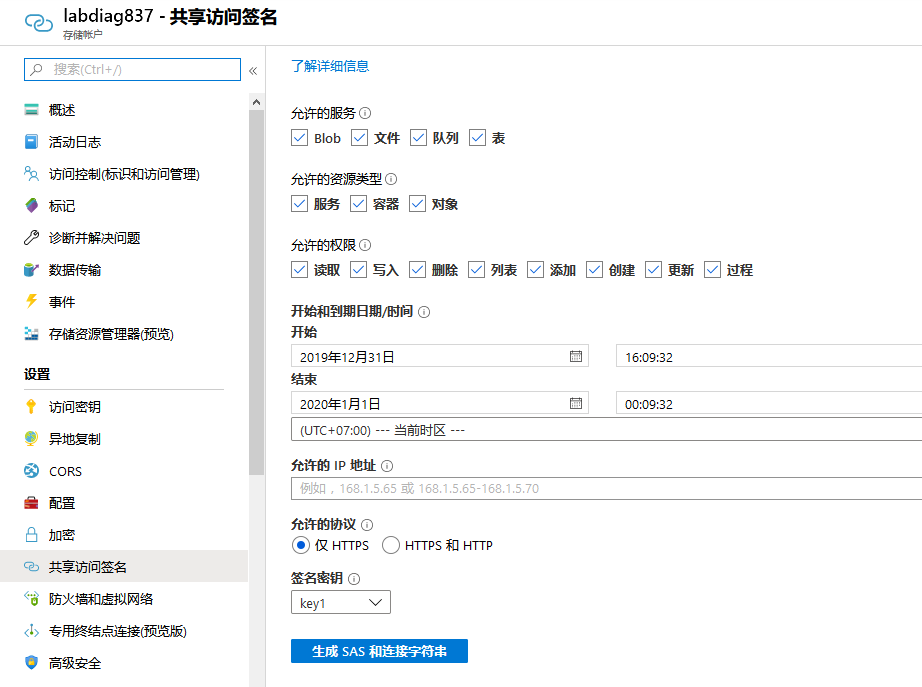
 

### 任务 5：仅需要私有访问 blob 容器 

你可以在 Azure Blob 存储中启用对容器及其 Blob 的匿名、公共读取访问。通过这样做，你可以授予对这些资源的只读访问权限，而无需共享你的帐户密钥，也无需共享访问签名 (SAS)。默认情况下，容器及其中的任何 blob 只能由已获得适当权限的用户访问。要授予匿名用户对容器及其 blob 的读访问权限，可以设置容器公共访问级别。授予对容器的公共访问权限时，匿名用户可以在不公开请求的情况下读取可公开访问的容器中的 blob。

1.  前往**“存储帐户”**。
3.  对于每个存储帐户，请转到**“BLOB 服务”**下的**“容器”**。
1.  请点击**“+容器”**。
1.  给容器起个名字**“az500”**然后点击**“好”**。

4.  确保“公共访问级别”设置为“私有”。

     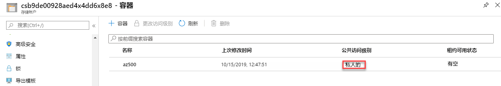

## 练习 4：创建 Azure SQL 数据库基线

Azure SQL Server 是基于云的关系数据库服务器，它支持许多与 Microsoft SQL Server 相同的功能。通过内置的诊断、冗余、安全性和可扩展性，它可以轻松地从本地数据库过渡到基于云的数据库。  本练习着眼于设置 Azure SQL Server 策略的安全建议。

### 任务 1：启用审核

Azure SQL 数据库和 SQL 数据仓库的审核跟踪数据库事件，并将它们写入 Azure 存储帐户、OMS 工作区或事件中心的审核日志。审核还：

-   可帮助维护合规性、了解数据库活动并获取有关可能指示业务关注点或可疑安全性违规的差异和异常信息。
-   实现并促进遵守合规性标准，但不保证合规性。

1.  在 Azure 门户中，浏览到**“SQL 数据库”**。
1.  单击**“+ 添加”**。
1.  使用以下设置创建数据库，然后单击**“审核 + 创建”**然后点击**“创建”**：

      - **“资源组”**：选择“MyResourceGroup”
      - **“数据库名称”**: az500
      - **“服务器”**：**新建**
         - **“服务器名称”**为服务器指定一个唯一的名称
         - **“服务器管理员登录”**：localadmin
         - **“密码”**：Pa55w.rd1234
         - **位置**： EastUS

1.  部署完成后，单击**“前往资源”**。

4.  选择**“安全”**部分下面的**“审核”**。

1.  请点击**“查看服务器设置”**。

     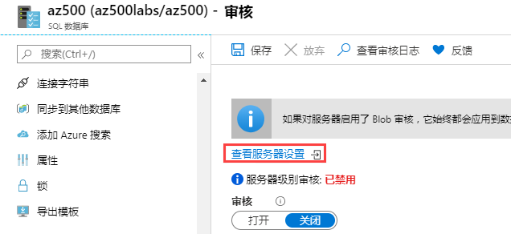
 
1.  选择**“开启”**并选中**“日志分析”**旁边的框。

1.  选择你在较早的实验中创建的 Log Analyics 工作区，然后单击**“保存”**。

     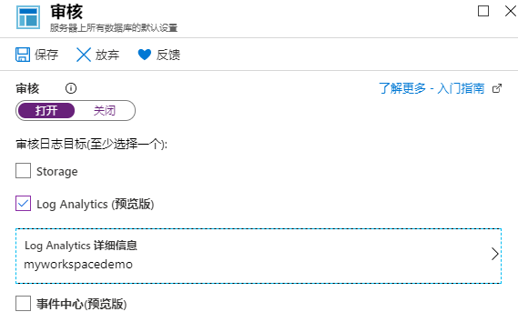

1.  退出审核边栏选项卡。

5.  确保将审核设置为**开启**并选中**“日志分析”**旁边的框。

1.  选择你在较早的实验中创建的 Log Analyics 工作区，然后单击**“保存”**。

     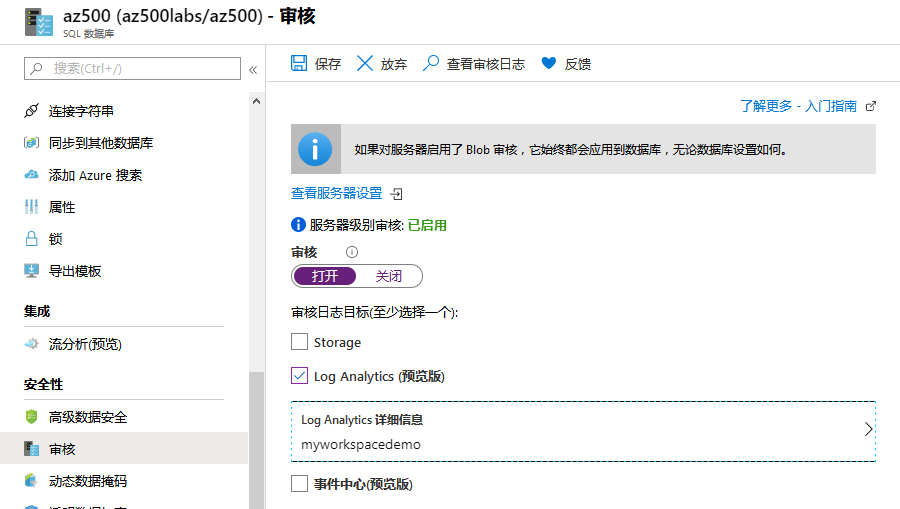

### 任务 2：启用威胁检测服务

单个和池化数据库的威胁检测检测异常活动，指示访问或利用数据库的异常且可能有害的尝试。威胁检测可以识别潜在的 SQL 注入，来自异常位置或数据中心的访问，来自不熟悉的主体或可能有害的应用程序的访问以及暴力 SQL 凭证。威胁检测是高级数据安全 (ADS) 产品的一部分，该产品是高级 SQL 安全功能的统一包。可以通过中央 SQL ADS 门户访问和管理威胁检测。

1.  在 Azure 门户中，浏览到**“SQL 数据库”**。

2.  在**“安全”**下，然后导航到**“高级数据安全”**。
3.  单击**“设置”**。
4.  选择**“在服务器上启用高级数据安全性”**然后点击**“是”**再点击**“保存”**。

### 任务 3：启用所有威胁检测类型 

高级数据安全性 (ADS) 提供一组高级 SQL 安全功能，包括数据发现和分类、漏洞评估和高级威胁检测 (ATP)。

高级威胁检测是高级数据安全 (ADS) 产品的一部分，该产品是高级 SQL 安全策略深度防御的一部分。可以通过中央 SQL ADS 门户访问和管理高级威胁检测。

1.  在 Azure 门户中，浏览到**“SQL 数据库”**。
4.  在**“安全”**下，然后导航到**“高级数据安全”**。
1.  单击**“设置”**。

7.  确保**“发送提醒”**设置恰当。

     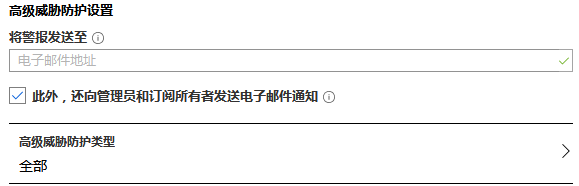

## 练习 5：创建日志记录和监控基线

尝试识别、检测和缓解安全威胁时，日志记录和监视是至关重要的要求。拥有适当的日志记录策略可以确保你可以确定何时发生安全违规，而且还可以识别出肇事者。Azure 活动日志提供有关外部访问资源和诊断日志的数据，诊断日志提供有关特定资源操作的信息。

### 任务 1：确保存在日志配置文件

Azure 活动日志可以深入了解 Azure 中已经发生的订阅级事件。这包括一系列数据，从 Azure 资源管理器的操作数据到服务运行状况事件的更新。活动日志以前称为审核日志或操作日志，因为管理类别报告订阅的控制平面事件。每个 Azure 订阅都有一个活动日志。它从外部提供有关资源操作的数据。诊断日志由资源发出，并提供有关该资源操作的信息。你必须为每个资源启用诊断设置。

1.  在 Azure 门户中转到**“监控”**，然后选择**“活动日志”**。

3.  点击**“导出到事件中心”**。
5.  配置以下设置，然后单击**“保存”**。

      - **“区域”**：EastUS
      - **“选择”**：导出到存储帐户
      - **存储帐户**：选择你的存储帐户并点击“好”。
      - **“保留”**：90 天

6.  选择**“保存”**。

     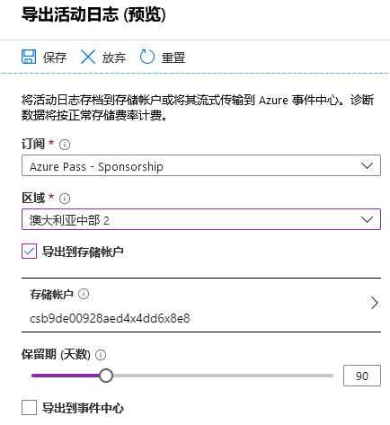

### 任务 2：确保将活动日志保留期更改为 365 天或更长时间

将保留（天数）设置为 0 将永久保留数据。

1.  请按照上面列出的步骤。调整“保留天数”滑块。

### 任务 3：为“创建、更新或删除网络安全组”创建活动日志警报 

默认情况下，创建/更新/删除 NSG 时不会创建监视警报。更改或删除安全组可以允许从不正确的来源访问内部资源，或者用于意外的出站网络流量。

1.  进入 Azure 门户，转到**“监控”**，然后选择**“警报”**。

3.  然后选择**“+新建警报规则”**。

4.  在里面**“资源”**部分点击**“选择”**。

1.  选择你的订阅，然后单击**“完成”**。

4.  在**“条件”**部分里面点击**“添加”**。

1.  搜索**“创建或更新网络安全组”**并选择它。

1.  在“配置”信号逻辑边栏选项卡上的“由...启动的事件”中，输入**“任何”**然后点击**“完成”**。

     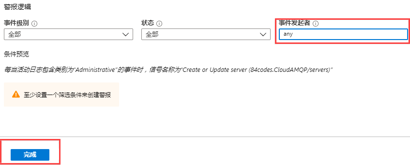

1.  在**“动作”**部分里面点击**“建立行动小组”**。

1.  在“添加操作组”边栏选项卡上，输入以下详细信息：

      - **“行动组名称”**：NSG 警报
      - **“简称”**：NSGAlert
      - **“动作名称”**：NSG 警报
      - **“动作类型”**：电子邮件/短信/推送/语音

1.  在**“电子邮件/短信/推送/语音”**边栏选项卡检查电子邮件框，输入你的电子邮件地址，然后单击**“好”**。

     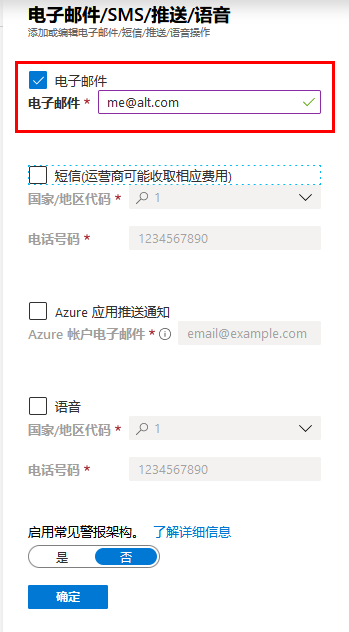

1.  在“添加操作组”页面上，单击**“是”**。

     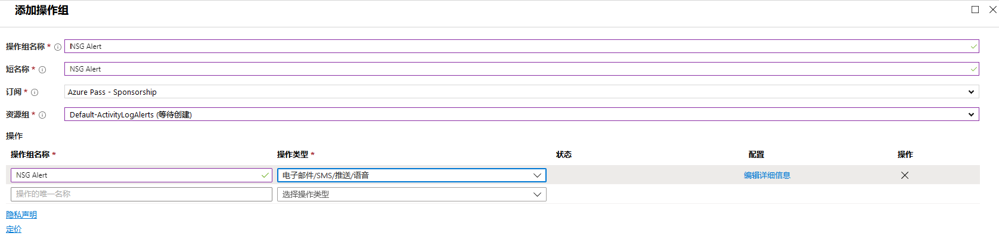

1.  在创建规则边栏选项卡上，**“警报详细信息”**部分输入以下详细信息：

      - **“警报规则名称”**：NSG 警报
      - **“保存到资源组”**：myResourceGroup

     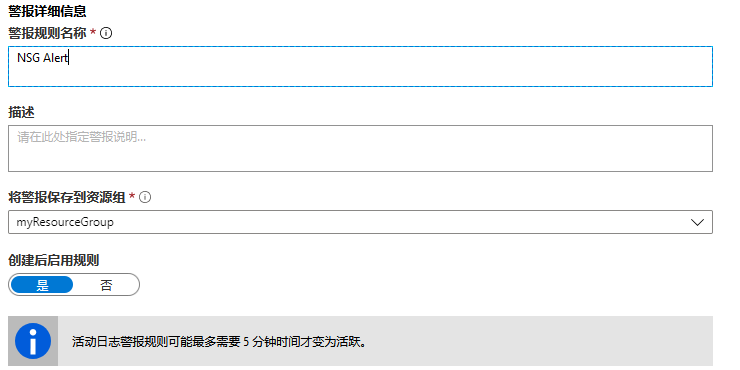

6.  单击**“创捷警报规则”**

## 练习 5：创建网络基线

Azure 网络服务通过设计最大限度地提高灵活性、可用性、复原能力、安全性和完整性。位于 Azure 的资源之间、本地和 Azure 托管资源之间，以及 Internet 和 Azure 之间的资源可以进行网络连接。

### 任务 1：限制来自 Internet 的 RDP 和 SSH 访问 

可以通过使用远程桌面协议 (RDP) 和安全外壳 (SSH) 协议来访问 Azure 虚拟机。这些协议是数据中心计算的标准配置，并且使我们能够管理远程位置的 VM。

通过 Internet 使用这些协议的潜在安全问题是攻击者可以使用强力技术来访问 Azure 虚拟机。在攻击者获得访问权限后，他们可以将你的 VM 用作攻击虚拟网络上其他计算机的启动点，甚至可以攻击 Azure 之外的网络设备。

建议你禁用从 Internet 对 Azure VM 的直接 RDP 和 SSH 访问。在禁用来自 Internet 的直接 RDP 和 SSH 访问后，你可以使用其他选项来访问这些 VM 以进行远程管理：

- 点到站点 VPN
- 站点到站点 VPN
- Azure ExpressRoute
- Azure Bastion Host

1.  在 Azure 门户中，浏览到**“虚拟机”**。

1.  选择**“myVM”**。

1.  打开**“网络”**边栏选项卡。

1.  选择允许 RDP（端口 3389）的规则，然后单击**“删除”**。

     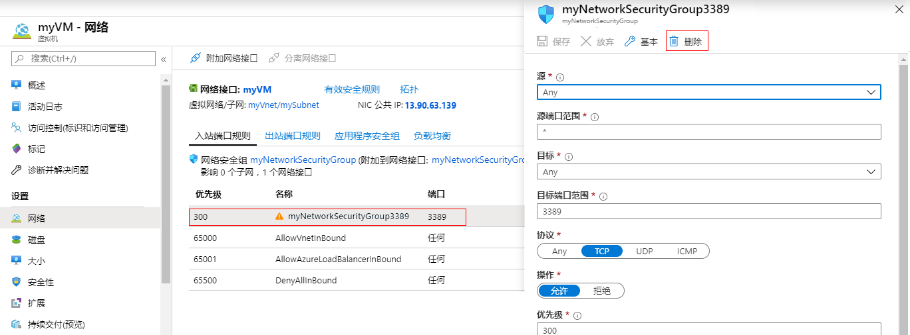

## 任务 2：限制从 Internet 访问 SQL Server 

防火墙系统可防止未经授权访问计算机资源。如果防火墙已打开但未正确配置，则可能会阻止尝试连接到 SQL Server。

若要通过防火墙访问 SQL Server 实例，必须在运行 SQL Server 的计算机上配置防火墙。允许 IP 范围`0.0.0.0/0`（StartIp 为`0.0.0.0`，EndIP 为`0.0.0.0`）的入口允许对任何/所有流量进行开放访问，这可能使 SQL 数据库容易受到攻击。确保没有 SQL 数据库允许从 Internet 进入。

1.  在 Azure 门户中转到**“SQL 服务器”**并选择你的 SQL Server。

4.  单击**“防火墙和虚拟网络”**。

     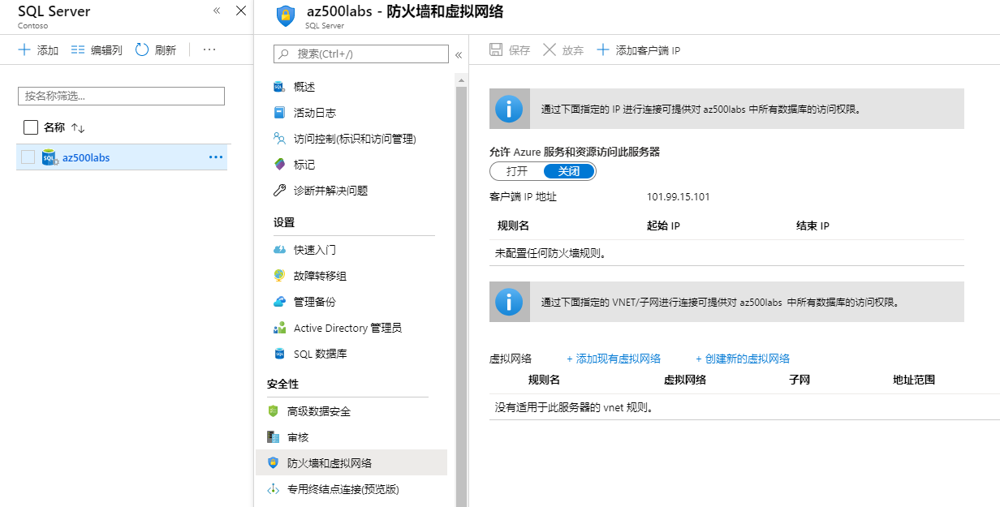

5.  确保存在防火墙规则，并且没有规则的起始 IP 为 `0.0.0.0`且 ENd IP 为`0.0.0.0`或允许访问更宽的公共 IP 范围的其他组合。

6.  合上边栏选项卡。

### 任务 3：配置 NSG 流日志

在订阅中创建或更新虚拟网络时，将在你的虚拟网络区域中自动启用 Network Watcher。自动启用 Network Watcher 对你的资源或相关费用没有影响。

网络安全组 (NSG) 流日志是网络监视器的一项功能，允许你通过 NSG 查看有关入口和出口 IP 流量的信息。流日志以 JSON 格式编写，并按规则显示流应用的网络接口 (NIC)的出站和入站流，5 元组信息（源/目标IP，源/目标端口和协议）允许或拒绝流量的相关信息，在版本 2 中，则显示吞吐量信息（字节和数据包）。日志可用于检查异常情况并深入了解可疑的违规行为。

1.  在 Azure 门户中，选择**“所有服务”**。

3.  选择**“联网”**。

4.  选择**“网络观察程序”**。

5.  选择日志下的**“NSG 流日志”**。

1.  选择**“开启”**。

1.  选择一个存储帐户，然后单击**“保存”**。

 

### 任务 4：启用网络观察程序 

网络安全组 (NSG) 流日志是网络监视器的一项功能，允许你通过 NSG 查看有关入口和出口 IP 流量的信息。

1.  在 Azure 门户中，选择“所有服务”。在筛选器框里，输入**“网络观察程序”**。当网络观察程序出现在结果中时，请选择它。

3.  选择“区域”，将其展开，然后在未启用的区域上选择省略号（...）按钮。

4.  选择**“启用网络观察程序”**。

     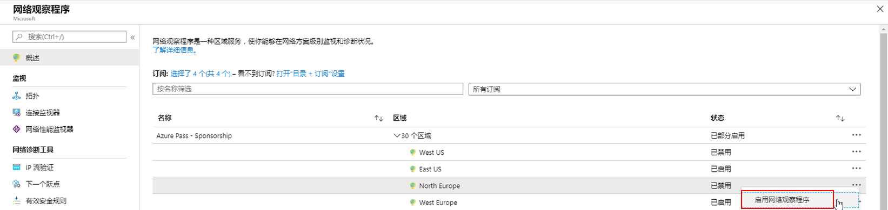

## 练习 7：创建 Azure VM 基线

Azure Policy 是 Azure 中用于创建、分配和管理策略的服务。这些策略对你的资源实施不同的规则和效果，因此这些资源符合你的企业标准和服务水平协议 (SLA)。Azure Policy 通过评估你的资源是否符合指定的策略来满足此需求。例如，你可以制定策略，仅允许环境中 SKU 的虚拟机大小。实施此策略后，将评估新资源和现有资源的合规性。通过正确的策略类型，可以使现有资源符合规定。

**Azure 网络安全组建议**

以下是在 Azure 订阅上设置虚拟机 (VM) 策略时应遵循的安全建议。每个建议中都包含 Azure 门户中要遵循的基本步骤。你应该使用自己的资源在自己的订阅上执行这些步骤，以验证每个安全性。请记住，级别 2 选项可能会限制某些功能或活动，因此请仔细考虑你决定强制实施的安全选项。

### 任务 1：确保操作系统磁盘已加密

Azure 磁盘加密有助于保护和保护你的数据，以满足你的组织安全性和合规性承诺。它使用 Windows 的 BitLocker 功能和 Linux 的 DM-Crypt 功能为 Azure 虚拟机 (VM) 的操作系统和数据磁盘提供卷加密。它与 Azure 密钥保管库集成，以帮助你控制和管理磁盘加密密钥和机密，同时，确保 VM 磁盘中的所有数据在 Azure 存储时静态加密。适用于 Windows 和 Linux VM 的 Azure 磁盘加密适用于所有 Azure 公共区域和 Azure 政府区域的一般可用性，适用于具有 Azure 高级存储的标准 VM 和 VM。

如果你使用 Azure 安全中心（建议），则在你拥有未加密的虚拟机时会收到警报。

1.  在 Azure 门户中搜索**“KeyVault”**。

1.  选择**“密钥保管库”**，然后单击**“创建”**。

1.  输入以下详细信息：

      - **“资源组”**：myResourceGroup
      - **“密钥保管库”**：_输入独特的内容_
      - **“区域”**：EastUS
   
     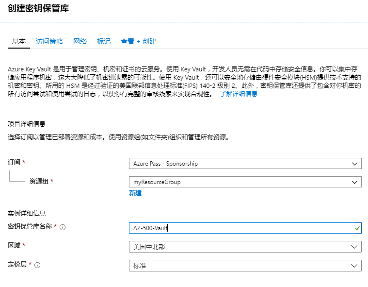

1.  选择**“访问策略”**标签并选择**“Azure 磁盘加密”**用于卷加密。

     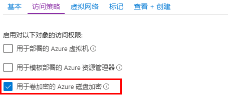

1.  请点击**“查看 + 创建”**然后点击**“创建”**。

1.  继续前等待部署完成。

1.  在 Azure 门户中，选择**“虚拟机”**。

1.  选择**“myVM”**虚拟机。

3.  在**“设置”**部分下，选择**磁盘**。

1.  请注意，磁盘未加密。

     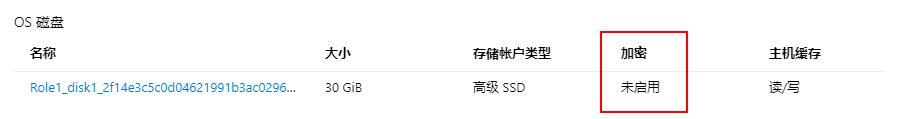

1.  请点击**“加密”**。

     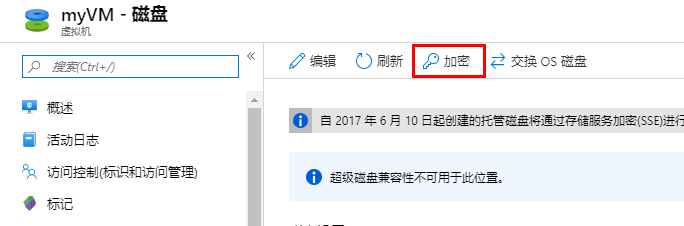

5.  选择要加密的**“操作系统和数据磁盘”**。

1.  请点击**“选择密钥库和密钥进行加密”**然后选择你的保管库，然后单击**“选择”**。

1.  请点击**“保存”**然后点击**“是”**确认。

### 任务 2：确保仅安装批准的扩展

Azure 虚拟机 (VM) 扩展是一些小型应用程序，可在 Azure VM 上提供部署后配置和自动化任务。例如，如果虚拟机需要软件安装，防病毒保护或在其中运行脚本，则可以使用 VM 扩展。Azure VM 扩展可以使用 Azure CLI、PowerShell、Azure 资源管理器模板和 Azure 门户运行。扩展可以与新 VM 部署捆绑在一起，也可以针对任何现有系统运行。

1.  在 Azure 门户中，浏览到**“虚拟机”**。

3.  选择**“myVM”**然后在**“设置”**部分点击**“扩展”**。
5.  确保列出的扩展程序已获批准使用。

     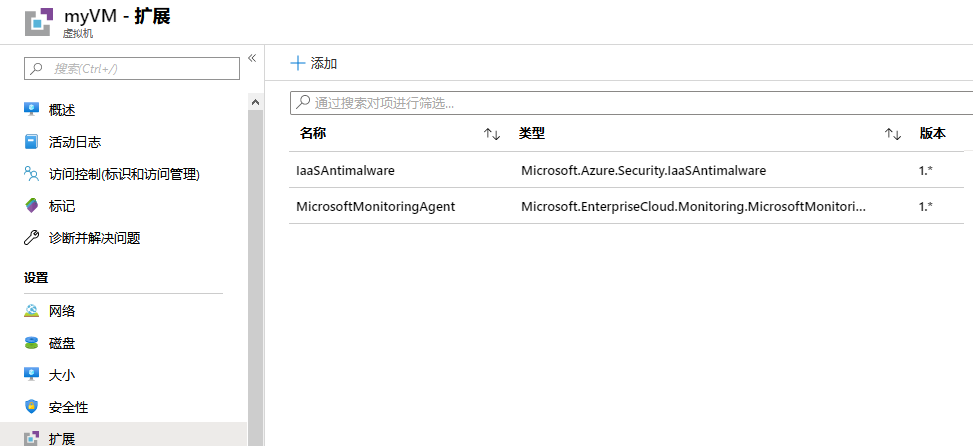

**结果**：你现在已经完成了本试验。

