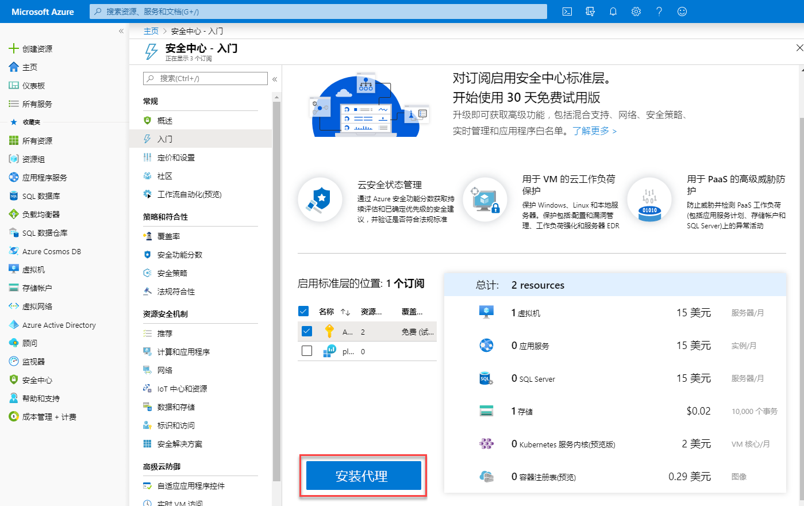
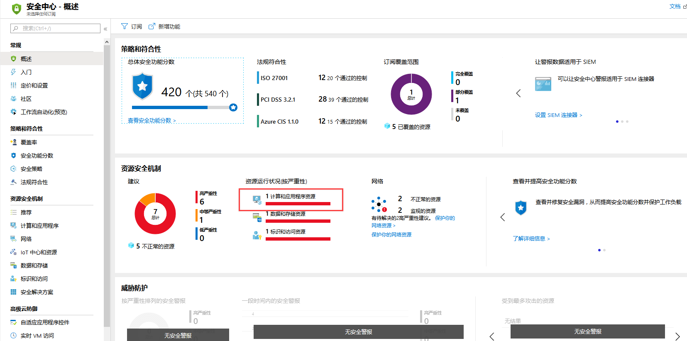
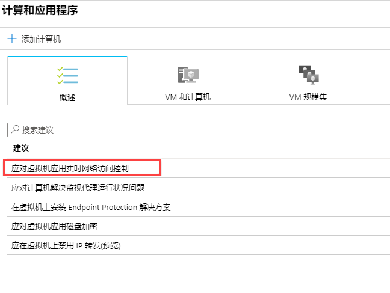
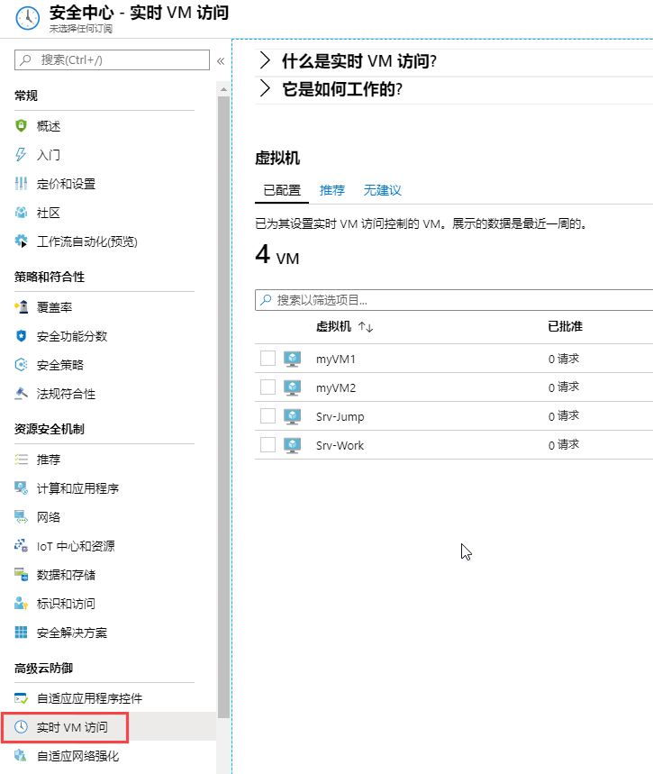
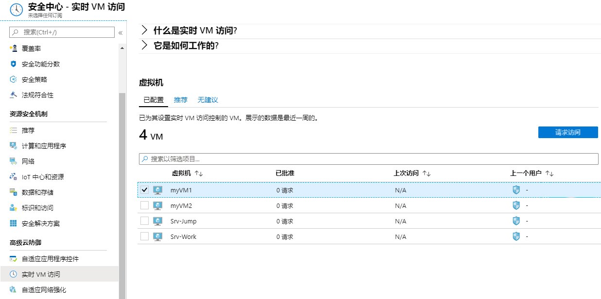
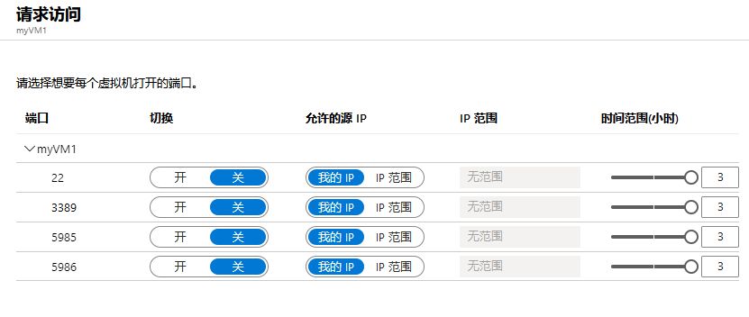
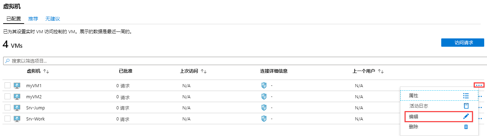
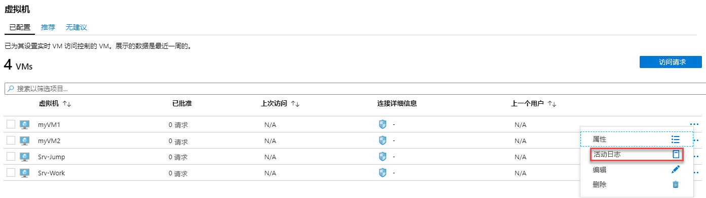
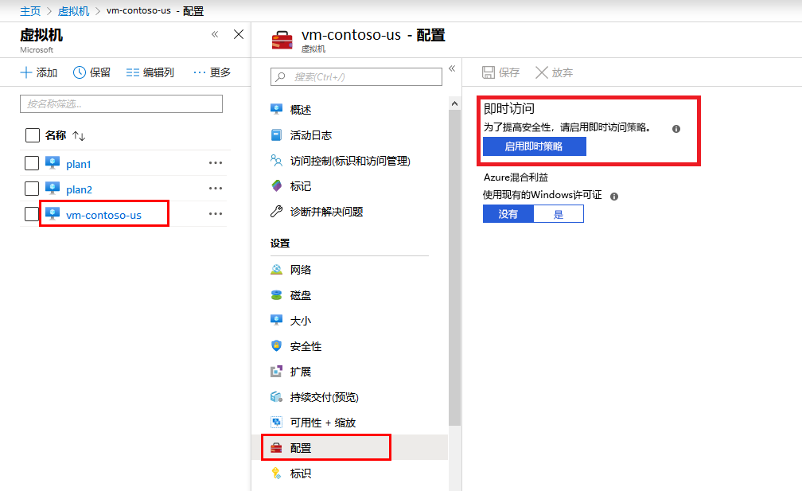
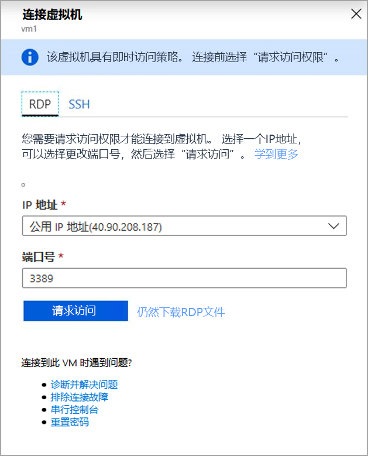

---
lab:
    title: '实验 9 - JIT'
    module: '模块 3：管理安全操作'
---

# 模块 3：实验 9 - JIT

**场景**

实时 (JIT) 虚拟机 (VM) 访问可用于锁定 Azure VM 的入站流量，减少攻击风险，同时在需要时提供连接到 VM 的轻松访问。

暴力攻击通常以管理端口为目标，以获取对 VM 的访问权限。如果成功，攻击者可以控制 Vm并 在你的环境中建立立足点。

减少暴力攻击暴露的一种方法是限制端口打开的时间。管理端口无需始终打开。只有在连接到 VM 时才需要打开它们，例如执行管理或维护任务。启用实时时，安全中心使用网络安全组 (NSG) 和 Azure 防火墙规则，这些规则限制对管理端口的访问，因此攻击者无法将其作为目标。

## 练习 1：使用实时管理虚拟机访问

有三种方法可以在 VM 上配置 JIT 策略：

- 使用 Azure 安全中心配置 JIT 访问
- 在 Azure VM 边栏选项卡上配置 JIT 访问
- 以编程方式在 VM 上配置 JIT 策略

### 任务 1：在 Azure 安全中心中的 VM 上配置 JIT 访问

1.  在 Azure 门户中打开**“安全中心”**，然后单击**“入门”**。

1.  请单击**“安装代理”**。

     

**注**：你可能需要等待5分钟才能部署代理。

2.  从左侧窗格中选择**“概述”**。

1.  选择**“计算和应用资源”**。

     

1.  在计算边栏选项卡上，注意建议。

1.  选择**“应在虚拟机上应用实时网络访问控制”**。

     

1.  选择所有 4 个虚拟机，然后单击**“在 4 个 VM 上启用 JIT”**。

     

1.  在**“JIT VM 访问配置”**边栏选项卡上，单击**“保存”**。
  - 此边栏选项卡显示 Azure 安全中心推荐的默认端口：
      - 22 - SSH
      - 3389 - RDP
      - 5985 - WinRM 
      - 5986-WinRM
 
     

1.  关闭所有边栏选项卡，然后在安全中心边栏选项卡上单击**“实时 VM 访问”**。

     

    **“实时 VM 访问”**窗口打开。
      
    **“实时 VM 访问”**提供有关虚拟机状态的信息：

    - **已配置** -  VM 已配置，以支持实时 VM 访问。显示的数据是上周的数据，其中包括每个 VM 的已批准请求数、上次访问日期和时间以及上次用户。
    - **建议的** -  VM 可以支持实时 VM 访问但尚未配置的 VM。我们建议你为这些 VM 启用实时 VM 访问控制。
    - **无建议** - 可能导致不建议使用 VM 的原因有：
      - 缺少 NSG - 实时解决方案需要有一个 NSG。
      - 经典 VM - 安全中心实时 VM 访问当前仅支持通过 Azure 资源管理器部署的 VM。实时解决方案不支持经典部署。 
      - 其他 - 如果在订阅或资源组的安全策略中关闭了实时解决方案，或者如果 VM 缺少公共 IP 并且没有 NSG，则 VM 属于此类别。
 

**注**：为虚拟机启用“JIT VM 访问”后，Azure 安全中心将为关联的网络安全组和与其关联的网络安全组中的选定端口创建“拒绝所有入站流量”规则。如果为所选端口创建了其他规则，则现有规则的优先级高于新的“拒绝所有入站流量”规则。如果所选端口上没有现有规则，则新的“拒绝所有入站流量”规则在网络安全组和 Azure 防火墙中具有最高优先级。

### 任务 2：通过 ASC 请求 JIT 访问

要通过 ASC 请求访问 VM：

1.  在**“实时 VM 访问”**下，选择**“已配置”**选项卡。

2.  在**“虚拟机”**下，选择你要请求访问权限的虚拟机之一。这会将复选标记放在 VM 旁边。

    - **“连接详细信息”**列中的图标指示是否在 NSG 或 FW 上启用了 JIT。如果两者都启用，则仅显示防火墙图标。

    - **“连接详细信息”**列提供连接 VM 及其开放端口所需的信息。

      

3.  请单击**“请求访问”**。**“请求访问”**窗口打开。

       

4.  在**“请求访问”**下，对于每个 Vm，配置要打开的端口，打开该端口的源 IP 地址以及时间窗口。只能请求访问实时策略中配置的端口。每个端口都有一个基于实时策略的最大允许时间。

5.  单击**“打开端口”**。

**注**：如果请求访问的用户位于代理之后，则该选项**“我的 IP”**可能不起作用。你可能需要定义组织的完整 IP 地址范围。

### 任务 3：  通过 ASC 编辑 JIT 访问策略

你可以通过添加和配置新端口以保护该 VM，更改其现有的实时策略，或者更改与已受保护的端口相关的任何其他设置。

要编辑 VM 的现有实时策略：

1.  在**“已配置”**选项卡中，**“VM”**下方，通过单击该虚拟机行中的三个点，选择要向其添加端口的虚拟机。 

1.  选择**“编辑”**。
1.  在**“JIT VM 访问配置”**下，你可以编辑已经受保护的端口的现有设置，也可以添加新的自定义端口。 
  
      

### 任务 4：  审核 ASC 中的 JIT 访问活动

你可以使用日志搜索深入了解 VM 活动。查看日志

1.  在**“实时 VM 访问”**下，选择**“已配置”**选项卡。
2.  在 **VM** 下，通过单击该 VM 行中的三个点，选择一个虚拟机以查看有关的信息，然后在菜单中选择**“活动日志”**。**“活动日志”**打开。

       

   **“活动日志”**提供该 VM 的先前操作以及时间、日期和订阅的筛选视图。

你可以通过选择**“单击此处将所有项目下载为 CSV”**下载日志信息。

修改筛选器，然后单击**“应用”**创建搜索和日志。

### 任务 5：通过 Azure VM 边栏选项卡，配置 VM 上的 JIT 访问

为了使跨 VM 的实时访问变得容易，你可以将 VM 设置为仅允许直接从 VM 内部进行实时访问。

1.  在 Azure 门户中，选择**“虚拟机”**。

2.  单击你要限制为实时访问的虚拟机。
3.  在菜单中，单击**“配置”**。
4.  在**“实时访问”**下，单击**“启用实时策略”**。 

    这样可以使用以下设置对 VM 进行实时访问：

       - Windows 服务器：
         - RDP 端口 3389
         - 最多允许访问三个小时
         - 允许的源 IP 地址设置为“任何”
    
       - Linux 服务器：
         - SSH 端口 22
         - 最多允许三个小时的访问
         - 允许的源 IP 地址设置为“任意”
     
    如果虚拟机已经启用了实时功能，则在转到其配置页面时，你将看到实时功能已启用，并且可以使用链接在 Azure 安全中心中打开策略以查看和更改设置。 

     

### 任务 5：  通过 Azure VM 边栏选项卡请求对 VM 进行 JIT 访问

在 Azure 门户中，当你尝试连接到 VM 时，Azure 会检查你是否在该 VM 上配置了实时访问策略。

- 如果确实在 VM 上配置了 JIT 策略，则可以单击**“请求访问”**，使你能够根据为 VM 设置的 JIT 策略进行访问。 

     

  使用以下默认参数请求访问：

  - **源 IP**：'任何’ (*)（无法更改）
  - **时间范围**：三个小时（无法更改） 
  - **端口号** Windows 的 RDP 端口为 3389 / Linux 的端口为 22（可以更改）

  **注**：批准对受 Azure 防火墙保护的 VM 的请求后，安全中心将为用户提供正确的连接详细信息（DNAT 表中的端口映射），以用于连接到 VM。

  - 如果未在 VM 上配置 JIT，系统将提示你为其配置 JIT 策略。

      

| 警告：在继续之前，你应该删除此实验室教学使用的所有资源。  为此，应在**“Azure 门户”**中，单击**“资源组”**。  选择你创建的任何资源组。  在资源组边栏选项卡上，单击**删除资源组**，输入资源组名称，然后单击**删除**。  对你创建的任何其他资源组重复该过程。**否则可能会导致其他实验室出现问题。** |
| --- |

**“结果”**：现在你已经完成了本实验室教学。

